# QuantaAlpha — Backend Developer Guide

> A structural and connection map of the `quantaalpha/` Python backend, written for people who are about to **modify** it.
>
> For installation and first-run basics see [`README.md`](README.md). For experiment tuning see [`docs/user_guide.md`](docs/user_guide.md). This document covers what those don't: how the pieces are wired to each other, where the extension points are, and what will surprise you.

---

## Table of Contents

- [1. What This System Is](#1-what-this-system-is)
- [2. Quick Start](#2-quick-start)
- [3. System Architecture](#3-system-architecture)
- [4. Entry Points](#4-entry-points)
- [5. The Mining Loop](#5-the-mining-loop)
- [6. Component Wiring — The Plugin System](#6-component-wiring--the-plugin-system)
- [7. The Loop Engine — `LoopMeta` / `LoopBase`](#7-the-loop-engine--loopmeta--loopbase)
- [8. The Evolution System](#8-the-evolution-system)
- [9. The Factor Expression DSL](#9-the-factor-expression-dsl)
- [10. The Quality Gate](#10-the-quality-gate)
- [11. CoSTEER — Self-Evolving Code Generation](#11-costeer--self-evolving-code-generation)
- [12. Module Reference](#12-module-reference)
- [13. Cross-Module Dependency Graph](#13-cross-module-dependency-graph)
- [14. Standalone Backtest (V2)](#14-standalone-backtest-v2)
- [15. Web Dashboard](#15-web-dashboard)
- [16. Runtime Artifacts](#16-runtime-artifacts)
- [17. Configuration Reference](#17-configuration-reference)
- [18. How to Extend](#18-how-to-extend)
- [19. Known Issues and Dead Code](#19-known-issues-and-dead-code)
- [20. Glossary](#20-glossary)

---

## 1. What This System Is

QuantaAlpha is an **LLM-driven, self-evolving alpha-factor mining agent** built on top of Microsoft [Qlib](https://github.com/microsoft/qlib). You give it a research direction in natural language; it autonomously proposes hypotheses, writes factor expressions in a custom DSL, compiles and executes them against price/volume data, backtests them, reads its own results, and evolves the next generation of hypotheses.

| | |
| :--- | :--- |
| **Paper** | [arXiv:2602.07085](https://arxiv.org/abs/2602.07085) — *QuantaAlpha: An Evolutionary Framework for LLM-Driven Alpha Mining* |
| **Lineage** | Fork/rebrand of Microsoft **RD-Agent**; borrows from **AlphaAgent** (KDD 2025). Class names like `AlphaAgentLoop` are a leftover of this. |
| **Runtime dep** | The external `rdagent` package is still imported at runtime (see [§19](#19-known-issues-and-dead-code)) |
| **Python** | ≥ 3.10 |
| **Headline result** | CSI 300, 2022–2025 test period: IC **0.0472**, Rank IC **0.0459**, ARR **4.68%**, IR **0.6453**, MDD **11.80%** |
| **Primary fitness metric** | **RankIC** — a trajectory is "successful" when RankIC > 0 |

The core intellectual loop is five steps, repeated:

```
propose → construct → calculate → backtest → feedback
```

...wrapped in an outer **evolutionary** loop that mutates and crosses over whole strategy trajectories.

---

## 2. Quick Start

### Install

```bash
git clone https://github.com/QuantaAlpha/QuantaAlpha.git
cd QuantaAlpha
conda create -n quantaalpha python=3.10
conda activate quantaalpha
SETUPTOOLS_SCM_PRETEND_VERSION=0.1.0 pip install -e .
pip install -r requirements.txt
```

### Data

Two datasets are required, both on [HuggingFace](https://huggingface.co/datasets/QuantaAlpha/qlib_csi300):

| File | Purpose |
| :--- | :--- |
| `cn_data.zip` | Raw Qlib market data (A-shares, 2016–2025). Needed for Qlib init and **backtest**. |
| `daily_pv.h5` | Pre-computed price/volume panel. Needed for **factor mining**. |
| `daily_pv_debug.h5` | Smaller debug subset. Needed for mining in debug mode. |

```bash
unzip hf_data/cn_data.zip -d ./data/qlib

mkdir -p git_ignore_folder/factor_implementation_source_data
mkdir -p git_ignore_folder/factor_implementation_source_data_debug
cp hf_data/daily_pv.h5        git_ignore_folder/factor_implementation_source_data/daily_pv.h5
cp hf_data/daily_pv_debug.h5  git_ignore_folder/factor_implementation_source_data_debug/daily_pv.h5
```

> The debug file **must be renamed to `daily_pv.h5`** in the debug folder. Both folder paths come from `FactorCoSTEERSettings.data_folder` / `.data_folder_debug` in `quantaalpha/factors/coder/config.py:10-14` and are overridable via `FACTOR_CoSTEER_DATA_FOLDER` / `FACTOR_CoSTEER_DATA_FOLDER_DEBUG`.

The system *can* generate `daily_pv.h5` itself from Qlib data (`quantaalpha/factors/data_template/generate.py`), but it is slow — downloading is strongly preferred.

### Configure

```bash
cp configs/.env.example .env
```

Minimum viable `.env`:

```bash
QLIB_DATA_DIR=./data/qlib/cn_data     # must contain calendars/ features/ instruments/
DATA_RESULTS_DIR=./data/results
OPENAI_API_KEY=...
OPENAI_BASE_URL=https://your-provider/v1
CHAT_MODEL=deepseek-v3
REASONING_MODEL=deepseek-v3
```

### Run

```bash
./run.sh "price-volume factor mining"           # mine
./run.sh "microstructure factors" "exp_micro"   # mine, with factor-library suffix

python -m quantaalpha.backtest.run_backtest \
  -c configs/backtest.yaml --factor-source custom \
  --factor-json all_factors_library.json        # standalone backtest

cd frontend-v2 && bash start.sh                 # web UI on :3000
```

---

## 3. System Architecture

The backend is a layered stack. Each layer only depends on layers below it; `llm/`, `utils/`, and `log/` are cross-cutting and used by everything.

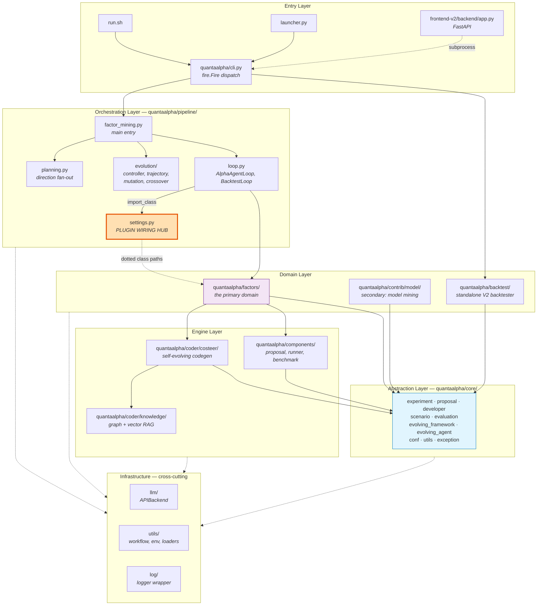

**The single most important box is `pipeline/settings.py`.** It holds dotted class-path strings that are resolved at runtime. Swapping any pipeline stage means editing one string — not editing the loop.

---

## 4. Entry Points

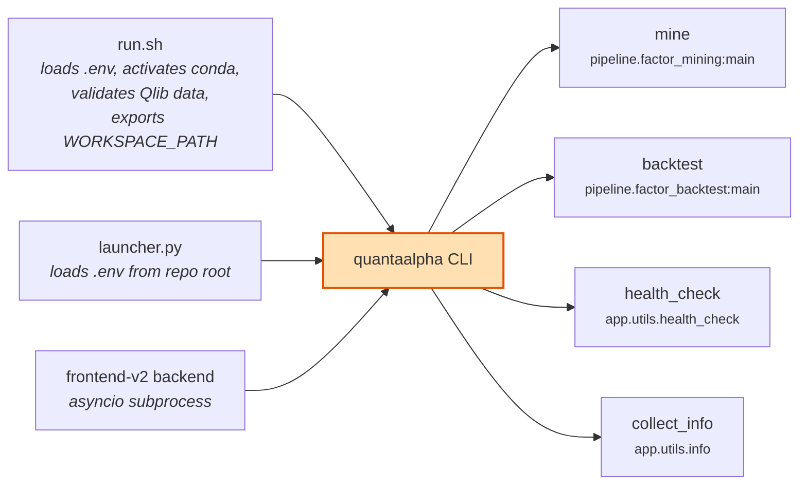

`quantaalpha/cli.py` is the complete public surface — four commands, dispatched by [`fire`](https://github.com/google/python-fire):

```python
def app():
    fire.Fire({
        "mine": mine,
        "backtest": backtest,
        "health_check": health_check,
        "collect_info": collect_info,
    })
```

> **Note:** `pipeline/factor_from_report.py` (mine factors out of PDF research reports) is **not registered here** and does not currently import — see [§19](#19-known-issues-and-dead-code).

### What `run.sh` does beyond calling the CLI

| Step | Effect |
| :--- | :--- |
| Loads `.env` | `set -a; source .env; set +a` — exports everything |
| Activates conda | `$CONDA_ENV_NAME`, default `quantaalpha` |
| Generates `EXPERIMENT_ID` | `exp_YYYYmmdd_HHMMSS` unless already set |
| Exports `WORKSPACE_PATH` | `$DATA_RESULTS_DIR/workspace_$EXPERIMENT_ID` |
| Exports `PICKLE_CACHE_FOLDER_PATH_STR` | `$DATA_RESULTS_DIR/pickle_cache_$EXPERIMENT_ID` |
| Validates Qlib data | Requires `calendars/`, `features/`, `instruments/` |
| Symlinks Qlib data | `$QLIB_DATA_DIR` → `~/.qlib/qlib_data/cn_data` |
| Exports `FACTOR_LIBRARY_SUFFIX` | From `$2`, controls output JSON filename |

`EXPERIMENT_ID=shared` is a special value that **skips** workspace/cache isolation.

---

## 5. The Mining Loop

`AlphaAgentLoop` in `quantaalpha/pipeline/loop.py` defines exactly five steps. They run cyclically, and a full session snapshot is pickled after every single one.

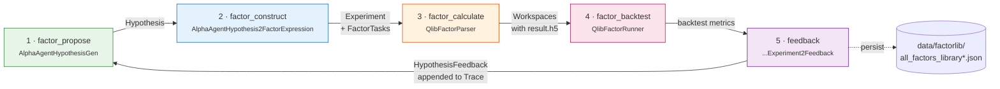

### Step by step

```mermaid
sequenceDiagram
    participant Loop as AlphaAgentLoop
    participant Gen as HypothesisGen
    participant H2E as Hypothesis2Experiment
    participant Gate as FactorQualityGate
    participant Coder as QlibFactorParser
    participant WS as FactorFBWorkspace
    participant Runner as QlibFactorRunner
    participant Sum as Summarizer
    participant Trace as Trace

    Loop->>Gen: factor_propose(trace)
    Gen->>Gen: LLM call w/ direction<br/>+ evolution prompt suffix
    Gen-->>Loop: Hypothesis

    Loop->>H2E: factor_construct(hypothesis)
    H2E->>H2E: LLM → factor expressions (DSL)
    H2E->>Gate: consistency / complexity / redundancy
    Gate-->>H2E: accept / correct / reject
    H2E-->>Loop: QlibFactorExperiment(sub_tasks)

    Loop->>Coder: factor_calculate(exp)
    Coder->>Coder: compile DSL → Python
    Coder->>WS: write factor.py, link data folder
    WS->>WS: subprocess exec → result.h5
    WS-->>Coder: values + feedback
    Coder-->>Loop: exp with populated workspaces

    Loop->>Runner: factor_backtest(exp)
    Runner->>Runner: combine factors → parquet<br/>run Qlib workflow
    Runner-->>Loop: metrics (RankIC, IC, ...)

    Loop->>Sum: feedback(exp, trace)
    Sum->>Sum: LLM analyses results
    Sum-->>Trace: append (hypothesis, exp, feedback)
    Loop->>Loop: persist to factor library JSON
```

**Error handling is part of the control flow**, not an afterthought:

| Exception | Behaviour in `LoopBase.run()` |
| :--- | :--- |
| `FactorEmptyError` (via `skip_loop_error`) | Log warning, **advance loop index**, reset to step 0 |
| `CoderError` | Log warning, **reset to step 0 of the same loop** (retry) |
| anything else | Propagates and kills the run |

---

## 6. Component Wiring — The Plugin System

This is the mechanism you will use most when modifying the system.

`quantaalpha/pipeline/settings.py` declares components as **dotted class-path strings**. `AlphaAgentLoop.__init__` resolves them at runtime with `quantaalpha.core.utils.import_class`. There are **no hardcoded imports** of the implementation classes in `loop.py`.

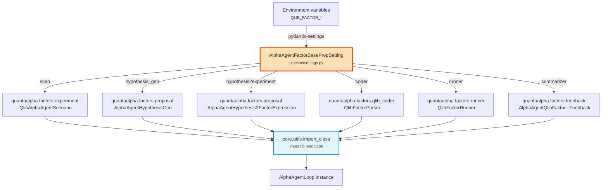

### The five setting singletons

| Singleton | Class | Env prefix | Used by |
| :--- | :--- | :--- | :--- |
| `ALPHA_AGENT_FACTOR_PROP_SETTING` | `AlphaAgentFactorBasePropSetting` | `QLIB_FACTOR_` | `AlphaAgentLoop` — **the main mining path** |
| `FACTOR_PROP_SETTING` | `FactorBasePropSetting` | `QLIB_FACTOR_` | generic factor R&D loop |
| `FACTOR_BACK_TEST_PROP_SETTING` | `FactorBackTestBasePropSetting` | — | `BacktestLoop` |
| `FACTOR_FROM_REPORT_PROP_SETTING` | `FactorFromReportPropSetting` | — | `factor_from_report.py` (currently broken) |
| `MODEL_PROP_SETTING` | `ModelBasePropSetting` | — | `contrib/model/` |

### Overriding without touching code

Settings inherit from `ExtendedBaseSettings` (`core/conf.py`), whose `ExtendedEnvSettingsSource` walks **both the class's own `env_prefix` and its parents'**. So to swap the coder:

```bash
export QLIB_FACTOR_CODER=myproject.custom.MyFactorCoder
```

Also configurable: `QLIB_FACTOR_SCEN`, `QLIB_FACTOR_HYPOTHESIS_GEN`, `QLIB_FACTOR_HYPOTHESIS2EXPERIMENT`, `QLIB_FACTOR_RUNNER`, `QLIB_FACTOR_SUMMARIZER`, `QLIB_FACTOR_EVOLVING_N`.

> **Contract:** any replacement must satisfy the abstract base in `core/` — `HypothesisGen`, `Hypothesis2Experiment`, `Developer`, `HypothesisExperiment2Feedback`, `Scenario`.

---

## 7. The Loop Engine — `LoopMeta` / `LoopBase`

`quantaalpha/utils/workflow.py` is small but has outsized consequences.

`LoopMeta` is a metaclass that **auto-discovers steps**: every public (non-underscore) callable attribute defined on the class body becomes a workflow step, in definition order, appended after any inherited steps.

```python
for name, attr in attrs.items():
    if not name.startswith("_") and isinstance(attr, Callable):
        if name not in steps:
            steps.append(name)
attrs["steps"] = steps
```


### Consequences you must internalise

1. **Adding a public method to a `LoopMeta` class silently adds a pipeline step.** This is why `AlphaAgentLoop._get_trajectory_data()` is underscore-prefixed — helpers *must* be private or they become steps.
2. **Every step is pickled.** Anything you attach to `self` must be picklable. Open file handles, sockets, threads, and lambdas will break session dumps.
3. **`loop_prev_out` is a plain dict keyed by step name.** Steps communicate through it: `factor_construct` reads `prev_out["factor_propose"]`.
4. **Sessions are resumable** — `LoopBase.load(path)` restores state and truncates the log storage back to that point.
5. `FactorReportLoop` overrides `self.steps` explicitly in `__init__`, bypassing auto-discovery. That's the escape hatch if you need a custom order.

---

## 8. The Evolution System

Outside the 5-step loop sits a trajectory-level evolutionary search. Each completed mining loop becomes a `StrategyTrajectory`; the pool of trajectories is then mutated and crossed over.

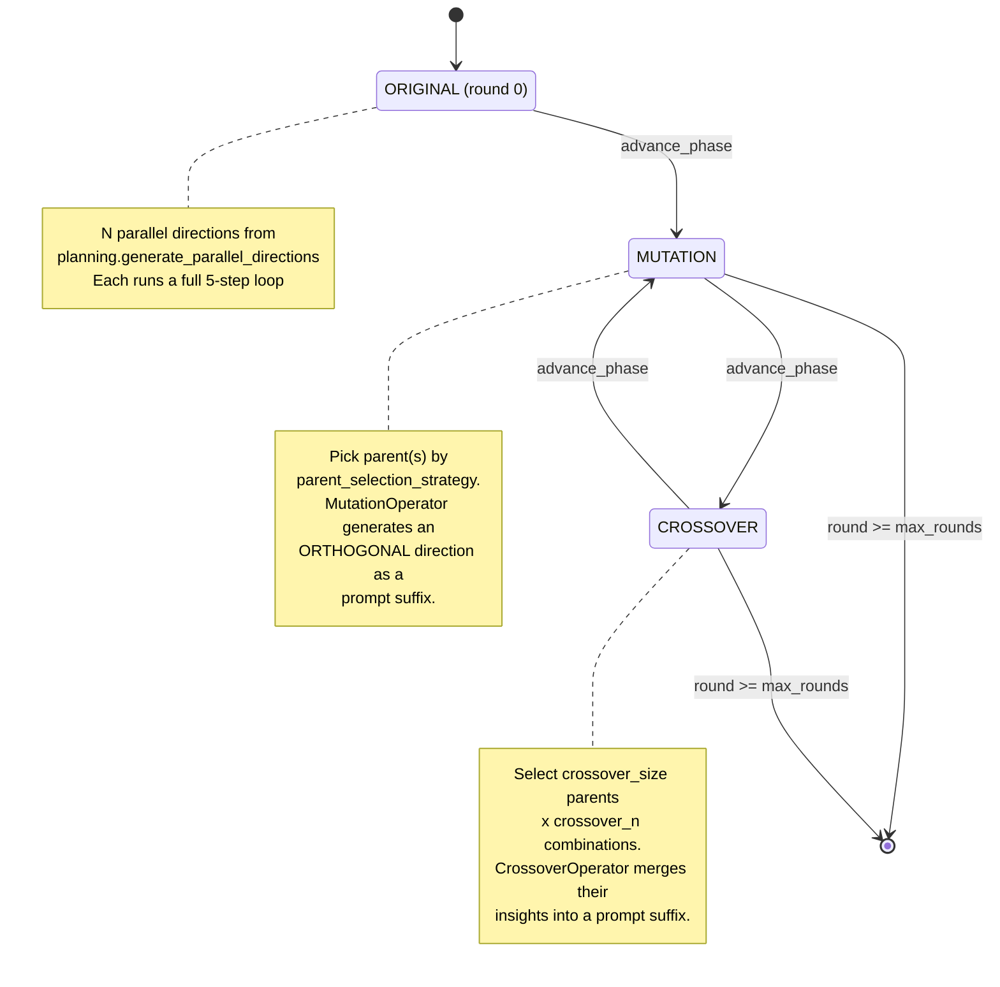

If `mutation_enabled: false`, rounds alternate Original → Crossover only; likewise if `crossover_enabled: false`.

### The key architectural insight

**Mutation and crossover do not manipulate factor expressions directly.** They call `generate_mutation_prompt_suffix(parent)` / `generate_crossover_prompt_suffix(parents)`, which produce **natural-language prompt suffixes appended to the hypothesis generator's direction**. The LLM does the actual recombination.

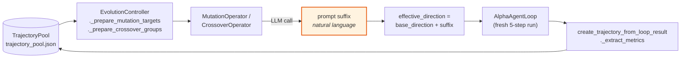

### Parent selection strategies

| Strategy | Behaviour |
| :--- | :--- |
| `best` | Highest-RankIC trajectories first *(default)* |
| `random` | Uniform |
| `weighted` | Performance-weighted sampling |
| `weighted_inverse` | Inverse-performance weighted — encourages exploring failures |
| `top_percent_plus_random` | Top `top_percent_threshold` guaranteed + random fill |

### Files

| File | Contains |
| :--- | :--- |
| `pipeline/evolution/trajectory.py` | `RoundPhase` enum, `StrategyTrajectory`, `TrajectoryPool` (JSON-persisted) |
| `pipeline/evolution/controller.py` | `EvolutionConfig`, `EvolutionController` — phase state machine |
| `pipeline/evolution/mutation.py` | `MutationOperator` |
| `pipeline/evolution/crossover.py` | `CrossoverOperator`, `select_crossover_pairs` |

> Evolution mode sets `RD_AGENT_SETTINGS.use_file_lock = False` in `factor_mining.py`, because concurrent branches otherwise deadlock on the pickle cache lock.

---

## 9. The Factor Expression DSL

Factors are written in a custom expression language, e.g.:

```
RANK(DELTA($close, 5)) / TS_STD($volume, 20)
```

**There are two completely independent parsers over this same syntax.** This trips up everyone who modifies the language.

```mermaid
flowchart TD
    EXPR["Factor expression string<br/><code>RANK&#40;DELTA&#40;$close, 5&#41;&#41;</code>"]

    EXPR --> P1["<b>factor_ast.py</b><br/>pyparsing grammar #1<br/><i>builds a real AST</i>"]
    EXPR --> P2["<b>expr_parser.py</b><br/>pyparsing grammar #2<br/><i>compiles to a call string</i>"]

    P1 --> AST["AST nodes<br/>VarNode · NumberNode · FunctionNode<br/>BinaryOpNode · ConditionalNode · UnaryOpNode"]
    AST --> METRICS["Static analysis<br/>calculate_symbol_length<br/>count_base_features<br/>count_free_args<br/>find_largest_common_subtree<br/>match_alphazoo"]
    METRICS --> GATE["Quality Gate<br/><i>complexity + redundancy</i>"]

    P2 --> CALLSTR["Python call string<br/><code>DIVIDE&#40;RANK&#40;...&#41;, ...&#41;</code>"]
    CALLSTR --> TPL["template.jinjia2<br/><i>renders factor.py</i>"]
    TPL --> PY["workspace/factor.py"]
    PY -->|"eval&#40;&#41; against"| FLIB["function_lib.py<br/><i>988 lines of implementations</i>"]
    FLIB --> H5["result.h5"]

    style P1 fill:#e3f2fd,stroke:#1565c0,stroke-width:2px
    style P2 fill:#fff3e0,stroke:#e65100,stroke-width:2px
    style GATE fill:#fce4ec,stroke:#ad1457
    style H5 fill:#e8f5e9,stroke:#2e7d32
```

| Path | Role | Repo imports |
| :--- | :--- | :--- |
| `factors/coder/factor_ast.py` | AST for **static analysis only**. Never executed. | none — standalone |
| `factors/coder/expr_parser.py` | **Compiler**. Emits `ADD/SUBTRACT/MULTIPLY/DIVIDE/GT/LT/GE/LE/EQ/NE/AND/OR/WHERE` calls. | none — standalone |
| `factors/coder/function_lib.py` | Runtime implementations of every DSL callable. | none — standalone |
| `factors/coder/template.jinjia2` | Jinja skeleton for the generated `factor.py`. Placeholders: `{{ expression }}`, `{{ factor_name }}`. | — |

### Operator families in `function_lib.py`

| Family | Functions |
| :--- | :--- |
| Cross-sectional | `RANK`, `ZSCORE`, `SCALE` |
| Time-series | `TS_MEAN`, `TS_STD`, `TS_RANK`, `TS_CORR`, `REGBETA`, `REGRESI`, `DECAYLINEAR` |
| Moving averages | `SMA`, `EMA`, `WMA` |
| Technical | `MACD`, `RSI`, `BB_*` |
| Arithmetic / logical / comparison | with index-alignment helpers |

> ⚠️ **Adding a DSL operator requires editing three files**: the grammar in `expr_parser.py`, the implementation in `function_lib.py`, and — if the quality gate should understand it — the AST in `factor_ast.py`. Miss the third and your operator will parse and run but be invisible to complexity/redundancy checks.

---

## 10. The Quality Gate

Before a factor reaches backtest it passes three independent checks in `factors/regulator/consistency_checker.py`.

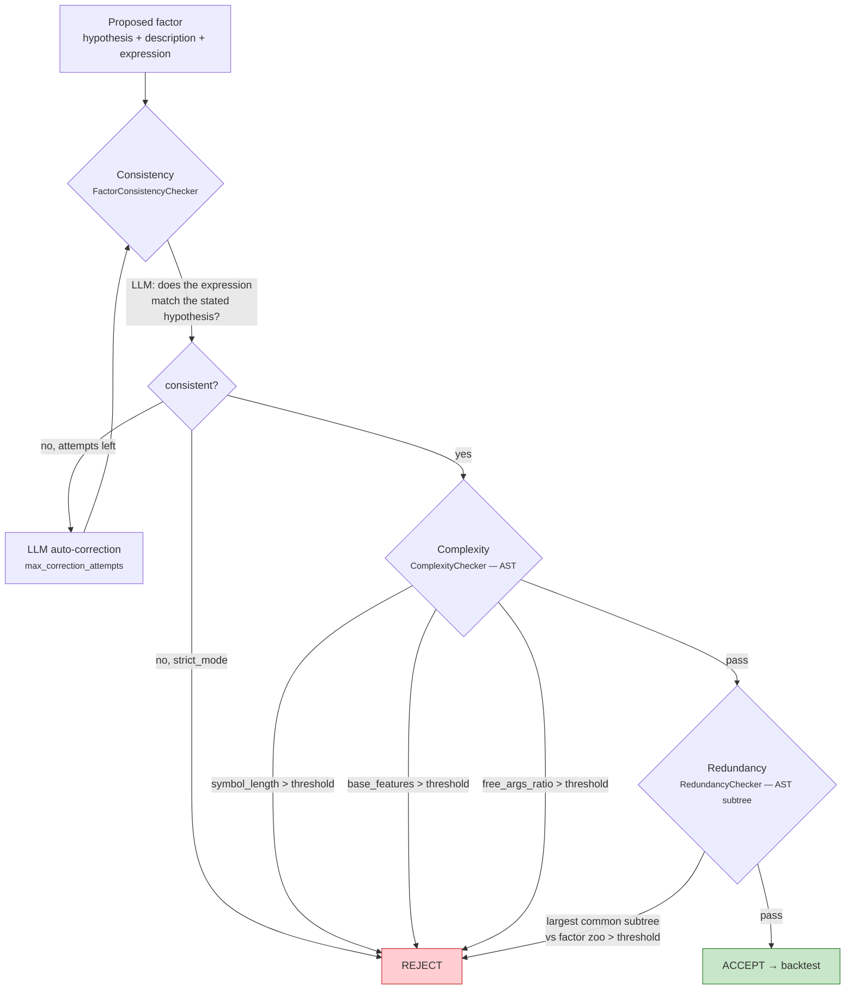

The composite score in the paper is:

$$R_g(f,h) = \alpha_1 \cdot SL + \alpha_2 \cdot PC + \alpha_3 \cdot ER$$

where **SL** = symbol length, **PC** = parameter/free-args count, **ER** = number of distinct base features.

### Threshold sources — they disagree, and precedence matters

| Threshold | `configs/experiment.yaml` | Code default (`factors/coder/config.py`) | `docs/experiment_hyperparameters.md` |
| :--- | :--- | :--- | :--- |
| `symbol_length_threshold` | **200** | 300 | 250 *(stale)* |
| `base_features_threshold` | **5** | 6 | 6 |
| `free_args_ratio_threshold` | **0.5** | — | 0.5 |
| `duplication threshold` | **5** | 8 | 5 |
| `factors_per_hypothesis` | **1** | — | 3 *(stale)* |

The YAML wins at runtime. Treat the hyperparameter doc as historical.

> `consistency_enabled` defaults to **false** in `configs/experiment.yaml` — it is the expensive check (one LLM call per factor, plus correction rounds). Complexity and redundancy are on.

---

## 11. CoSTEER — Self-Evolving Code Generation

CoSTEER is the inner evolutionary loop that turns a task description into working code, learning from a persistent knowledge base as it goes. It lives in `quantaalpha/coder/costeer/`.

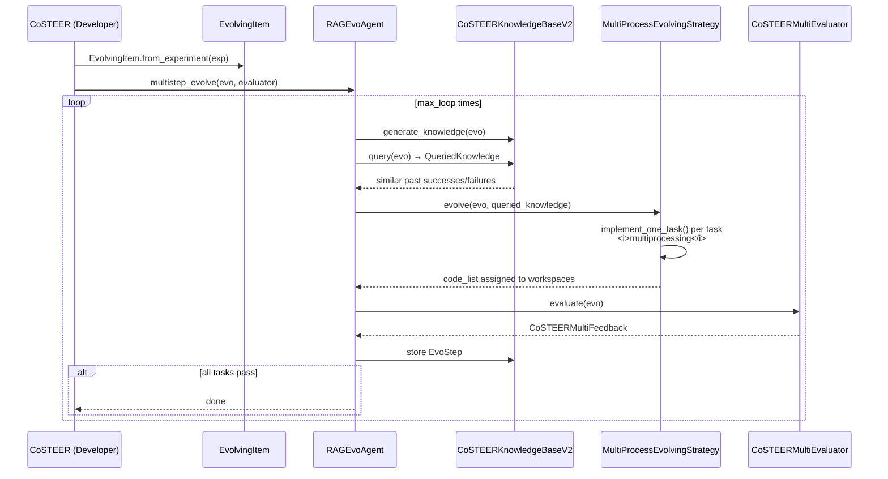

| File | Role |
| :--- | :--- |
| `coder/costeer/__init__.py` | `CoSTEER(Developer[Experiment])`, `load_or_init_knowledge_base` |
| `coder/costeer/evolvable_subjects.py` | `EvolvingItem` — bridges `Experiment` ↔ `EvolvableSubjects` |
| `coder/costeer/evolving_agent.py` | `FilterFailedRAGEvoAgent` |
| `coder/costeer/evolving_strategy.py` | `MultiProcessEvolvingStrategy` (abstract `implement_one_task`) |
| `coder/costeer/evaluators.py` | `CoSTEERSingleFeedback`, `CoSTEERMultiEvaluator` |
| `coder/costeer/knowledge_management.py` | Knowledge bases + RAG strategies. **V1 is deprecated and raises `NotImplementedError`** — use V2. |
| `coder/costeer/scheduler.py` | `random_select` |
| `coder/knowledge/vector_base.py` | `PDVectorBase`, `Document` |
| `coder/knowledge/graph.py` | `UndirectedGraph`, semantic dedup at 0.95/0.999, BFS `get_nodes_within_steps` |

### The three factor coders

`factors/qlib_coder.py` aliases three strategies — pick with `QLIB_FACTOR_CODER`:

| Alias | Class | Behaviour |
| :--- | :--- | :--- |
| `QlibFactorParser` | `FactorParser` | **Default.** Template-first: compile the DSL; fall back to LLM only if needed. |
| `QlibFactorCoSTEER` | `FactorCoSTEER` | Full CoSTEER evolutionary LLM codegen. |
| `QlibFactorCoder` | `FactorCoder` | Template-only, no LLM. |

---

## 12. Module Reference

### `quantaalpha/core/` — abstraction layer

Everything imports this; it imports nothing from the rest of the package.

| File | Key exports |
| :--- | :--- |
| `experiment.py` | `Task`, `Workspace`, `FBWorkspace`, `Experiment`, `Loader`, `WsLoader` |
| `proposal.py` | `Hypothesis`, `HypothesisFeedback`, `Trace`, `HypothesisGen`, `Hypothesis2Experiment`, `HypothesisExperiment2Feedback` |
| `developer.py` | `Developer` — the base for all coders/runners |
| `scenario.py` | `Scenario` |
| `evaluation.py` | `Feedback`, `Evaluator` |
| `evolving_framework.py` | `EvolvableSubjects`, `EvolvingStrategy`, `RAGStrategy`, `EvolvingKnowledgeBase`, `QueriedKnowledge`, `EvoStep` |
| `evolving_agent.py` | `EvoAgent`, `RAGEvoAgent.multistep_evolve` |
| `conf.py` | `ExtendedBaseSettings`, `RDAgentSettings`, `RD_AGENT_SETTINGS` |
| `utils.py` | **`import_class`**, `multiprocessing_wrapper`, `cache_with_pickle`, `SingletonBaseClass`, `parse_json`, `similarity` |
| `exception.py` | `CoderError`, `CodeFormatError`, `CustomRuntimeError`, `NoOutputError`, **`FactorEmptyError`**, `ModelEmptyError` |
| `prompts.py` | `Prompts(SingletonBaseClass, dict)` — YAML prompt loader |

> `core.evaluation` and `core.proposal` both re-export `Scenario`. Harmless, but confusing when tracing imports.

### `quantaalpha/factors/` — the primary domain

| File | Lines | Role |
| :--- | ---: | :--- |
| `proposal.py` | 662 | `AlphaAgentHypothesisGen`, `AlphaAgentHypothesis2FactorExpression` (holds `FactorRegulator` + lazy `FactorQualityGate`), `BacktestHypothesis2FactorExpression` |
| `feedback.py` | 410 | `AlphaAgentQlibFactorHypothesisExperiment2Feedback`, `process_results` |
| `runner.py` | 234 | `QlibFactorRunner(CachedRunner)`, `process_factor_data`, writes `combined_factors_df.parquet` |
| `library.py` | 343 | `FactorLibraryManager` — `add_factors_from_experiment`, `check_cache_status`, `warm_cache_from_json` |
| `experiment.py` | — | `QlibFactorExperiment`, `QlibAlphaAgentScenario` |
| `qlib_coder.py` | — | The three coder aliases |
| `qlib_utils.py` | — | `generate_data_folder_from_qlib`, `get_data_folder_intro`, `get_file_desc` |
| `workspace.py` | — | `QlibFBWorkspace` |
| `coder/factor.py` | 247 | `FactorTask`, `FactorFBWorkspace` — writes `factor.py`, links data folder, subprocess exec, reads `result.h5` |
| `coder/factor_ast.py` | 597 | AST parser + static metrics |
| `coder/expr_parser.py` | 378 | DSL → Python call-string compiler |
| `coder/function_lib.py` | 988 | All DSL runtime functions |
| `coder/evaluators.py` | 283 | `FactorEvaluatorForCoder`, `check_ast_regularization` |
| `coder/eva_utils.py` | 585 | 12 evaluators: value, code, correlation, row-count, index, inf, NaN, format, datetime, … |
| `coder/evolving_strategy.py` | 419 | `FactorMultiProcessEvolvingStrategy`, `FactorParsingStrategy`, `FactorRunningStrategy` |
| `regulator/factor_regulator.py` | 211 | `FactorRegulator(Evaluator)` — factor zoo management |
| `regulator/consistency_checker.py` | 454 | `FactorConsistencyChecker`, `ComplexityChecker`, `RedundancyChecker`, `FactorQualityGate` |
| `loader/pdf_loader.py` | 594 | Multi-stage LLM extraction from PDFs + K-means dedup |
| `data_template/generate.py` | — | Builds `daily_pv_all.h5` / `daily_pv_debug.h5` from Qlib |
| `prompts/prompts.yaml` | 34 KB | The bulk of the system's prompts |

### `quantaalpha/llm/`

`client.py` holds `APIBackend`, the single LLM entry point for the whole system.

| Feature | Detail |
| :--- | :--- |
| Canonical call | `build_messages_and_create_chat_completion(user_prompt, system_prompt, json_mode=...)` |
| Backends | OpenAI, Azure OpenAI, llama2, GCR endpoint |
| Caching | `SQliteLazyCache` (singleton) + `SessionChatHistoryCache` |
| Robust JSON | `robust_json_parse` — direct → ```json fence → balanced braces → LaTeX-escape repair → loose regex |
| JSON mode | `response_format={"type":"json_object"}`, auto-appends *"Please respond in json format."* on the specific `BadRequestError` |
| Per-caller models | `chat_model_map` keyed on the caller class name via `inspect.stack()[4]` — **fragile; changing call depth changes model selection** |
| Retry | `_try_create_chat_completion_or_embedding` |

`config.py` — `LLMSettings` (~40 fields), `LLM_SETTINGS` singleton.

### `quantaalpha/utils/`

| File | Role |
| :--- | :--- |
| `workflow.py` | `LoopMeta`, `LoopBase`, `LoopTrace` — see [§7](#7-the-loop-engine--loopmeta--loopbase) |
| `env.py` | `Env`/`LocalEnv`/`DockerEnv` hierarchy; **`QTDockerEnv`** is the local-or-Docker switch used by `factors/qlib_utils.py`; `QlibLocalEnv` runs `qrun conf.yaml` |
| `document_reader/` | PDF loaders (LangChain, Azure Document Intelligence) |
| `loader/experiment_loader.py` | `FactorExperimentLoader`, `ModelExperimentLoader` |
| `loader/task_loader.py` | `FactorTaskLoader`, `ModelTaskLoader`, `ModelWsLoader` |
| `agent/` | `tpl.py`, `ret.py`, `tpl.yaml` — **unused scaffolding**, no consumers outside itself |

### `quantaalpha/components/`

| File | Role |
| :--- | :--- |
| `proposal/__init__.py` | `LLMHypothesisGen` + `Factor`/`Model`/`FactorAndModel` variants, and the matching `Hypothesis2Experiment` classes |
| `runner/__init__.py` | `CachedRunner` — `get_cache_key` (md5 of task info), `assign_cached_result` |
| `benchmark/eval_method.py` | `TestCase`, `TestCases`, `BaseEval`, `FactorImplementEval`, `summarize_res` |
| `benchmark/example.json` | 3 sample factors with ground-truth code |

### `quantaalpha/app/`, `log/`, `docker/`

| Path | Role |
| :--- | :--- |
| `app/utils/health_check.py` | `check_docker`, `is_port_in_use`, `check_and_list_free_ports` |
| `app/utils/info.py` | `sys_info`, `python_info`, `docker_info`, `collect_info` |
| `app/benchmark/factor/` | `eval.py`, `analysis.py` (`BenchmarkAnalyzer`, `Plotter`) |
| `log/__init__.py` | `_AlphaAgentLoggerWrapper` around `rdagent_logger`; adds `log_trace_path` + `set_trace_path` |
| `log/time.py` | `measure_time` decorator |
| `docker/Dockerfile` | pytorch 2.2.1-cuda12.1-cudnn8-runtime; Qlib pinned to commit `c9ed050e` |

---

## 13. Cross-Module Dependency Graph


Read bottom-up: arrows point from a module to what it depends on. `core/` is the sink. The dashed red node is the **external** `rdagent` package — an unvendored dependency that several modules still reach into.

---

## 14. Standalone Backtest (V2)

There are **two distinct backtest paths** and confusing them costs hours:

| Path | Code | When |
| :--- | :--- | :--- |
| **In-loop backtest** | `factors/runner.py::QlibFactorRunner` | Step 4 of every mining loop. Validation set. Quick fitness signal. |
| **Standalone V2** | `quantaalpha/backtest/` | After mining. Full out-of-sample test set. What you report. |

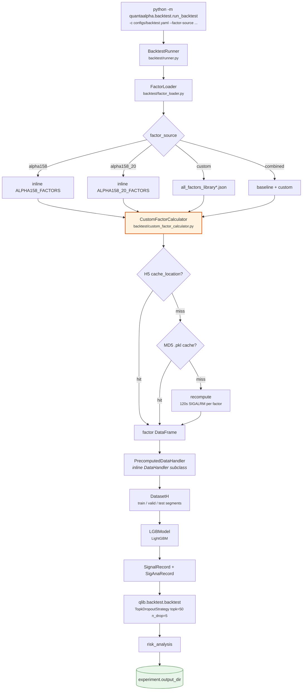

**The three-tier cache in `custom_factor_calculator.py` is the performance-critical path.** A cold run recomputes every factor with a 120-second per-factor timeout; a warm run reads H5. The frontend's `/api/v1/factors/warm-cache` endpoint pre-populates tier 2.

> `backtest/factor_calculator.py` is a **different, unused** module (it has an LLM fallback). `runner.py` uses `custom_factor_calculator.py`. Don't edit the wrong one.

---

## 15. Web Dashboard

`frontend-v2/` is a React + TypeScript SPA with a FastAPI backend. **The backend does not import the mining loop** — it shells out to the CLI and streams stdout.

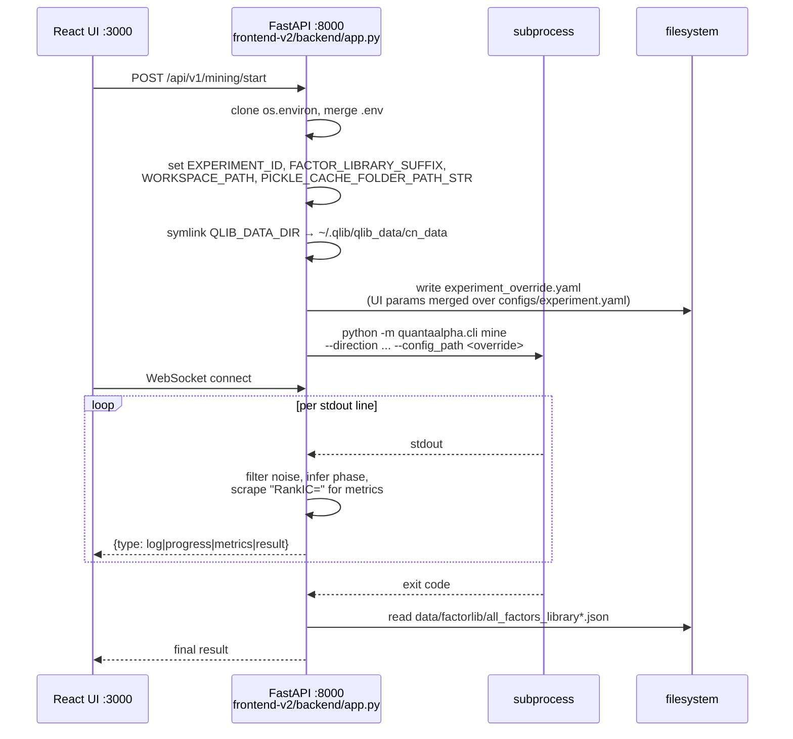

### Key API routes

| Method | Path | Purpose |
| :--- | :--- | :--- |
| `GET` | `/api/health` | Liveness |
| `POST` | `/api/v1/mining/start` | Launch a mining run as a subprocess |
| `GET` | `/api/v1/factors` | Paginated factor browse with quality/search filters |
| `GET` | `/api/v1/factors/libraries` | List `all_factors_library*.json` files |
| `GET` | `/api/v1/factors/cache-status` | → `FactorLibraryManager.check_cache_status` |
| `POST` | `/api/v1/factors/warm-cache` | → `FactorLibraryManager.warm_cache_from_json` |
| `GET` | `/api/v1/factors/{factor_id}` | Single factor detail |
| `POST` | `/api/v1/backtest/start` | Launch standalone backtest subprocess |
| `GET` | `/api/v1/backtest/{task_id}` | Backtest status/results |
| `DELETE` | `/api/v1/backtest/{task_id}` | `SIGTERM` the subprocess |
| `WS` | *(per task)* | Streams `log` / `progress` / `metrics` / `result` / `error` |

> **Route-ordering hazard:** `/api/v1/factors/cache-status` and `/api/v1/factors/libraries` **must** be registered before `/api/v1/factors/{factor_id}`, or FastAPI matches them as a `factor_id`. There's a comment in the source; preserve it if you add routes.

Only two touchpoints reach into the Python package — both are `FactorLibraryManager` calls. Everything else is subprocess + file I/O. That makes the frontend cheap to keep working when you refactor the backend, as long as you don't move the factor library JSON or change its schema.

### Task state is in memory

`tasks: Dict[str, Dict]` and `ws_connections` are module-level dicts. **Restarting the API server loses all task state**, and running multiple workers will break the dashboard.

---

## 16. Runtime Artifacts

| Artifact | Default path | Produced by |
| :--- | :--- | :--- |
| Factor library | `data/factorlib/all_factors_library[_suffix].json` | `AlphaAgentLoop.feedback` → `FactorLibraryManager` |
| Session snapshots | `<log_trace_path>/__session__/{loop}/{step}_{name}` | `LoopBase.dump` after every step |
| Workspaces | `$WORKSPACE_PATH` = `$DATA_RESULTS_DIR/workspace_$EXPERIMENT_ID` | `RD_AGENT_SETTINGS.workspace_path` (`core/conf.py:71-74`) |
| Pickle cache | `$PICKLE_CACHE_FOLDER_PATH_STR` = `$DATA_RESULTS_DIR/pickle_cache_$EXPERIMENT_ID` | `core/conf.py:81-84`, used by `cache_with_pickle` |
| Combined factor panel | `combined_factors_df.parquet` | `factors/runner.py` |
| Per-factor values | `<workspace>/result.h5` | `FactorFBWorkspace` subprocess |
| Trajectory pool | `trajectory_pool.json` | `TrajectoryPool` |
| Evolution state | controller state file | `EvolutionController.save_state` |
| Branch logs | `log/branch_{i}` | `execution.branch_log_root` / `branch_log_prefix` |
| Backtest results | `experiment.output_dir` in `configs/backtest.yaml` | `BacktestRunner` |

Env-var plumbing, end to end:

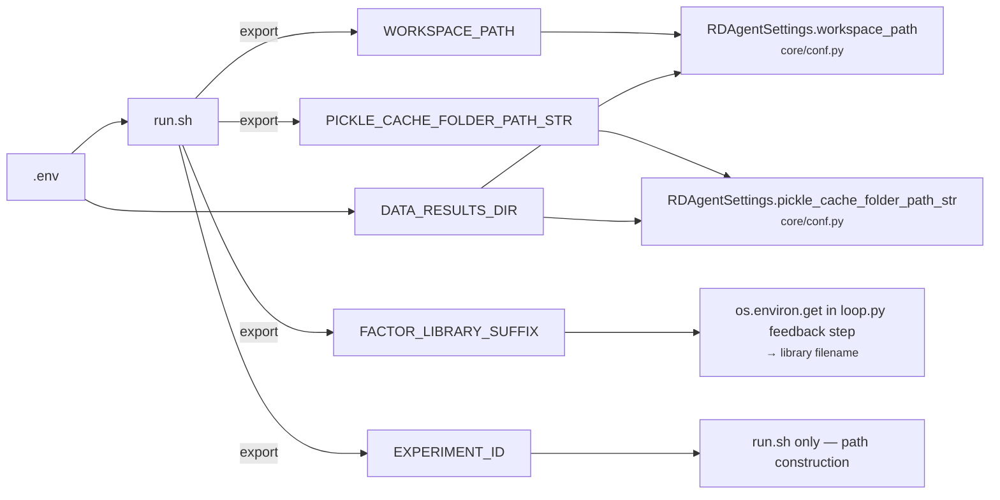

---

## 17. Configuration Reference

Three configuration systems coexist. Precedence: **env vars > YAML > pydantic defaults**.

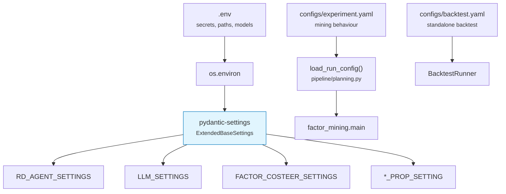

### `configs/experiment.yaml`

| Section | Keys |
| :--- | :--- |
| `planning` | `enabled`, `num_directions` (2), `max_attempts` (5), `use_llm`, `allow_fallback`, `prompt_file` |
| `execution` | `max_loops` (2), `steps_per_loop` (5, fixed), `step_n`, `use_local` (true), `parallel_execution`, `branch_log_root`, `branch_log_prefix` |
| `evolution` | `enabled`, `mutation_enabled`, `crossover_enabled`, `max_rounds` (3), `crossover_size` (2), `crossover_n` (2), `parallel_enabled`, `prefer_diverse_crossover`, `parent_selection_strategy` (`best`), `top_percent_threshold` (0.3), `fresh_start`, `cleanup_on_finish` |
| `quality_gate` | `consistency_enabled` (**false**), `complexity_enabled` (true), `redundancy_enabled` (true), `consistency_strict_mode`, `max_correction_attempts` (3) |
| `factor` | `factors_per_hypothesis` (1), `complexity.*`, `duplication.*` |
| `backtest` | `use_docker` (false), `timeout` (800), `qlib.config_name` (`conf_baseline.yaml`) |
| `llm` | `factor_mining_timeout`, `max_retries`, `retry_delay`, `json_mode_strict` |
| `logging` | `level`, `save_snapshots`, `save_trajectory_pool` |

`step_n` has the highest priority and overrides `max_loops × steps_per_loop`.

### `configs/backtest.yaml`

| Section | Notable values |
| :--- | :--- |
| `random_seed` | 42 |
| `factor_source` | `alpha158` \| `alpha158_20` \| `alpha360` \| `custom` \| `combined` |
| `data` | `provider_uri: ~/.qlib/qlib_data/cn_data`, `region: cn`, `market: csi300`, 2016-01-01 → 2025-12-26 |
| `dataset` | label `Ref($close,-2)/Ref($close,-1)-1`; learn/infer processors; train 2016–2020, valid 2021, test 2022–2025 |
| `model` | LightGBM — `learning_rate` 0.05, `max_depth` 8, `num_leaves` 210, `num_boost_round` 500, `early_stopping_round` 50 |
| `backtest` | `TopkDropoutStrategy(topk=50, n_drop=5)`, account 1e8, benchmark `SH000300`, open_cost 0.0005, close_cost 0.0015 |

### Resource cost

| Configuration | Tokens | Wall clock |
| :--- | :--- | :--- |
| 2 directions × 3 rounds × 3 factors | ~100K | 30–60 min |
| 3 × 5 × 5 | ~500K | 2–4 h |
| 5 × 10 × 5 | ~2M | 8–16 h |

---

## 18. How to Extend

| I want to… | Touch these |
| :--- | :--- |
| **Swap a pipeline stage** | One string in `pipeline/settings.py`, or the matching `QLIB_FACTOR_*` env var. Implement the `core/` ABC. |
| **Change how hypotheses are generated** | `factors/proposal.py::AlphaAgentHypothesisGen` + `factors/prompts/prompts.yaml` |
| **Add a DSL operator** | `factors/coder/expr_parser.py` (grammar) **+** `factors/coder/function_lib.py` (impl) **+** `factors/coder/factor_ast.py` (so the gate sees it) |
| **Change the generated `factor.py`** | `factors/coder/template.jinjia2` |
| **Add/modify a quality check** | `factors/regulator/consistency_checker.py`; thresholds in `configs/experiment.yaml` under `factor.complexity` |
| **Change the fitness metric** | `pipeline/evolution/trajectory.py::StrategyTrajectory.get_primary_metric` and `is_successful` |
| **Add an evolution operator** | New module in `pipeline/evolution/`, wire into `EvolutionController` phase machine. Follow the *prompt-suffix* convention. |
| **Change backtest model/strategy** | `configs/backtest.yaml` for the standalone path; `factors/factor_template/conf_baseline.yaml` for the in-loop path |
| **Add a factor evaluator** | `factors/coder/eva_utils.py`, register in `factors/coder/evaluators.py` |
| **Add a CLI command** | `quantaalpha/cli.py` — add to the `fire.Fire` dict |
| **Add a pipeline step** | Add a **public** method to `AlphaAgentLoop` (auto-discovered). Keep helpers `_`-prefixed. |
| **Change the LLM provider** | `.env` (`OPENAI_BASE_URL`, `CHAT_MODEL`) or `llm/config.py` |
| **Add an API route** | `frontend-v2/backend/app.py` — mind the route-ordering hazard in [§15](#15-web-dashboard) |

### Traps

1. **Public methods on loop classes become pipeline steps.** Prefix helpers with `_`.
2. **Loop state must be picklable** — a snapshot is written after every step.
3. **Two parsers, one syntax.** Adding an operator to only one of them fails silently in the other's domain.
4. **`chat_model_map` reads `inspect.stack()[4]`.** Wrapping or re-nesting `APIBackend` calls changes which model gets selected.
5. **Config disagreement.** `configs/experiment.yaml` overrides code defaults; `docs/experiment_hyperparameters.md` is stale and matches neither.
6. **Two backtest paths.** In-loop (`factors/runner.py`) vs standalone (`backtest/`). They use different configs and different factor calculators.

---

## 19. Known Issues and Dead Code

Catalogued while mapping the tree. Useful to know before you spend an afternoon debugging something that was never wired up.

| # | Location | Issue |
| :--- | :--- | :--- |
| 1 | `pipeline/factor_from_report.py:9` | Imports `quantaalpha.app.qlib_rd_loop.factor`, which does not exist in this tree (`app/` contains only `benchmark/` and `utils/`). The module cannot import. Also not registered in `cli.py`. Leftover from the pre-rename AlphaAgent layout. |
| 2 | `utils/env.py` | `QlibDockerConf.dockerfile_folder_path` → `quantaalpha/scenarios/qlib/docker`, which doesn't exist; the real Dockerfile is `quantaalpha/docker/Dockerfile`. The build branch is guarded by `.exists()`, so it silently no-ops and falls through to an image pull. |
| 3 | `components/benchmark/conf.py:24` | `bench_method_cls` defaults to `"rdagent.components.coder.factor_coder.FactorCoSTEER"` — an **upstream** path. Override with `BENCHMARK_BENCH_METHOD_CLS`. Also uses pydantic-v1-style `class Config` rather than `model_config`. |
| 4 | `app/benchmark/model/eval.py` | References `components/coder/model_coder/benchmark`, absent from this tree. |
| 5 | `utils/loader/experiment_loader.py` | `ModelExperimentLoader(Loader[FactorExperiment])` — copy-paste bug, wrong type parameter. |
| 6 | `backtest/factor_calculator.py` | Orphan. Exported by `backtest/__init__.py` but unused; `runner.py` uses `custom_factor_calculator.py`. |
| 7 | `utils/agent/{ret.py,tpl.py,tpl.yaml}` | Scaffolding with no consumers outside itself. |
| 8 | `factors/feedback.py` | `QlibModelHypothesisExperiment2Feedback` references `feedback_prompts["model_feedback_generation"]`, not loaded in that file. |
| 9 | `factors/coder/expr_parser.py::parse_expression` | Prints the preprocessed expression to stdout — leftover debug artifact, noisy in logs. |
| 10 | `factors/coder/test.py` | References `template_debug.jinjia2`, which doesn't exist alongside it. |
| 11 | `factors/prompts/experiment.yaml` | Likely a stale local copy; `experiment.py` pulls those prompts from rdagent templates instead. |
| 12 | `coder/costeer/knowledge_management.py` | `CoSTEERKnowledgeBaseV1` / `CoSTEERRAGStrategyV1` are deprecated and raise `NotImplementedError`. Use V2. |
| 13 | `docs/experiment_hyperparameters.md` | Stale throughout — documents `运行实验.sh`, `alphaagent/app/qlib_rd_loop/run_config.yaml`, and `alphaagent/scenarios/...` paths that no longer exist, plus defaults that disagree with `configs/experiment.yaml`. |
| 14 | package-wide | Hard runtime dependency on the external **`rdagent`** package (`log/__init__.py`, `factors/experiment.py`, `factors/workspace.py`, `contrib/model/experiment.py`, `components/runner/__init__.py`). Since `core/` imports `log/`, losing `rdagent` breaks essentially the whole package. |

> Items 1, 2, 4, and 13 all trace to the same incomplete rename from `alphaagent`/`rdagent` to `quantaalpha`. If you're cleaning up, do them together.

---

## 20. Glossary

| Term | Meaning |
| :--- | :--- |
| **Alpha factor** | A formula over market data whose cross-sectional ranking predicts future returns |
| **RankIC** | Spearman correlation between factor rank and forward-return rank. The primary fitness metric. |
| **IC** | Pearson version of the above |
| **ICIR / IR** | Information ratio — mean IC divided by its standard deviation |
| **Trajectory** | One complete mining run: hypothesis → factors → backtest → feedback. The unit of evolution. |
| **CoSTEER** | The self-evolving code-generation subsystem — generate → query knowledge → evolve → evaluate |
| **Factor zoo** | Reference set of known factors (e.g. Alpha101) used for redundancy checking |
| **Quality gate** | Consistency + complexity + redundancy checks run before backtest |
| **Scenario** | A `core/scenario.py` object bundling background, data description, and output spec for the LLM |
| **Trace** | Append-only history of `(hypothesis, experiment, feedback)` triples fed back into the proposer |
| **Workspace** | A directory holding one generated `factor.py` plus its `result.h5` output |
| **Qlib** | Microsoft's quantitative investment platform — provides data, model training, and backtest |

---

*Map of the `quantaalpha/` backend. If you change the wiring in `pipeline/settings.py`, the loop steps in `pipeline/loop.py`, or the DSL in `factors/coder/`, update the corresponding section here.*
