# QuantaAlpha — Backend Developer Guide

> 📄 **Paper:** [QuantaAlpha: An Evolutionary Framework for LLM-Driven Alpha Mining](https://arxiv.org/abs/2602.07085) — Han et al., 2026 · arXiv:2602.07085 (q-fin.ST) · local source [`paper/Paper.tex`](paper/Paper.tex)

[](https://arxiv.org/abs/2602.07085)
[](https://www.python.org/)
[](https://github.com/microsoft/qlib)
[](#20-reproducing-the-paper-results)
[](#20-reproducing-the-paper-results)

> A structural and connection map of the `quantaalpha/` Python backend, written for people who are about to **modify** it.
>
> For installation and first-run basics see [`README.md`](README.md). For experiment tuning see [`docs/user_guide.md`](docs/user_guide.md). This document covers what those don't: how the pieces are wired to each other, where the extension points are, and what will surprise you.
>
> 🔗 Every code reference is a clickable **local** link (e.g. [`quantaalpha/pipeline/loop.py:50`](quantaalpha/pipeline/loop.py#L50)) — **Cmd-click** it in the editor, or click it in the markdown preview, to open that file in a new tab in VS Code; a trailing `#L…` jumps straight to the line. None of the code links point to GitHub — they all resolve to files in *this* repo.

---

## Table of Contents

- [1. What This System Is](#1-what-this-system-is)
- [2. Quick Start](#2-quick-start)
- [3. System Architecture](#3-system-architecture)
- [4. Entry Points](#4-entry-points)
- [5. The Mining Loop](#5-the-mining-loop)
- [6. Component Wiring — The Plugin System](#6-component-wiring--the-plugin-system)
- [7. The Loop Engine — `LoopMeta` / `LoopBase`](#7-the-loop-engine--loopmeta--loopbase)
- [8. The Evolution System](#8-the-evolution-system)
- [9. The Factor Expression DSL](#9-the-factor-expression-dsl)
- [10. The Quality Gate](#10-the-quality-gate)
- [11. CoSTEER — Self-Evolving Code Generation](#11-costeer--self-evolving-code-generation)
- [12. Module Reference](#12-module-reference)
- [13. Cross-Module Dependency Graph](#13-cross-module-dependency-graph)
- [14. Standalone Backtest (V2)](#14-standalone-backtest-v2)
- [15. Runtime Artifacts](#15-runtime-artifacts)
- [16. Configuration Reference](#16-configuration-reference)
- [17. How to Extend](#17-how-to-extend)
- [18. Known Issues and Dead Code](#18-known-issues-and-dead-code)
- [19. Glossary](#19-glossary)
- [20. Reproducing the Paper Results](#20-reproducing-the-paper-results)
- [21. Citation](#21-citation)

---

## 1. What This System Is

QuantaAlpha is an **LLM-driven, self-evolving alpha-factor mining agent** built on top of Microsoft [Qlib](https://github.com/microsoft/qlib). You give it a research direction in natural language; it autonomously proposes hypotheses, writes factor expressions in a custom DSL, compiles and executes them against price/volume data, backtests them, reads its own results, and evolves the next generation of hypotheses.

| | |
| :--- | :--- |
| **Paper** | [arXiv:2602.07085](https://arxiv.org/abs/2602.07085) — *QuantaAlpha: An Evolutionary Framework for LLM-Driven Alpha Mining* · local source [`paper/Paper.tex`](paper/Paper.tex) |
| **Lineage** | Fork/rebrand of Microsoft **RD-Agent**; borrows from **AlphaAgent** (KDD 2025). Class names like `AlphaAgentLoop` are a leftover of this. |
| **Runtime dep** | The external `rdagent` package is still imported at runtime (see [§18](#18-known-issues-and-dead-code)) |
| **Python** | ≥ 3.10 |
| **Headline result** | CSI 300, 2022–2025 test period: IC **0.0472**, Rank IC **0.0459**, ARR **4.68%**, IR **0.6453**, MDD **11.80%** |
| **Primary fitness metric** | **RankIC** — a trajectory is "successful" when RankIC > 0 |

The core intellectual loop is five steps, repeated:

```
propose → construct → calculate → backtest → feedback
```

...wrapped in an outer **evolutionary** loop that mutates and crosses over whole strategy trajectories.

---

## 2. Quick Start

### Install

```bash
git clone https://github.com/QuantaAlpha/QuantaAlpha.git
cd QuantaAlpha
conda create -n quantaalpha python=3.10
conda activate quantaalpha
SETUPTOOLS_SCM_PRETEND_VERSION=0.1.0 pip install -e .
pip install -r requirements.txt
```

### Data

Two datasets are required, both on [HuggingFace](https://huggingface.co/datasets/QuantaAlpha/qlib_csi300):

| File | Purpose |
| :--- | :--- |
| `cn_data.zip` | Raw Qlib market data (A-shares, 2016–2025). Needed for Qlib init and **backtest**. |
| `daily_pv.h5` | Pre-computed price/volume panel. Needed for **factor mining**. |
| `daily_pv_debug.h5` | Smaller debug subset. Needed for mining in debug mode. |

```bash
unzip hf_data/cn_data.zip -d ./data/qlib

mkdir -p git_ignore_folder/factor_implementation_source_data
mkdir -p git_ignore_folder/factor_implementation_source_data_debug
cp hf_data/daily_pv.h5        git_ignore_folder/factor_implementation_source_data/daily_pv.h5
cp hf_data/daily_pv_debug.h5  git_ignore_folder/factor_implementation_source_data_debug/daily_pv.h5
```

> The debug file **must be renamed to `daily_pv.h5`** in the debug folder. Both folder paths come from `FactorCoSTEERSettings.data_folder` / `.data_folder_debug` in [`quantaalpha/factors/coder/config.py:10-14`](quantaalpha/factors/coder/config.py#L10-L14) and are overridable via `FACTOR_CoSTEER_DATA_FOLDER` / `FACTOR_CoSTEER_DATA_FOLDER_DEBUG`.

The system *can* generate `daily_pv.h5` itself from Qlib data ([`quantaalpha/factors/data_template/generate.py`](quantaalpha/factors/data_template/generate.py)), but it is slow — downloading is strongly preferred.

> ⚠️ **Feature-set divergence from the paper — read before mining.** The paper mines over six basic features: **open / high / low / close / volume / vwap**. The mining code does **not** use `$vwap`: [`generate.py`](quantaalpha/factors/data_template/generate.py) pulls only OHLCV and computes `$return = close.pct_change()` as the sixth feature, and the mining prompts ([`factors/prompts/prompts.yaml`](quantaalpha/factors/prompts/prompts.yaml)) advertise `$return` (line 352: "base features … $close, $open, $high, $low, $volume, $return"; line 426: "$return: daily return of the stock"). The HF `daily_pv.h5` ships with columns `[$open, $close, $high, $low, $volume, $factor]` — it has `$factor` (adjustment factor), **not** `$vwap` and **not** `$return`, so it is **stale** relative to [`generate.py`](quantaalpha/factors/data_template/generate.py). Consequence: a `$return`-based factor `SyntaxError`s at execution because `$return` isn't in the panel. Fix before mining: either run [`generate.py`](quantaalpha/factors/data_template/generate.py) (adds `$return`), or patch the downloaded file with `df['$return'] = df.groupby(level='instrument')['$close'].pct_change().fillna(0)` and atomic-save. The standalone **backtest** path is fine either way — it loads `$vwap` from Qlib *and* derives `$return` ([`backtest/custom_factor_calculator.py:579,85-86`](quantaalpha/backtest/custom_factor_calculator.py#L579)), so it supports both. But the mined pool is built over `$return`, not the paper's `$vwap`. See [§20.5](#205-reproducibility-caveats--discrepancies) #8 for the full impact and the paper-faithful fix.

### Configure

```bash
cp configs/.env.example .env
```

Minimum viable [`.env`](.env):

```bash
QLIB_DATA_DIR=./data/qlib/cn_data     # must contain calendars/ features/ instruments/
DATA_RESULTS_DIR=./data/results
OPENAI_API_KEY=...
OPENAI_BASE_URL=https://your-provider/v1
CHAT_MODEL=deepseek-v3
REASONING_MODEL=deepseek-v3
```

### Run

```bash
./run.sh "price-volume factor mining"           # mine
./run.sh "microstructure factors" "exp_micro"   # mine, with factor-library suffix

python -m quantaalpha.backtest.run_backtest \
  -c configs/backtest.yaml --factor-source custom \
  --factor-json all_factors_library.json        # standalone backtest
```

> **Reproducing the paper's reported numbers** is a two-stage pipeline (mine with GPT-5.2 at paper scale → standalone-backtest the mined library). See [§20](#20-reproducing-the-paper-results) for the exact commands, the Alpha158(20) seed, and whether the out-of-sample backtest includes LightGBM training and the trading strategy.

---

## 3. System Architecture

The backend is a layered stack. Each layer only depends on layers below it; `llm/`, `utils/`, and `log/` are cross-cutting and used by everything.

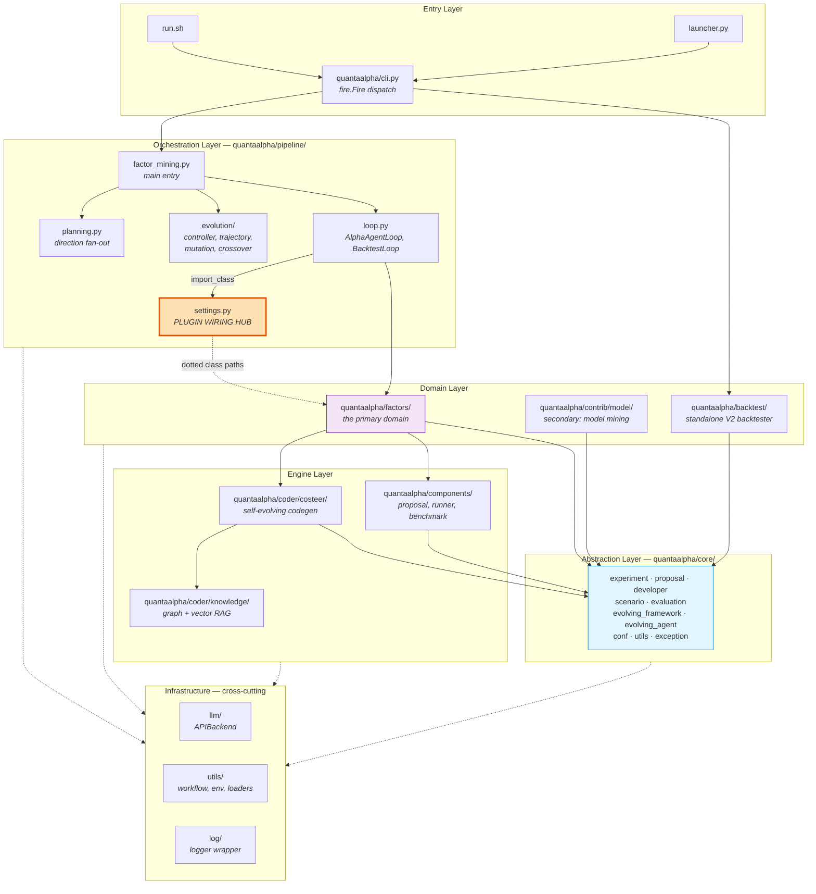

**The single most important box is [`pipeline/settings.py`](quantaalpha/pipeline/settings.py).** It holds dotted class-path strings that are resolved at runtime. Swapping any pipeline stage means editing one string — not editing the loop.

---

### System architecture — in depth

The stack is arranged so that **dependencies only ever point downward**, and [`quantaalpha/core/`](quantaalpha/core/experiment.py) is the sink. `core/` defines the abstract vocabulary — `Task`, `Workspace`, `Experiment`, `Hypothesis`, `Trace`, `Developer`, `Scenario`, `Evaluator`, and the evolving-framework ABCs — and imports nothing from the layers above it (only `RD_AGENT_SETTINGS` flows in). Everything above is a concrete realization of those abstractions. This inversion is exactly what makes the plugin system ([§6](#6-component-wiring--the-plugin-system)) possible: the orchestration layer stores *class-path strings*, not imports, so a stage can be replaced without the loop ever naming the implementation.

Reading the layers top to bottom:

- **Entry** — [`run.sh`](run.sh) / [`launcher.py`](launcher.py) prepare the environment and hand off to [`cli.py`](quantaalpha/cli.py), a four-command `fire.Fire` dispatcher ([§4](#4-entry-points)).
- **Orchestration** ([`pipeline/`](quantaalpha/pipeline/loop.py)) owns control flow: [`factor_mining.py`](quantaalpha/pipeline/factor_mining.py) is the driver, [`loop.py`](quantaalpha/pipeline/loop.py) the five-step state machine, [`settings.py`](quantaalpha/pipeline/settings.py) the wiring hub, [`planning.py`](quantaalpha/pipeline/planning.py) the direction fan-out, and [`evolution/`](quantaalpha/pipeline/evolution/controller.py) the trajectory-level search.
- **Domain** — [`factors/`](quantaalpha/factors/proposal.py) is the primary domain (the paper's four components); [`contrib/model/`](quantaalpha/contrib/model/experiment.py) is a secondary model-mining path; [`backtest/`](quantaalpha/backtest/runner.py) is the standalone out-of-sample tester ([§14](#14-standalone-backtest-v2)).
- **Engine** — [`coder/costeer/`](quantaalpha/coder/costeer/__init__.py) (self-evolving codegen, [§11](#11-costeer--self-evolving-code-generation)), [`coder/knowledge/`](quantaalpha/coder/knowledge/graph.py) (graph + vector RAG), and [`components/`](quantaalpha/components/runner/__init__.py) (proposal / runner / benchmark base classes).
- **Infrastructure** (cross-cutting) — [`llm/`](quantaalpha/llm/client.py) (the single `APIBackend`), [`utils/`](quantaalpha/utils/workflow.py) (`LoopBase`, env, loaders), [`log/`](quantaalpha/log/__init__.py). Every layer depends on these.

One wrinkle breaks the otherwise-clean layering: the external **`rdagent`** package. `core`'s logger wraps `rdagent_logger`, and several domain files import rdagent templates directly ([§13](#13-cross-module-dependency-graph), [§18](#18-known-issues-and-dead-code) #14). So while the *internal* graph is acyclic and core-sinking, the whole tree sits on an un-vendored external dependency — lose `rdagent` and essentially everything stops importing.

## 4. Entry Points

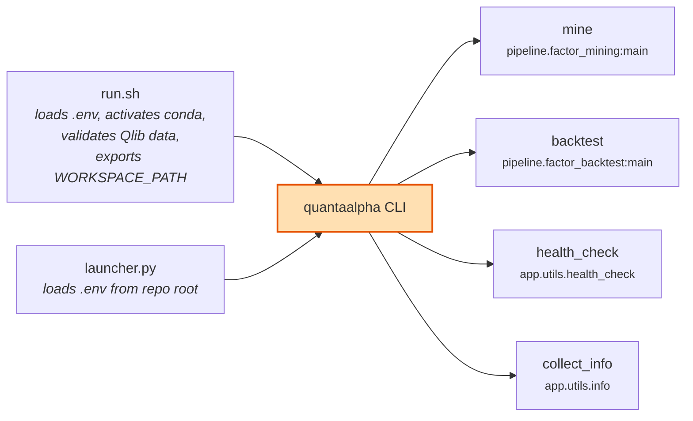

[`quantaalpha/cli.py`](quantaalpha/cli.py) is the complete public surface — four commands, dispatched by [`fire`](https://github.com/google/python-fire):

```python
def app():
    fire.Fire({
        "mine": mine,
        "backtest": backtest,
        "health_check": health_check,
        "collect_info": collect_info,
    })
```

> **Note:** [`pipeline/factor_from_report.py`](quantaalpha/pipeline/factor_from_report.py) (mine factors out of PDF research reports) is **not registered here** and does not currently import — see [§18](#18-known-issues-and-dead-code).

### What [`run.sh`](run.sh) does beyond calling the CLI

| Step | Effect |
| :--- | :--- |
| Loads [`.env`](.env) | `set -a; source .env; set +a` — exports everything |
| Activates conda | `$CONDA_ENV_NAME`, default `quantaalpha` |
| Generates `EXPERIMENT_ID` | `exp_YYYYmmdd_HHMMSS` unless already set |
| Exports `WORKSPACE_PATH` | `$DATA_RESULTS_DIR/workspace_$EXPERIMENT_ID` |
| Exports `PICKLE_CACHE_FOLDER_PATH_STR` | `$DATA_RESULTS_DIR/pickle_cache_$EXPERIMENT_ID` |
| Validates Qlib data | Requires `calendars/`, `features/`, `instruments/` |
| Symlinks Qlib data | `$QLIB_DATA_DIR` → `~/.qlib/qlib_data/cn_data` |
| Exports `FACTOR_LIBRARY_SUFFIX` | From `$2`, controls output JSON filename |

`EXPERIMENT_ID=shared` is a special value that **skips** workspace/cache isolation.

---

### Entry points — in depth

[`cli.py`](quantaalpha/cli.py) is the entire public surface. `app()` ([`quantaalpha/cli.py:29`](quantaalpha/cli.py#L29)) hands a four-key dict to [`fire.Fire`](https://github.com/google/python-fire), which turns each key into a subcommand: `mine` → [`pipeline.factor_mining:main`](quantaalpha/pipeline/factor_mining.py#L515), `backtest` → `pipeline.factor_backtest:main` (the **loop-based** `BacktestLoop`, which is *not* the standalone `backtest/` package of [§14](#14-standalone-backtest-v2)), plus `health_check` and `collect_info`. Note the module docstring still advertises a `ui` command — that key is **not** in the dict, so it is a stale leftover, not a real command.

Two things call into `cli.app`. [`launcher.py`](launcher.py) loads `.env` from the repo root (python-dotenv) and calls `cli.app` directly — the minimal Python entry. [`run.sh`](run.sh) is the shell wrapper that does the real environment setup: it `set -a; source .env; set +a` to export every variable, activates the `$CONDA_ENV_NAME` env, generates a timestamped `EXPERIMENT_ID` when one isn't already set, derives and exports `WORKSPACE_PATH` / `PICKLE_CACHE_FOLDER_PATH_STR` from `$DATA_RESULTS_DIR` + `EXPERIMENT_ID`, validates that the Qlib data directory holds `calendars/` / `features/` / `instruments/`, symlinks it into `~/.qlib/qlib_data/cn_data`, and finally runs `quantaalpha mine --direction "$1" --config_path "${CONFIG_PATH:-configs/experiment.yaml}"`. The **second positional argument** becomes `FACTOR_LIBRARY_SUFFIX`, which the loop's `feedback` step appends to the output library filename ([§15](#15-runtime-artifacts)).

The `EXPERIMENT_ID=shared` sentinel is the one branch that skips per-run isolation: instead of each invocation getting its own `workspace_<id>` and `pickle_cache_<id>` directories, everything shares one pair. Set it when you deliberately want to reuse a warm factor cache across runs; leave it unset for clean, reproducible, isolated experiments.

## 5. The Mining Loop

`AlphaAgentLoop` in [`quantaalpha/pipeline/loop.py`](quantaalpha/pipeline/loop.py) defines exactly five steps. They run cyclically, and a full session snapshot is pickled after every single one.

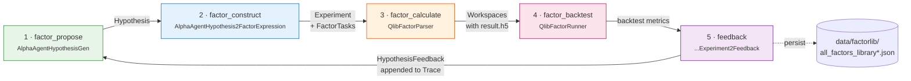

### Step by step

```mermaid
sequenceDiagram
    participant Loop as AlphaAgentLoop
    participant Gen as HypothesisGen
    participant H2E as Hypothesis2Experiment
    participant Gate as FactorQualityGate
    participant Coder as QlibFactorParser
    participant WS as FactorFBWorkspace
    participant Runner as QlibFactorRunner
    participant Sum as Summarizer
    participant Trace as Trace

    Loop->>Gen: factor_propose(trace)
    Gen->>Gen: LLM call w/ direction<br/>+ evolution prompt suffix
    Gen-->>Loop: Hypothesis

    Loop->>H2E: factor_construct(hypothesis)
    H2E->>H2E: LLM → factor expressions (DSL)
    H2E->>Gate: consistency / complexity / redundancy
    Gate-->>H2E: accept / correct / reject
    H2E-->>Loop: QlibFactorExperiment(sub_tasks)

    Loop->>Coder: factor_calculate(exp)
    Coder->>Coder: compile DSL → Python
    Coder->>WS: write factor.py, link data folder
    WS->>WS: subprocess exec → result.h5
    WS-->>Coder: values + feedback
    Coder-->>Loop: exp with populated workspaces

    Loop->>Runner: factor_backtest(exp)
    Runner->>Runner: combine factors → parquet<br/>run Qlib workflow
    Runner-->>Loop: metrics (RankIC, IC, ...)

    Loop->>Sum: feedback(exp, trace)
    Sum->>Sum: LLM analyses results
    Sum-->>Trace: append (hypothesis, exp, feedback)
    Loop->>Loop: persist to factor library JSON
```

**Error handling is part of the control flow**, not an afterthought:

| Exception | Behaviour in `LoopBase.run()` |
| :--- | :--- |
| `FactorEmptyError` (via `skip_loop_error`) | Log warning, **advance loop index**, reset to step 0 |
| `CoderError` | Log warning, **reset to step 0 of the same loop** (retry) |
| anything else | Propagates and kills the run |

---

### Mining loop — in depth

**[`pipeline/loop.py`](quantaalpha/pipeline/loop.py) — `AlphaAgentLoop`.** `class AlphaAgentLoop(LoopBase, metaclass=LoopMeta)` ([`quantaalpha/pipeline/loop.py:50`](quantaalpha/pipeline/loop.py#L50)) with `skip_loop_error = (FactorEmptyError,)`. `__init__` ([`quantaalpha/pipeline/loop.py:54`](quantaalpha/pipeline/loop.py#L54)) `import_class`-resolves scen/hypothesis_gen/hypothesis2experiment/coder/runner/summarizer, appends `strategy_suffix` to `potential_direction`, and sets the module-global `STOP_EVENT` ([`quantaalpha/pipeline/loop.py:129`](quantaalpha/pipeline/loop.py#L129)). The five step methods (collected in definition order by `LoopMeta`): `factor_propose` ([`quantaalpha/pipeline/loop.py:143`](quantaalpha/pipeline/loop.py#L143), calls `hypothesis_generator.gen(self.trace)`), `factor_construct` ([`quantaalpha/pipeline/loop.py:153`](quantaalpha/pipeline/loop.py#L153), `factor_constructor.convert(prev_out["factor_propose"], self.trace)`), `factor_calculate` ([`quantaalpha/pipeline/loop.py:162`](quantaalpha/pipeline/loop.py#L162), `coder.develop(prev_out["factor_construct"])`), `factor_backtest` ([`quantaalpha/pipeline/loop.py:172`](quantaalpha/pipeline/loop.py#L172), `runner.develop(..., use_local=...)`, raises `FactorEmptyError` if None at [`quantaalpha/pipeline/loop.py:177`](quantaalpha/pipeline/loop.py#L177)), and `feedback` ([`quantaalpha/pipeline/loop.py:186`](quantaalpha/pipeline/loop.py#L186), `summarizer.generate_feedback(...)`, appends to `self.trace.hist`, and auto-saves to `FactorLibraryManager` at [`quantaalpha/pipeline/loop.py:194`](quantaalpha/pipeline/loop.py#L194)). `_get_trajectory_data()` ([`quantaalpha/pipeline/loop.py:251`](quantaalpha/pipeline/loop.py#L251)) is **intentionally underscore-prefixed** so `LoopMeta` does not register it as a step — it's the accessor the evolution controller reads. [`BacktestLoop`](quantaalpha/pipeline/loop.py#L273) overrides the first four steps and replaces `feedback` with `stop` ([`quantaalpha/pipeline/loop.py:346`](quantaalpha/pipeline/loop.py#L346), which calls `exit(0)`); its `coder` is built `with_feedback=False, with_knowledge=False`. A third loop class, [`FactorReportLoop`](quantaalpha/pipeline/factor_from_report.py#L104) (mine factors out of PDF research reports), does exist — and it is the one place in the codebase that sets `self.steps` explicitly ([`quantaalpha/pipeline/factor_from_report.py:119`](quantaalpha/pipeline/factor_from_report.py#L119)) instead of letting `LoopMeta` auto-discover them — but the module is **dead**: its top-level `from quantaalpha.app.qlib_rd_loop.factor import FactorRDLoop` ([`quantaalpha/pipeline/factor_from_report.py:9`](quantaalpha/pipeline/factor_from_report.py#L9)) imports a path that does not exist in this tree, so the file cannot be imported and no CLI command registers it (see [§18](#18-known-issues-and-dead-code) #1).

**[`pipeline/factor_mining.py`](quantaalpha/pipeline/factor_mining.py) — the CLI driver.** `main()` ([`quantaalpha/pipeline/factor_mining.py:515`](quantaalpha/pipeline/factor_mining.py#L515), `@force_timeout`) loads `run_cfg = load_run_config(config_path)` ([`quantaalpha/pipeline/factor_mining.py:549`](quantaalpha/pipeline/factor_mining.py#L549), default [`configs/experiment.yaml`](configs/experiment.yaml)), splits it into planning/execution/evolution/quality_gate, and resolves `use_evolution`. The **`step_n`/`max_loops` logic** at [`quantaalpha/pipeline/factor_mining.py:560`](quantaalpha/pipeline/factor_mining.py#L560) — if `step_n` is unset, `step_n = max_loops * steps_per_loop` (max_loops default 10, steps_per_loop default 5) — only matters in **non-evolution** mode; in evolution mode each task is run with `step_n = steps_per_loop` ([`quantaalpha/pipeline/factor_mining.py:437`](quantaalpha/pipeline/factor_mining.py#L437) and [`quantaalpha/pipeline/factor_mining.py:477`](quantaalpha/pipeline/factor_mining.py#L477)), so `max_rounds` (not `step_n`) controls total work. `run_evolution_loop` ([`quantaalpha/pipeline/factor_mining.py:318`](quantaalpha/pipeline/factor_mining.py#L318)) disables `use_file_lock` ([`quantaalpha/pipeline/factor_mining.py:331`](quantaalpha/pipeline/factor_mining.py#L331)), generates directions via `generate_parallel_directions`, builds `EvolutionConfig`/`EvolutionController`, and runs either the parallel branch (`get_all_tasks_for_current_phase` → `_run_tasks_parallel` → `create_trajectory_from_loop_result` → `advance_phase_after_parallel_completion`, [`quantaalpha/pipeline/factor_mining.py:419`](quantaalpha/pipeline/factor_mining.py#L419)–`458`) or the serial branch (`get_next_task` → `_run_evolution_task`, [`quantaalpha/pipeline/factor_mining.py:460`](quantaalpha/pipeline/factor_mining.py#L460)–`496`). `_run_evolution_task` ([`quantaalpha/pipeline/factor_mining.py:115`](quantaalpha/pipeline/factor_mining.py#L115)) constructs an `AlphaAgentLoop` with the evolution provenance fields (phase/direction_id/round_idx/parent_trajectories) and returns `model_loop._get_trajectory_data()`.

**[`pipeline/planning.py`](quantaalpha/pipeline/planning.py) — diversified directions.** `generate_parallel_directions` ([`quantaalpha/pipeline/planning.py:69`](quantaalpha/pipeline/planning.py#L69)) formats the `system`/`user`/`output_format` prompts with `{initial_direction}` and `{n}`, calls the LLM with `json_mode=False` ([`quantaalpha/pipeline/planning.py:95`](quantaalpha/pipeline/planning.py#L95)), parses `data["directions"]` via `_parse_directions` ([`quantaalpha/pipeline/planning.py:38`](quantaalpha/pipeline/planning.py#L38)), and on parse failure appends `"Strictly output valid JSON…"` and retries up to `max_attempts`; the final fallback is `_fallback_directions` ([`quantaalpha/pipeline/planning.py:51`](quantaalpha/pipeline/planning.py#L51)), a deterministic 8-pattern template (momentum/volatility/liquidity/sector-neutral/reversal/fundamental/calendar/risk-adjusted) whose base defaults to `"market microstructure"` ([`quantaalpha/pipeline/planning.py:52`](quantaalpha/pipeline/planning.py#L52)).

## 6. Component Wiring — The Plugin System

This is the mechanism you will use most when modifying the system.

[`quantaalpha/pipeline/settings.py`](quantaalpha/pipeline/settings.py) declares components as **dotted class-path strings**. `AlphaAgentLoop.__init__` resolves them at runtime with `quantaalpha.core.utils.import_class`. There are **no hardcoded imports** of the implementation classes in [`loop.py`](quantaalpha/pipeline/loop.py).

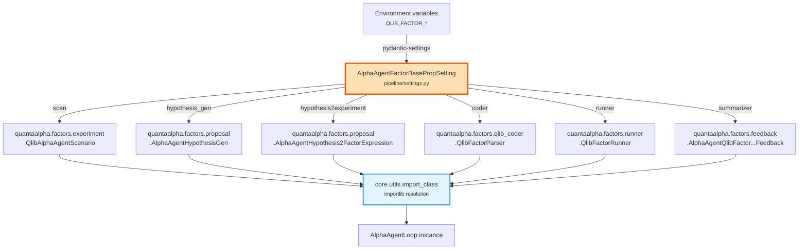

### The five setting singletons

| Singleton | Class | Env prefix | Used by |
| :--- | :--- | :--- | :--- |
| `ALPHA_AGENT_FACTOR_PROP_SETTING` | `AlphaAgentFactorBasePropSetting` | `QLIB_FACTOR_` | `AlphaAgentLoop` — **the main mining path** |
| `FACTOR_PROP_SETTING` | `FactorBasePropSetting` | `QLIB_FACTOR_` | generic factor R&D loop |
| `FACTOR_BACK_TEST_PROP_SETTING` | `FactorBackTestBasePropSetting` | — | `BacktestLoop` |
| `FACTOR_FROM_REPORT_PROP_SETTING` | `FactorFromReportPropSetting` | — | [`factor_from_report.py`](quantaalpha/pipeline/factor_from_report.py) (currently broken) |
| `MODEL_PROP_SETTING` | `ModelBasePropSetting` | — | `contrib/model/` |

### Overriding without touching code

Settings inherit from `ExtendedBaseSettings` ([`core/conf.py`](quantaalpha/core/conf.py)), whose `ExtendedEnvSettingsSource` walks **both the class's own `env_prefix` and its parents'**. So to swap the coder:

```bash
export QLIB_FACTOR_CODER=myproject.custom.MyFactorCoder
```

Also configurable: `QLIB_FACTOR_SCEN`, `QLIB_FACTOR_HYPOTHESIS_GEN`, `QLIB_FACTOR_HYPOTHESIS2EXPERIMENT`, `QLIB_FACTOR_RUNNER`, `QLIB_FACTOR_SUMMARIZER`, `QLIB_FACTOR_EVOLVING_N`.

> **Contract:** any replacement must satisfy the abstract base in `core/` — `HypothesisGen`, `Hypothesis2Experiment`, `Developer`, `HypothesisExperiment2Feedback`, `Scenario`.

---

### Plugin system — in depth

[`pipeline/settings.py`](quantaalpha/pipeline/settings.py) declares five `*PropSetting` classes, each a `pydantic-settings` model whose fields are **dotted class-path strings**. The main mining path uses `AlphaAgentFactorBasePropSetting` ([`quantaalpha/pipeline/settings.py:48`](quantaalpha/pipeline/settings.py#L48)) — env prefix `QLIB_FACTOR_`, fields `scen` / `hypothesis_gen` / `hypothesis2experiment` / `coder` / `runner` / `summarizer` and `evolving_n` (default 5). At construction time `AlphaAgentLoop.__init__` reads each string and passes it to [`core.utils.import_class`](quantaalpha/core/utils.py#L75), a three-line resolver — `module_path, class_name = name.rsplit(".", 1)` → `importlib.import_module(module_path)` → `getattr(module, class_name)`. Nothing in [`loop.py`](quantaalpha/pipeline/loop.py) statically imports the implementation classes; the loop only ever holds the resolved instances.

The override mechanism is subtler than a plain settings class. All five settings inherit [`ExtendedBaseSettings`](quantaalpha/core/conf.py#L41), whose custom [`ExtendedEnvSettingsSource`](quantaalpha/core/conf.py#L19) walks **both the class's own `env_prefix` and every parent class's prefix** when resolving a field. That is why one `QLIB_FACTOR_CODER=my.module.MyCoder` overrides the coder even though `coder` is declared on a base class — the source tries each prefix in the MRO until one matches. Any replacement still has to satisfy the matching `core/` ABC (`HypothesisGen.gen`, `Hypothesis2Experiment.convert`, `Developer.develop`, `HypothesisExperiment2Feedback.generate_feedback`, `Scenario`) because the loop calls those methods by name.

The remaining four singletons follow the same pattern for other paths: `FACTOR_PROP_SETTING` (the generic factor R&D loop), `FACTOR_BACK_TEST_PROP_SETTING` (`BacktestLoop`), `FACTOR_FROM_REPORT_PROP_SETTING` (the dead report loop, [§18](#18-known-issues-and-dead-code) #1), and `MODEL_PROP_SETTING` (`contrib/model/`). The shared base also carries a few construction/calculation fields that the current loop never reads — a leftover of an earlier split-stage design, harmless but confusing when you grep the settings.

## 7. The Loop Engine — `LoopMeta` / `LoopBase`

[`quantaalpha/utils/workflow.py`](quantaalpha/utils/workflow.py) is small but has outsized consequences.

`LoopMeta` is a metaclass that **auto-discovers steps**: every public (non-underscore) callable attribute defined on the class body becomes a workflow step, in definition order, appended after any inherited steps.

```python
for name, attr in attrs.items():
    if not name.startswith("_") and isinstance(attr, Callable):
        if name not in steps:
            steps.append(name)
attrs["steps"] = steps
```

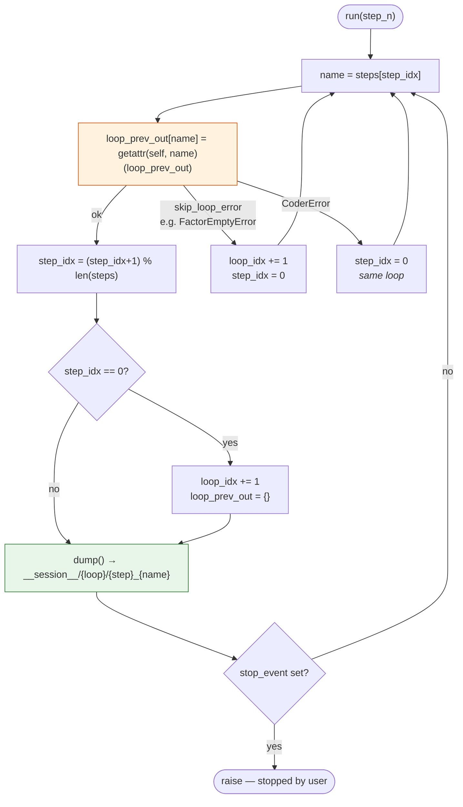

### Consequences you must internalise

1. **Adding a public method to a `LoopMeta` class silently adds a pipeline step.** This is why `AlphaAgentLoop._get_trajectory_data()` is underscore-prefixed — helpers *must* be private or they become steps.
2. **Every step is pickled.** Anything you attach to `self` must be picklable. Open file handles, sockets, threads, and lambdas will break session dumps.
3. **`loop_prev_out` is a plain dict keyed by step name.** Steps communicate through it: `factor_construct` reads `prev_out["factor_propose"]`.
4. **Sessions are resumable** — `LoopBase.load(path)` restores state and truncates the log storage back to that point.
5. **You can bypass auto-discovery** by assigning `self.steps` explicitly in `__init__`. The only class that does this is [`FactorReportLoop`](quantaalpha/pipeline/factor_from_report.py#L119) — which is itself dead code ([§18](#18-known-issues-and-dead-code) #1), but the technique is the escape hatch if you ever need a step order that differs from method-definition order.

---

### Loop engine — in depth

[`utils/workflow.py`](quantaalpha/utils/workflow.py) is ~160 lines and defines three things: `LoopMeta`, `LoopBase`, `LoopTrace`. [`LoopMeta`](quantaalpha/utils/workflow.py#L24) is the metaclass; its `__new__` collects every public callable defined on the class body into an ordered `steps` list ([`quantaalpha/utils/workflow.py:57`](quantaalpha/utils/workflow.py#L57)–`64`), appended after any steps inherited from base classes. So method-definition order *is* execution order — and a stray public helper silently becomes a stage.

[`LoopBase.run()`](quantaalpha/utils/workflow.py#L90) is the driver. It carries two indices — `loop_idx` (which trajectory iteration) and `step_idx` (which step within it) — and on each tick calls `getattr(self, steps[step_idx])(loop_prev_out)`, storing the return under `loop_prev_out[step_name]` so downstream steps read upstream outputs by name (`factor_construct` reads `prev_out["factor_propose"]`). The **error handling is the control flow** ([`quantaalpha/utils/workflow.py:116`](quantaalpha/utils/workflow.py#L116)–`124`): an exception listed in the class's `skip_loop_error` (for the mining loop, `FactorEmptyError`) logs a warning, increments `loop_idx`, and resets `step_idx` to 0 — abandoning the current trajectory and starting the next; a `CoderError` resets `step_idx` to 0 *without* advancing `loop_idx`, retrying the same trajectory from step 1; anything else propagates and kills the run.

After each successful step, `run()` calls [`dump()`](quantaalpha/utils/workflow.py#L140), which pickles the whole loop object to `<log_trace_path>/__session__/{loop_idx}/{step_idx}_{step_name}`. That is the machinery behind resumability: `LoopBase.load(path)` unpickles a snapshot and truncates the log storage back to that point, so a crashed run can restart from its last completed step. It is equally the reason **every attribute on `self` must be picklable** (consequence #2 above) — an open file handle, socket, thread, or lambda on `self` turns the next `dump()` into a `PicklingError` and takes the run down with it. `LoopTrace` records per-step timing/metadata alongside the snapshots.

## 8. The Evolution System

Outside the 5-step loop sits a trajectory-level evolutionary search. Each completed mining loop becomes a `StrategyTrajectory`; the pool of trajectories is then mutated and crossed over.

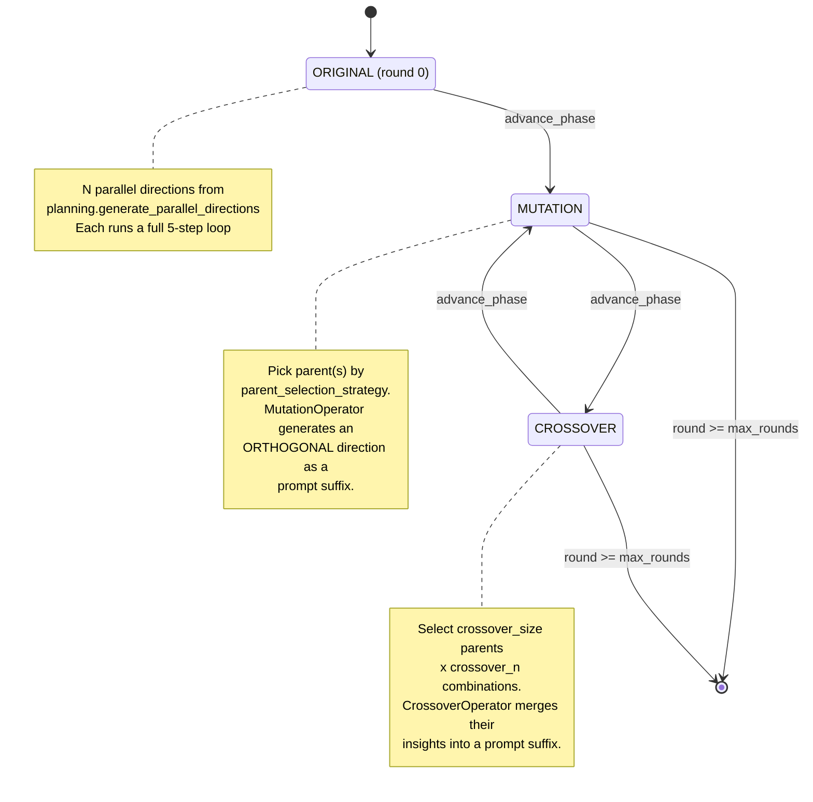

If `mutation_enabled: false`, rounds alternate Original → Crossover only; likewise if `crossover_enabled: false`.

### The key architectural insight

**Mutation and crossover do not manipulate factor expressions directly.** They call `generate_mutation_prompt_suffix(parent)` / `generate_crossover_prompt_suffix(parents)`, which produce **natural-language prompt suffixes appended to the hypothesis generator's direction**. The LLM does the actual recombination.

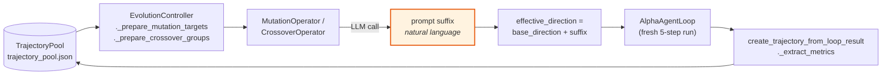

### Parent selection strategies

| Strategy | Behaviour |
| :--- | :--- |
| `best` | Highest-RankIC trajectories first *(default)* |
| `random` | Uniform |
| `weighted` | Performance-weighted sampling |
| `weighted_inverse` | Inverse-performance weighted — encourages exploring failures |
| `top_percent_plus_random` | Top `top_percent_threshold` guaranteed + random fill |

### Files

| File | Contains |
| :--- | :--- |
| [`pipeline/evolution/trajectory.py`](quantaalpha/pipeline/evolution/trajectory.py) | `RoundPhase` enum, `StrategyTrajectory`, `TrajectoryPool` (JSON-persisted) |
| [`pipeline/evolution/controller.py`](quantaalpha/pipeline/evolution/controller.py) | `EvolutionConfig`, `EvolutionController` — phase state machine |
| [`pipeline/evolution/mutation.py`](quantaalpha/pipeline/evolution/mutation.py) | `MutationOperator` |
| [`pipeline/evolution/crossover.py`](quantaalpha/pipeline/evolution/crossover.py) | `CrossoverOperator`, `select_crossover_pairs` |

> Evolution mode sets `RD_AGENT_SETTINGS.use_file_lock = False` in [`factor_mining.py`](quantaalpha/pipeline/factor_mining.py), because concurrent branches otherwise deadlock on the pickle cache lock.

---

### Evolution — in depth

**[`pipeline/evolution/controller.py`](quantaalpha/pipeline/evolution/controller.py) — the phase state machine.** [`EvolutionConfig`](quantaalpha/pipeline/evolution/controller.py#L25) holds the knobs (`num_directions`, `max_rounds`, `crossover_size`, `crossover_n`, `parent_selection_strategy`, `top_percent_threshold`, `parallel_enabled`, `fresh_start`, …). [`EvolutionController`](quantaalpha/pipeline/evolution/controller.py#L69) cycles `ORIGINAL → MUTATION → CROSSOVER → MUTATION → …` until `_current_round >= max_rounds` (`is_complete`, [`quantaalpha/pipeline/evolution/controller.py:861`](quantaalpha/pipeline/evolution/controller.py#L861)). Serial dispatch is `get_next_task` ([`quantaalpha/pipeline/evolution/controller.py:134`](quantaalpha/pipeline/evolution/controller.py#L134)); parallel dispatch is `get_all_tasks_for_current_phase` ([`quantaalpha/pipeline/evolution/controller.py:167`](quantaalpha/pipeline/evolution/controller.py#L167)) + `advance_phase_after_parallel_completion` ([`quantaalpha/pipeline/evolution/controller.py:293`](quantaalpha/pipeline/evolution/controller.py#L293)). Mutation parents come from `_prepare_mutation_targets` ([`quantaalpha/pipeline/evolution/controller.py:464`](quantaalpha/pipeline/evolution/controller.py#L464) — round 1 uses `pool.get_by_phase(ORIGINAL)`, later rounds use the latest crossover round); crossover parents from `_prepare_crossover_groups` ([`quantaalpha/pipeline/evolution/controller.py:510`](quantaalpha/pipeline/evolution/controller.py#L510)), which calls `CrossoverOperator.select_crossover_pairs`. Each completed loop becomes a `StrategyTrajectory` via `create_trajectory_from_loop_result` ([`quantaalpha/pipeline/evolution/controller.py:710`](quantaalpha/pipeline/evolution/controller.py#L710)), which extracts hypothesis/factor/metrics/feedback and calls `_extract_metrics` ([`quantaalpha/pipeline/evolution/controller.py:795`](quantaalpha/pipeline/evolution/controller.py#L795)) — a **pandas-only** extractor (DataFrame/Series) that prefers `1day.excess_return_with_cost.*` keys and silently returns all-`None` if the result isn't a pandas object or the lookup fails.

**[`pipeline/evolution/trajectory.py`](quantaalpha/pipeline/evolution/trajectory.py) — the data model.** [`RoundPhase`](quantaalpha/pipeline/evolution/trajectory.py#L21) (`ORIGINAL`/`MUTATION`/`CROSSOVER`). [`StrategyTrajectory`](quantaalpha/pipeline/evolution/trajectory.py#L28) is the dataclass (trajectory_id, direction_id, round_idx, phase, hypothesis, factors, backtest_metrics, feedback, parent_ids, …); `generate_id` ([`quantaalpha/pipeline/evolution/trajectory.py:83`](quantaalpha/pipeline/evolution/trajectory.py#L83)) is an md5 of `direction_round_phase_timestamp`; [`get_primary_metric`](quantaalpha/pipeline/evolution/trajectory.py#L90) returns `backtest_metrics["RankIC"]` and [`is_successful`](quantaalpha/pipeline/evolution/trajectory.py#L94) is `rank_ic is not None and rank_ic > 0` — the paper's "successful = RankIC > 0". `to_dict` ([`quantaalpha/pipeline/evolution/trajectory.py:131`](quantaalpha/pipeline/evolution/trajectory.py#L131)) nulls out the non-serializable `backtest_result`. [`TrajectoryPool`](quantaalpha/pipeline/evolution/trajectory.py#L148) is the in-memory dict + by-direction/by-phase indexes, JSON-persisted via `_save` ([`quantaalpha/pipeline/evolution/trajectory.py:341`](quantaalpha/pipeline/evolution/trajectory.py#L341)); `add` ([`quantaalpha/pipeline/evolution/trajectory.py:178`](quantaalpha/pipeline/evolution/trajectory.py#L178)) saves immediately. Note: `select_parents_for_mutation` ([`quantaalpha/pipeline/evolution/trajectory.py:231`](quantaalpha/pipeline/evolution/trajectory.py#L231)) and `select_parents_for_crossover` ([`quantaalpha/pipeline/evolution/trajectory.py:251`](quantaalpha/pipeline/evolution/trajectory.py#L251)) are **dead** — the controller uses `_prepare_mutation_targets` and `CrossoverOperator.select_crossover_pairs` instead.

**[`pipeline/evolution/mutation.py`](quantaalpha/pipeline/evolution/mutation.py) and [`pipeline/evolution/crossover.py`](quantaalpha/pipeline/evolution/crossover.py) — the operators.** They do **not** touch factor expressions; they produce natural-language prompt suffixes. [`MutationOperator.generate_mutation_prompt_suffix`](quantaalpha/pipeline/evolution/mutation.py#L219) calls `generate_mutation` ([`quantaalpha/pipeline/evolution/mutation.py:76`](quantaalpha/pipeline/evolution/mutation.py#L76), LLM with `json_mode=use_detailed_prompt`) to get a `new_hypothesis`/`exploration_direction`/`orthogonality_reason`, then formats `prompts["suffix_template"]` (or a hard-coded English fallback, [`quantaalpha/pipeline/evolution/mutation.py:244`](quantaalpha/pipeline/evolution/mutation.py#L244)). [`CrossoverOperator.generate_crossover_prompt_suffix`](quantaalpha/pipeline/evolution/crossover.py#L242) does the analogous hybrid-strategy synthesis. [`CrossoverOperator.select_crossover_pairs`](quantaalpha/pipeline/evolution/crossover.py#L303) is the parent-selection entry point: `_select_candidates_by_strategy` ([`quantaalpha/pipeline/evolution/crossover.py:375`](quantaalpha/pipeline/evolution/crossover.py#L375)) sorts by `get_primary_metric()` and implements `best`/`random`/`weighted`/`weighted_inverse`/`top_percent_plus_random` (unknown → `best`), then `itertools.combinations` are scored by `directions*2 + phases + avg_metric` when `prefer_diverse` ([`quantaalpha/pipeline/evolution/crossover.py:353`](quantaalpha/pipeline/evolution/crossover.py#L353)). Both operators fall back to keyword heuristics (`_generate_fallback_hypothesis`, `_generate_fallback_crossover`) on JSON failure. The prompts live in [`pipeline/prompts/evolution_prompts.yaml`](quantaalpha/pipeline/prompts/evolution_prompts.yaml) (`mutation:`/`crossover:` sections with `suffix_template`s; the `orthogonality_check:` and `trajectory_summary:` sections have no callers).

## 9. The Factor Expression DSL

Factors are written in a custom expression language, e.g.:

```
RANK(DELTA($close, 5)) / TS_STD($volume, 20)
```

**There are two completely independent parsers over this same syntax.** This trips up everyone who modifies the language.

```mermaid
flowchart TD
    EXPR["Factor expression string<br/><code>RANK&#40;DELTA&#40;$close, 5&#41;&#41;</code>"]

    EXPR --> P1["<b>factor_ast.py</b><br/>pyparsing grammar #1<br/><i>builds a real AST</i>"]
    EXPR --> P2["<b>expr_parser.py</b><br/>pyparsing grammar #2<br/><i>compiles to a call string</i>"]

    P1 --> AST["AST nodes<br/>VarNode · NumberNode · FunctionNode<br/>BinaryOpNode · ConditionalNode · UnaryOpNode"]
    AST --> METRICS["Static analysis<br/>calculate_symbol_length<br/>count_base_features<br/>count_free_args<br/>find_largest_common_subtree<br/>match_alphazoo"]
    METRICS --> GATE["Quality Gate<br/><i>complexity + redundancy</i>"]

    P2 --> CALLSTR["Python call string<br/><code>DIVIDE&#40;RANK&#40;...&#41;, ...&#41;</code>"]
    CALLSTR --> TPL["template.jinjia2<br/><i>renders factor.py</i>"]
    TPL --> PY["workspace/factor.py"]
    PY -->|"eval&#40;&#41; against"| FLIB["function_lib.py<br/><i>988 lines of implementations</i>"]
    FLIB --> H5["result.h5"]

    style P1 fill:#e3f2fd,stroke:#1565c0,stroke-width:2px
    style P2 fill:#fff3e0,stroke:#e65100,stroke-width:2px
    style GATE fill:#fce4ec,stroke:#ad1457
    style H5 fill:#e8f5e9,stroke:#2e7d32
```

| Path | Role | Repo imports |
| :--- | :--- | :--- |
| [`factors/coder/factor_ast.py`](quantaalpha/factors/coder/factor_ast.py) | AST for **static analysis only**. Never executed. | none — standalone |
| [`factors/coder/expr_parser.py`](quantaalpha/factors/coder/expr_parser.py) | **Compiler**. Emits `ADD/SUBTRACT/MULTIPLY/DIVIDE/GT/LT/GE/LE/EQ/NE/AND/OR/WHERE` calls. | none — standalone |
| [`factors/coder/function_lib.py`](quantaalpha/factors/coder/function_lib.py) | Runtime implementations of every DSL callable. | none — standalone |
| [`factors/coder/template.jinjia2`](quantaalpha/factors/coder/template.jinjia2) | Jinja skeleton for the generated `factor.py`. Placeholders: `{{ expression }}`, `{{ factor_name }}`. | — |

### Operator families in [`function_lib.py`](quantaalpha/factors/coder/function_lib.py)

| Family | Functions |
| :--- | :--- |
| Cross-sectional | `RANK`, `ZSCORE`, `SCALE` |
| Time-series | `TS_MEAN`, `TS_STD`, `TS_RANK`, `TS_CORR`, `REGBETA`, `REGRESI`, `DECAYLINEAR` |
| Moving averages | `SMA`, `EMA`, `WMA` |
| Technical | `MACD`, `RSI`, `BB_*` |
| Arithmetic / logical / comparison | with index-alignment helpers |

> ⚠️ **Adding a DSL operator requires editing three files**: the grammar in [`expr_parser.py`](quantaalpha/factors/coder/expr_parser.py), the implementation in [`function_lib.py`](quantaalpha/factors/coder/function_lib.py), and — if the quality gate should understand it — the AST in [`factor_ast.py`](quantaalpha/factors/coder/factor_ast.py). Miss the third and your operator will parse and run but be invisible to complexity/redundancy checks.

---

### Factor DSL — in depth

The two parsers never meet, and they exist for different reasons. [`factor_ast.py`](quantaalpha/factors/coder/factor_ast.py) is a **static analyzer**: its grammar builds a real tree of dataclass nodes (`VarNode` / `NumberNode` / `FunctionNode` / `BinaryOpNode` / `ConditionalNode` / `UnaryOpNode`, [`factor_ast.py:33`](quantaalpha/factors/coder/factor_ast.py#L33)–`122`) that is **never executed**. It exists only to answer the quality gate's questions ([§10](#10-the-quality-gate)): [`calculate_symbol_length`](quantaalpha/factors/coder/factor_ast.py#L482) (the SL term), [`count_base_features`](quantaalpha/factors/coder/factor_ast.py#L496) (distinct `$`-vars, the ER term), [`count_free_args`](quantaalpha/factors/coder/factor_ast.py#L387) (numeric literals, the PC term), and [`find_largest_common_subtree`](quantaalpha/factors/coder/factor_ast.py#L278) / [`match_alphazoo`](quantaalpha/factors/coder/factor_ast.py#L370) (redundancy against the factor zoo).

[`expr_parser.py`](quantaalpha/factors/coder/expr_parser.py) is a **compiler**: [`parse_expression`](quantaalpha/factors/coder/expr_parser.py#L344) walks the same syntax and emits a Python *call string*, turning infix operators into function calls — `a + b` → `ADD(a, b)`, `a > b` → `GT(a, b)`, `cond ? x : y` → `WHERE(cond, x, y)` — while numeric operands stay inline, and `parse_symbol` maps a `$close` token to its DataFrame column. That call string is injected into [`template.jinjia2`](quantaalpha/factors/coder/template.jinjia2) (placeholders `{{ expression }}`, `{{ factor_name }}`) to render the `factor.py` that runs in a workspace subprocess ([§12](#12-module-reference)), where the emitted calls resolve against [`function_lib.py`](quantaalpha/factors/coder/function_lib.py) and write `result.h5`.

[`function_lib.py`](quantaalpha/factors/coder/function_lib.py) (~988 lines) is the runtime standard library: cross-sectional (`RANK`/`ZSCORE`/`SCALE`), time-series (`TS_MEAN`/`TS_STD`/`TS_RANK`/`TS_CORR`/`REGBETA`/`REGRESI`/`DECAYLINEAR`), moving averages (`SMA`/`EMA`/`WMA`), technical (`MACD`/`RSI`/`BB_*`), and the index-aligned arithmetic/comparison/logical helpers `expr_parser` emits. Time-shift operators such as `DELAY` only shift *backward*, guarding against look-ahead. The redundancy of two grammars is exactly the trap the warning above names: an operator you add to `expr_parser` + `function_lib` will parse and run, but until you also teach `factor_ast` about it, the gate silently miscounts complexity and never flags redundancy for expressions that use it.

The standalone backtester deliberately **reuses this same DSL** — [`custom_factor_calculator.py`](quantaalpha/backtest/custom_factor_calculator.py) imports `parse_symbol`/`parse_expression` and `function_lib` directly ([§14](#14-standalone-backtest-v2)) — so a mined factor computes identically during mining and during the out-of-sample test, which is what makes the two-stage reproduction pipeline ([§20](#20-reproducing-the-paper-results)) apples-to-apples.

## 10. The Quality Gate

Every proposed factor is screened during **step 2 (`factor_construct`)** — before it is ever written to a workspace or backtested. The screening lives inside `AlphaAgentHypothesis2FactorExpression._convert_with_history_limit` ([`factors/proposal.py:409`](quantaalpha/factors/proposal.py#L409)), and the **always-on** accept/reject decision is made by exactly one method: [`FactorRegulator.is_expression_acceptable`](quantaalpha/factors/regulator/factor_regulator.py#L115). A richer, LLM-driven [`FactorQualityGate`](quantaalpha/factors/regulator/consistency_checker.py#L364) also exists — but it only runs when `consistency_enabled: true` (the shipped default is **false**), and even then it does *not* decide accept/reject; it only rewrites the expression before the regulator judges it.

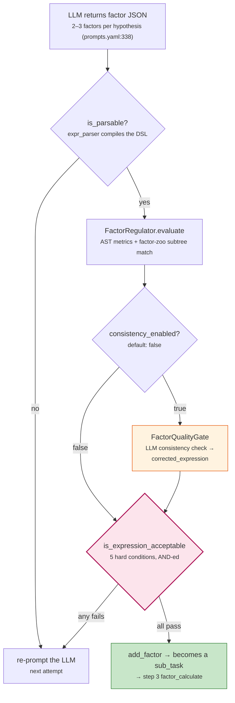

### What actually gates a factor: the five hard conditions

The paper frames constraint control as a weighted complexity score

$$R_g(f,h) = \alpha_1 \cdot SL + \alpha_2 \cdot PC + \alpha_3 \cdot ER$$

(**SL** = symbol length, **PC** = free-parameter count, **ER** = number of distinct base features). In the code that score is realized not as a weighted sum but as **five boolean gates AND-ed together** ([`factor_regulator.py:130-170`](quantaalpha/factors/regulator/factor_regulator.py#L130-L170)). A factor is accepted only if *all five* pass; failing any one sends the loop back to re-prompt the LLM with an `expression_duplication` feedback template.

| # | Condition | Meaning | Effective threshold |
| :--- | :--- | :--- | :--- |
| 1 | `duplicated_subtree_size ≤ duplication_threshold` | largest subtree shared with the factor zoo | **8** |
| 2 | `-log(1 − free_args_ratio) < 0.693` | free numeric args / total nodes < 0.5 | **0.5** |
| 3 | `-log(1 − unique_vars_ratio) < 0.693` | distinct variables / total nodes < 0.5 | **0.5** |
| 4 | `symbol_length ≤ symbol_length_threshold` | expression string length (SL) | **300** |
| 5 | `num_base_features ≤ base_features_threshold` | distinct `$`-features used (ER) | **6** |

### Where the thresholds really come from — and where they don't

This is the part that surprises people. **The `factor.complexity` and `factor.duplication` blocks in [`configs/experiment.yaml`](configs/experiment.yaml) are never read by the mining gate.** `AlphaAgentHypothesis2FactorExpression.__init__` builds its `FactorRegulator` passing **only** `factor_zoo_path` and `duplication_threshold` ([`proposal.py:343-346`](quantaalpha/factors/proposal.py#L343-L346)); everything else falls back to `FactorRegulator.__init__`'s hardcoded defaults ([`factor_regulator.py:20-21`](quantaalpha/factors/regulator/factor_regulator.py#L20-L21)).

| Threshold | Effective value | How to actually change it |
| :--- | :--- | :--- |
| SL (condition 4) | **300, hardcoded** | Not env-configurable at the gate — `FACTOR_CoSTEER_SYMBOL_LENGTH_THRESHOLD` sets `FACTOR_COSTEER_SETTINGS.symbol_length_threshold`, which only feeds the *feedback* warnings ([`feedback.py:240`](quantaalpha/factors/feedback.py#L240)), never the gate. Edit the default at [`factor_regulator.py:21`](quantaalpha/factors/regulator/factor_regulator.py#L21), or thread it through [`proposal.py:343`](quantaalpha/factors/proposal.py#L343). |
| base features (condition 5) | **6, hardcoded** | Same story — the gate ignores the env var and the YAML; edit [`factor_regulator.py:21`](quantaalpha/factors/regulator/factor_regulator.py#L21). |
| free-args ratio (condition 2) | **0.5, hardcoded** | Change the `0.693` literal at [`factor_regulator.py:157`](quantaalpha/factors/regulator/factor_regulator.py#L157). |
| unique-vars ratio (condition 3) | **0.5, hardcoded** | Change the literal at [`factor_regulator.py:160`](quantaalpha/factors/regulator/factor_regulator.py#L160). |
| duplication (condition 1) | **8** | The one that *is* wired: `FACTOR_CoSTEER_DUPLICATION_THRESHOLD` → `FACTOR_COSTEER_SETTINGS.duplication_threshold` → passed at [`proposal.py:345`](quantaalpha/factors/proposal.py#L345). |

The `symbol_length_threshold: 250` and `duplication_threshold: 5` you see as `ComplexityChecker` / `RedundancyChecker` defaults ([`consistency_checker.py:245`](quantaalpha/factors/regulator/consistency_checker.py#L245), [`consistency_checker.py:314`](quantaalpha/factors/regulator/consistency_checker.py#L314)) are a **third, unrelated** set of numbers — they only take effect *inside* `FactorQualityGate`, i.e. when `consistency_enabled: true`. In the default configuration those classes never run. And [`docs/experiment_hyperparameters.md`](docs/experiment_hyperparameters.md) is stale throughout; ignore its numbers.

> **`consistency_enabled` defaults to false** because it is the expensive path: `FactorConsistencyChecker` spends one LLM call per factor (plus up to `max_correction_attempts` correction rounds) verifying the expression matches the stated hypothesis. When it *is* on, its sole output is a `corrected_expression` handed back before the gate ([`proposal.py:472`](quantaalpha/factors/proposal.py#L472)) — the final accept/reject is still `is_expression_acceptable`. So `complexity_enabled` / `redundancy_enabled` in the YAML only matter in consistency mode; with the default config they are inert.

---

## 11. CoSTEER — Self-Evolving Code Generation

CoSTEER is the inner evolutionary loop that turns a task description into working code, learning from a persistent knowledge base as it goes. It lives in `quantaalpha/coder/costeer/`.

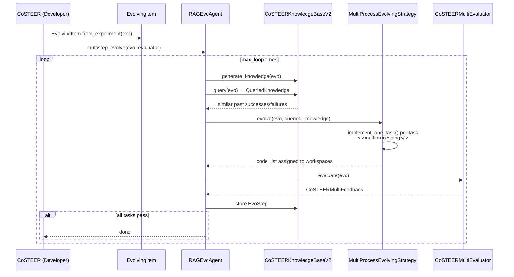

| File | Role |
| :--- | :--- |
| [`coder/costeer/__init__.py`](quantaalpha/coder/costeer/__init__.py) | `CoSTEER(Developer[Experiment])`, `load_or_init_knowledge_base` |
| [`coder/costeer/evolvable_subjects.py`](quantaalpha/coder/costeer/evolvable_subjects.py) | `EvolvingItem` — bridges `Experiment` ↔ `EvolvableSubjects` |
| [`coder/costeer/evolving_agent.py`](quantaalpha/coder/costeer/evolving_agent.py) | `FilterFailedRAGEvoAgent` |
| [`coder/costeer/evolving_strategy.py`](quantaalpha/coder/costeer/evolving_strategy.py) | `MultiProcessEvolvingStrategy` (abstract `implement_one_task`) |
| [`coder/costeer/evaluators.py`](quantaalpha/coder/costeer/evaluators.py) | `CoSTEERSingleFeedback`, `CoSTEERMultiEvaluator` |
| [`coder/costeer/knowledge_management.py`](quantaalpha/coder/costeer/knowledge_management.py) | Knowledge bases + RAG strategies. **V1 is deprecated and raises `NotImplementedError`** — use V2. |
| [`coder/costeer/scheduler.py`](quantaalpha/coder/costeer/scheduler.py) | `random_select` |
| [`coder/knowledge/vector_base.py`](quantaalpha/coder/knowledge/vector_base.py) | `PDVectorBase`, `Document` |
| [`coder/knowledge/graph.py`](quantaalpha/coder/knowledge/graph.py) | `UndirectedGraph`, semantic dedup at 0.95/0.999, BFS `get_nodes_within_steps` |

### The three factor coders

[`factors/qlib_coder.py`](quantaalpha/factors/qlib_coder.py) aliases three strategies — pick with `QLIB_FACTOR_CODER`:

| Alias | Class | Behaviour |
| :--- | :--- | :--- |
| `QlibFactorParser` | `FactorParser` | **Default.** Template-first: compile the DSL; fall back to LLM only if needed. |
| `QlibFactorCoSTEER` | `FactorCoSTEER` | Full CoSTEER evolutionary LLM codegen. |
| `QlibFactorCoder` | `FactorCoder` | Template-only, no LLM. |

---

### CoSTEER — in depth

[`CoSTEER`](quantaalpha/coder/costeer/__init__.py#L20) (`Developer[Experiment]`) is the inner self-evolving codegen loop. `develop()` ([`quantaalpha/coder/costeer/__init__.py:83`](quantaalpha/coder/costeer/__init__.py#L83)) builds an [`EvolvingItem`](quantaalpha/coder/costeer/evolvable_subjects.py#L7) from the experiment (`from_experiment`, [`quantaalpha/coder/costeer/evolvable_subjects.py:29`](quantaalpha/coder/costeer/evolvable_subjects.py#L29)), constructs a [`FilterFailedRAGEvoAgent`](quantaalpha/coder/costeer/evolving_agent.py#L7), and calls `multistep_evolve` ([`quantaalpha/coder/costeer/evolving_agent.py:97`](quantaalpha/coder/costeer/evolving_agent.py#L97)). The embedding-backed knowledge base is initialized in `__init__` at [`quantaalpha/coder/costeer/__init__.py:52`](quantaalpha/coder/costeer/__init__.py#L52) — `load_or_init_knowledge_base` ([`quantaalpha/coder/costeer/__init__.py:63`](quantaalpha/coder/costeer/__init__.py#L63)) unpickles an existing KB or builds a `CoSTEERKnowledgeBaseV2`, and the RAG strategy is wired at [`quantaalpha/coder/costeer/__init__.py:57`](quantaalpha/coder/costeer/__init__.py#L57) (`CoSTEERRAGStrategyV2` for `evolving_version==2`, else the stubbed V1). [`FilterFailedRAGEvoAgent`](quantaalpha/coder/costeer/evolving_agent.py#L7) overrides `filter_evolvable_subjects_by_feedback` ([`quantaalpha/coder/costeer/evolving_agent.py:8`](quantaalpha/coder/costeer/evolving_agent.py#L8)) to `.clear()` the workspace of any task whose `CoSTEERSingleFeedback` is truthy-but-`final_decision`-false (failed implementations are discarded, not persisted).

[`MultiProcessEvolvingStrategy`](quantaalpha/coder/costeer/evolving_strategy.py#L23) is the abstract strategy: `evolve()` ([`quantaalpha/coder/costeer/evolving_strategy.py:57`](quantaalpha/coder/costeer/evolving_strategy.py#L57)) reuses successful implementations from `queried_knowledge.success_task_to_knowledge_dict`, skips `failed_task_info_set`, fans out `implement_one_task` over `multiprocessing_wrapper(..., n=RD_AGENT_SETTINGS.multi_proc_n)` ([`quantaalpha/coder/costeer/evolving_strategy.py:86`](quantaalpha/coder/costeer/evolving_strategy.py#L86)), and assigns results via `assign_code_list_to_evo`. The factor subclasses ([`FactorMultiProcessEvolvingStrategy`](quantaalpha/factors/coder/evolving_strategy.py#L27), [`FactorParsingStrategy`](quantaalpha/factors/coder/evolving_strategy.py#L202), [`FactorRunningStrategy`](quantaalpha/factors/coder/evolving_strategy.py#L363)) implement those two abstract methods. [`CoSTEERMultiEvaluator`](quantaalpha/coder/costeer/evaluators.py#L75) runs the per-task [`CoSTEEREvaluator`](quantaalpha/coder/costeer/evaluators.py#L60) in parallel and sets `factor_implementation = True` on passed tasks ([`quantaalpha/coder/costeer/evaluators.py:111`](quantaalpha/coder/costeer/evaluators.py#L111)); [`CoSTEERSingleFeedback`](quantaalpha/coder/costeer/evaluators.py#L14) carries the eight feedback fields (execution/shape/code/value/final_decision/…).

**Knowledge & RAG — [`coder/costeer/knowledge_management.py`](quantaalpha/coder/costeer/knowledge_management.py), [`coder/knowledge/graph.py`](quantaalpha/coder/knowledge/graph.py), [`coder/knowledge/vector_base.py`](quantaalpha/coder/knowledge/vector_base.py).** V1 is stubbed: `CoSTEERKnowledgeBaseV1.query` ([`quantaalpha/coder/costeer/knowledge_management.py:71`](quantaalpha/coder/costeer/knowledge_management.py#L71)), `CoSTEERRAGStrategyV1.generate_knowledge` ([`quantaalpha/coder/costeer/knowledge_management.py:97`](quantaalpha/coder/costeer/knowledge_management.py#L97)) and `.query` ([`quantaalpha/coder/costeer/knowledge_management.py:140`](quantaalpha/coder/costeer/knowledge_management.py#L140)) all `raise NotImplementedError`. V2 is live: [`CoSTEERRAGStrategyV2.query`](quantaalpha/coder/costeer/knowledge_management.py#L292) chains `former_trace_query` → `component_query` → `error_query`; [`component_query`](quantaalpha/coder/costeer/knowledge_management.py#L457) does the graph walk and the **unguarded embedding call** `calculate_embedding_distance_between_str_list([target], success_list)[0]` ([`quantaalpha/coder/costeer/knowledge_management.py:530`](quantaalpha/coder/costeer/knowledge_management.py#L530)) — the Ollama crash point. [`CoSTEERKnowledgeBaseV2`](quantaalpha/coder/costeer/knowledge_management.py#L715) stores everything in an [`UndirectedGraph`](quantaalpha/coder/knowledge/graph.py#L103) (`graph.pkl`): `update_success_task` ([`quantaalpha/coder/costeer/knowledge_management.py:747`](quantaalpha/coder/costeer/knowledge_management.py#L747)) adds `task_description`/`task_trace`/`task_success_implement`/error nodes. The graph does semantic dedup at two thresholds — `same_node_threshold=0.95` on insert ([`quantaalpha/coder/knowledge/graph.py:119`](quantaalpha/coder/knowledge/graph.py#L119)) and `similarity_threshold=0.999` on `get_node_by_content` ([`quantaalpha/coder/knowledge/graph.py:188`](quantaalpha/coder/knowledge/graph.py#L188)) — and [`get_nodes_within_steps`](quantaalpha/coder/knowledge/graph.py#L193) is the BFS (deterministic via `sorted(…, key=content)`) the controller's `graph_query_by_intersection` uses. Per-node embeddings are created lazily in `add_node` ([`quantaalpha/coder/knowledge/graph.py:140`](quantaalpha/coder/knowledge/graph.py#L140)/`155`) and **gracefully skipped** on embedding failure (unlike the query-time embed). [`PDVectorBase`](quantaalpha/coder/knowledge/vector_base.py#L107) backs the `1 - cosine` similarity search ([`quantaalpha/coder/knowledge/vector_base.py:177`](quantaalpha/coder/knowledge/vector_base.py#L177)); [`Document = KnowledgeMetaData`](quantaalpha/coder/knowledge/vector_base.py#L59) is the embeddable record. [`random_select`](quantaalpha/coder/costeer/scheduler.py#L11) is the round-task sampler.

## 12. Module Reference

### `quantaalpha/core/` — abstraction layer

Everything imports this; it imports nothing from the rest of the package.

| File | Key exports |
| :--- | :--- |
| [`experiment.py`](quantaalpha/core/experiment.py) | `Task`, `Workspace`, `FBWorkspace`, `Experiment`, `Loader`, `WsLoader` |
| [`proposal.py`](quantaalpha/core/proposal.py) | `Hypothesis`, `HypothesisFeedback`, `Trace`, `HypothesisGen`, `Hypothesis2Experiment`, `HypothesisExperiment2Feedback` |
| [`developer.py`](quantaalpha/core/developer.py) | `Developer` — the base for all coders/runners |
| [`scenario.py`](quantaalpha/core/scenario.py) | `Scenario` |
| [`evaluation.py`](quantaalpha/core/evaluation.py) | `Feedback`, `Evaluator` |
| [`evolving_framework.py`](quantaalpha/core/evolving_framework.py) | `EvolvableSubjects`, `EvolvingStrategy`, `RAGStrategy`, `EvolvingKnowledgeBase`, `QueriedKnowledge`, `EvoStep` |
| [`evolving_agent.py`](quantaalpha/core/evolving_agent.py) | `EvoAgent`, `RAGEvoAgent.multistep_evolve` |
| [`conf.py`](quantaalpha/core/conf.py) | `ExtendedBaseSettings`, `RDAgentSettings`, `RD_AGENT_SETTINGS` |
| [`utils.py`](quantaalpha/core/utils.py) | **`import_class`**, `multiprocessing_wrapper`, `cache_with_pickle`, `SingletonBaseClass`, `parse_json`, `similarity` |
| [`exception.py`](quantaalpha/core/exception.py) | `CoderError`, `CodeFormatError`, `CustomRuntimeError`, `NoOutputError`, **`FactorEmptyError`**, `ModelEmptyError` |
| [`prompts.py`](quantaalpha/core/prompts.py) | `Prompts(SingletonBaseClass, dict)` — YAML prompt loader |

> `core.evaluation` and `core.proposal` both re-export `Scenario`. Harmless, but confusing when tracing imports.

#### `quantaalpha/core/` — in depth

`core/` is the abstraction layer everything else builds on; it imports nothing from the rest of the package (only `RD_AGENT_SETTINGS` flows in).

**Workspaces & experiments — [`core/experiment.py`](quantaalpha/core/experiment.py).** [`Task`](quantaalpha/core/experiment.py#L20) is the abstract unit of work (`get_task_information()` builds its cache key). [`Workspace`](quantaalpha/core/experiment.py#L40) is where a task's implementation lives; [`FBWorkspace`](quantaalpha/core/experiment.py#L70) is the file-based concrete base — it holds `code_dict` and a `workspace_path = RD_AGENT_SETTINGS.workspace_path / uuid4().hex` ([`quantaalpha/core/experiment.py:99`](quantaalpha/core/experiment.py#L99)), and provides `inject_code` ([`quantaalpha/core/experiment.py:131`](quantaalpha/core/experiment.py#L131)), `inject_code_from_folder` ([`quantaalpha/core/experiment.py:156`](quantaalpha/core/experiment.py#L156)), `link_all_files_in_folder_to_workspace` ([`quantaalpha/core/experiment.py:118`](quantaalpha/core/experiment.py#L118), symlink on Unix / hardlink on Windows), `clear` ([`quantaalpha/core/experiment.py:171`](quantaalpha/core/experiment.py#L171), `shutil.rmtree`), and `copy` ([`quantaalpha/core/experiment.py:165`](quantaalpha/core/experiment.py#L165), `deepcopy`). [`Experiment`](quantaalpha/core/experiment.py#L196) ties `sub_tasks` to `sub_workspace_list` (one workspace per task), a `based_experiments` lineage, a `result`, and an `experiment_workspace`.

**Hypothesis pipeline — [`core/proposal.py`](quantaalpha/core/proposal.py).** [`Hypothesis`](quantaalpha/core/proposal.py#L21) carries the six fields (hypothesis, reason, concise_reason, concise_observation, concise_justification, concise_knowledge); [`HypothesisFeedback`](quantaalpha/core/proposal.py#L60) adds `decision: bool` and `__bool__` returns it ([`quantaalpha/core/proposal.py:75`](quantaalpha/core/proposal.py#L75)); [`Trace`](quantaalpha/core/proposal.py#L90) is the append-only `(hypothesis, experiment, feedback)` history with `get_sota_hypothesis_and_experiment()` ([`quantaalpha/core/proposal.py:96`](quantaalpha/core/proposal.py#L96)) returning the most recent truthy-decision pair. The three ABCs the plugin system implements are [`HypothesisGen`](quantaalpha/core/proposal.py#L106) (`gen(trace)`), [`Hypothesis2Experiment`](quantaalpha/core/proposal.py#L130) (`convert(hypothesis, trace)`), and [`HypothesisExperiment2Feedback`](quantaalpha/core/proposal.py#L144) (`generate_feedback(exp, hypothesis, trace)`).

**The rest of the layer.** [`Developer`](quantaalpha/core/developer.py#L12) (`develop(exp)`, the ABC for all coders/runners), [`Scenario`](quantaalpha/core/scenario.py#L6) (abstract `background`/`interface`/`output_format`/`simulator`/`rich_style_description`/`get_scenario_all_desc`), [`Feedback`](quantaalpha/core/evaluation.py#L7) + [`Evaluator`](quantaalpha/core/evaluation.py#L11) (`evaluate(target_task, implementation, gt_implementation)`). The evolution ABCs live in [`core/evolving_framework.py`](quantaalpha/core/evolving_framework.py): [`EvolvableSubjects`](quantaalpha/core/evolving_framework.py#L31) (`clone` via `deepcopy`), [`EvoStep`](quantaalpha/core/evolving_framework.py#L41) (dataclass: evolvable_subjects/queried_knowledge/feedback), [`EvolvingStrategy`](quantaalpha/core/evolving_framework.py#L58) (`evolve(...)`), [`RAGStrategy`](quantaalpha/core/evolving_framework.py#L79) (`query` + `generate_knowledge`), [`EvolvingKnowledgeBase`](quantaalpha/core/evolving_framework.py#L23). [`RAGEvoAgent`](quantaalpha/core/evolving_agent.py#L38) drives the inner loop: `multistep_evolve()` ([`quantaalpha/core/evolving_agent.py:55`](quantaalpha/core/evolving_agent.py#L55)) runs `tqdm(range(max_loop))`, optionally generating/querying knowledge, calling `evolving_strategy.evolve`, logging the evolving code, and (if `with_feedback`) appending an `EvoStep` with the evaluator's feedback.

**Config & utils — [`core/conf.py`](quantaalpha/core/conf.py), [`core/utils.py`](quantaalpha/core/utils.py), [`core/exception.py`](quantaalpha/core/exception.py).** [`ExtendedBaseSettings`](quantaalpha/core/conf.py#L41) uses only [`ExtendedEnvSettingsSource`](quantaalpha/core/conf.py#L19), which walks **both the class's own `env_prefix` and every parent's** — this is why a single `QLIB_FACTOR_CODER=…` overrides any loop's coder. [`RDAgentSettings`](quantaalpha/core/conf.py#L55) holds `workspace_path` ([`quantaalpha/core/conf.py:71`](quantaalpha/core/conf.py#L71)), `pickle_cache_folder_path_str` ([`quantaalpha/core/conf.py:81`](quantaalpha/core/conf.py#L81)), `multi_proc_n` ([`quantaalpha/core/conf.py:77`](quantaalpha/core/conf.py#L77)), `use_file_lock` ([`quantaalpha/core/conf.py:85`](quantaalpha/core/conf.py#L85)); `RD_AGENT_SETTINGS` is the singleton ([`quantaalpha/core/conf.py:91`](quantaalpha/core/conf.py#L91)). [`core/utils.py`](quantaalpha/core/utils.py) has the workhorses: [`import_class`](quantaalpha/core/utils.py#L75) (`rsplit(".", 1)` → `importlib.import_module` → `getattr`, the resolver behind the plugin system), [`multiprocessing_wrapper`](quantaalpha/core/utils.py#L124) (in-proc when `n==1`, else `mp.Pool` with per-task seed reseeding via `_subprocess_wrapper`), [`cache_with_pickle`](quantaalpha/core/utils.py#L156) (the `@cache_with_pickle(hash_func, …)` decorator used by `FactorFBWorkspace.execute` and `QlibFactorRunner.develop`, FileLock-gated when `use_file_lock`), [`SingletonBaseClass`](quantaalpha/core/utils.py#L24) (unpicklable — `__reduce__` raises), `parse_json`, `similarity` (fuzzywuzzy), and `LLM_CACHE_SEED_GEN`. [`core/exception.py`](quantaalpha/core/exception.py) defines the hierarchy the loop's error handling keys off: [`CoderError`](quantaalpha/core/exception.py#L1) → [`CodeFormatError`](quantaalpha/core/exception.py#L11)/[`CustomRuntimeError`](quantaalpha/core/exception.py#L17)/[`NoOutputError`](quantaalpha/core/exception.py#L23), plus [`FactorEmptyError`](quantaalpha/core/exception.py#L35) (the `skip_loop_error` trigger) and `ModelEmptyError`. [`Prompts`](quantaalpha/core/prompts.py#L8) is the `SingletonBaseClass, dict` YAML loader; [`KnowledgeBase`](quantaalpha/core/knowledge_base.py#L8) is the dill-pickled base; [`CodeTemplate`](quantaalpha/core/template.py#L7) wraps Jinja2.

### `quantaalpha/factors/` — the primary domain

| File | Lines | Role |
| :--- | ---: | :--- |
| [`proposal.py`](quantaalpha/factors/proposal.py) | 662 | `AlphaAgentHypothesisGen`, `AlphaAgentHypothesis2FactorExpression` (holds `FactorRegulator` + lazy `FactorQualityGate`), `BacktestHypothesis2FactorExpression` |
| [`feedback.py`](quantaalpha/factors/feedback.py) | 410 | `AlphaAgentQlibFactorHypothesisExperiment2Feedback`, `process_results` |
| [`runner.py`](quantaalpha/factors/runner.py) | 234 | `QlibFactorRunner(CachedRunner)`, `process_factor_data`, writes `combined_factors_df.parquet` |
| [`library.py`](quantaalpha/factors/library.py) | 343 | `FactorLibraryManager` — `add_factors_from_experiment`, `check_cache_status`, `warm_cache_from_json` |
| [`experiment.py`](quantaalpha/factors/experiment.py) | — | `QlibFactorExperiment`, `QlibAlphaAgentScenario` |
| [`qlib_coder.py`](quantaalpha/factors/qlib_coder.py) | — | The three coder aliases |
| [`qlib_utils.py`](quantaalpha/factors/qlib_utils.py) | — | `generate_data_folder_from_qlib`, `get_data_folder_intro`, `get_file_desc` |
| [`workspace.py`](quantaalpha/factors/workspace.py) | — | `QlibFBWorkspace` |
| [`coder/factor.py`](quantaalpha/factors/coder/factor.py) | 247 | `FactorTask`, `FactorFBWorkspace` — writes `factor.py`, links data folder, subprocess exec, reads `result.h5` |
| [`coder/factor_ast.py`](quantaalpha/factors/coder/factor_ast.py) | 597 | AST parser + static metrics |
| [`coder/expr_parser.py`](quantaalpha/factors/coder/expr_parser.py) | 378 | DSL → Python call-string compiler |
| [`coder/function_lib.py`](quantaalpha/factors/coder/function_lib.py) | 988 | All DSL runtime functions |
| [`coder/evaluators.py`](quantaalpha/factors/coder/evaluators.py) | 283 | `FactorEvaluatorForCoder`, `check_ast_regularization` |
| [`coder/eva_utils.py`](quantaalpha/factors/coder/eva_utils.py) | 585 | 12 evaluators: value, code, correlation, row-count, index, inf, NaN, format, datetime, … |
| [`coder/evolving_strategy.py`](quantaalpha/factors/coder/evolving_strategy.py) | 419 | `FactorMultiProcessEvolvingStrategy`, `FactorParsingStrategy`, `FactorRunningStrategy` |
| [`regulator/factor_regulator.py`](quantaalpha/factors/regulator/factor_regulator.py) | 211 | `FactorRegulator(Evaluator)` — factor zoo management |
| [`regulator/consistency_checker.py`](quantaalpha/factors/regulator/consistency_checker.py) | 454 | `FactorConsistencyChecker`, `ComplexityChecker`, `RedundancyChecker`, `FactorQualityGate` |
| [`loader/pdf_loader.py`](quantaalpha/factors/loader/pdf_loader.py) | 594 | Multi-stage LLM extraction from PDFs + K-means dedup |
| [`data_template/generate.py`](quantaalpha/factors/data_template/generate.py) | — | Builds `daily_pv_all.h5` / `daily_pv_debug.h5` from Qlib |
| [`prompts/prompts.yaml`](quantaalpha/factors/prompts/prompts.yaml) | 34 KB | The bulk of the system's prompts |

#### `quantaalpha/factors/` — in depth

The factors domain is where the paper's four components live: hypothesis generation, factor realization (with constraint gating), evaluation, and the factor pool. The classes below are the actual implementation behind the §5 loop and the §10 gate.

**Hypothesis & construction — [`factors/proposal.py`](quantaalpha/factors/proposal.py).** [`AlphaAgentHypothesis`](quantaalpha/factors/proposal.py#L56) extends the core `Hypothesis` with a `concise_specification` field (the starting idea). [`AlphaAgentHypothesisGen`](quantaalpha/factors/proposal.py#L202) is the idea agent `A_i`: its `gen()` ([`quantaalpha/factors/proposal.py:246`](quantaalpha/factors/proposal.py#L246)) renders the `hypothesis_gen` prompts, calls the LLM, and on input-length errors shrinks the history window from `DEFAULT_HISTORY_LIMIT = 6` ([`quantaalpha/factors/proposal.py:19`](quantaalpha/factors/proposal.py#L19)) down to `MIN_HISTORY_LIMIT = 1` ([`quantaalpha/factors/proposal.py:20`](quantaalpha/factors/proposal.py#L20)) — this is the "dynamic history-limit shrinking" that lets long evolution traces still fit the context budget. [`AlphaAgentHypothesis2FactorExpression`](quantaalpha/factors/proposal.py#L338) is the factor agent `A_f` and the §10 gate host: it eagerly constructs a [`FactorRegulator`](quantaalpha/factors/regulator/factor_regulator.py) in `__init__` ([`quantaalpha/factors/proposal.py:339`](quantaalpha/factors/proposal.py#L339)) and lazily exposes a [`FactorQualityGate`](quantaalpha/factors/regulator/consistency_checker.py) via the `quality_gate` property ([`quantaalpha/factors/proposal.py:352`](quantaalpha/factors/proposal.py#L352)) only when `consistency_enabled=True`. Its `_convert_with_history_limit()` ([`quantaalpha/factors/proposal.py:409`](quantaalpha/factors/proposal.py#L409)) is the inner loop that, per factor, runs `factor_regulator.is_parsable` → `factor_regulator.evaluate` → (if enabled) `quality_gate.evaluate`, applies any `corrected_expression`, and re-prompts the LLM with an `expression_duplication` feedback template when `is_expression_acceptable` fails; accepted factors are registered with `factor_regulator.add_factor` ([`quantaalpha/factors/proposal.py:564`](quantaalpha/factors/proposal.py#L564)). [`BacktestHypothesis2FactorExpression`](quantaalpha/factors/proposal.py#L614) skips the LLM entirely and reads pre-mined expressions from a CSV — note the latent bug at [`quantaalpha/factors/proposal.py:661`](quantaalpha/factors/proposal.py#L661) where the error branch references `self.factor_csv_path` (never assigned; the attribute is `self.factor_path`), so the missing-file path raises `AttributeError` rather than the intended `ValueError`. [`EmptyHypothesisGen`](quantaalpha/factors/proposal.py#L313) feeds the `BacktestLoop` an empty hypothesis.

**Feedback — [`factors/feedback.py`](quantaalpha/factors/feedback.py).** [`AlphaAgentQlibFactorHypothesisExperiment2Feedback`](quantaalpha/factors/feedback.py#L215) is the evaluation agent's summarizer: `generate_feedback()` ([`quantaalpha/factors/feedback.py:216`](quantaalpha/factors/feedback.py#L216)) gathers `exp.result` (current) and `exp.based_experiments[-1].result` (SOTA), runs them through [`process_results`](quantaalpha/factors/feedback.py#L26), and additionally emits per-factor complexity warnings by importing `calculate_symbol_length`/`count_base_features` ([`quantaalpha/factors/feedback.py:240`](quantaalpha/factors/feedback.py#L240)) and comparing against `FACTOR_COSTEER_SETTINGS` thresholds (default SL 300, base features 6). The LLM call uses `json_mode=True` with up to `MAX_JSON_PARSE_RETRIES = 3` ([`quantaalpha/factors/feedback.py:20`](quantaalpha/factors/feedback.py#L20)) retries on `json.JSONDecodeError`. [`QlibModelHypothesisExperiment2Feedback`](quantaalpha/factors/feedback.py#L342) is **broken** — `generate_feedback` references an undefined `feedback_prompts` ([`quantaalpha/factors/feedback.py:353`](quantaalpha/factors/feedback.py#L353)), so calling it raises `NameError` (see [§18](#18-known-issues-and-dead-code) #8).

**Execution — [`factors/runner.py`](quantaalpha/factors/runner.py) and [`factors/coder/factor.py`](quantaalpha/factors/coder/factor.py).** [`QlibFactorRunner`](quantaalpha/factors/runner.py#L37) is step 4 of the loop. `develop()` ([`quantaalpha/factors/runner.py:75`](quantaalpha/factors/runner.py#L75)) is `@cache_with_pickle`-decorated; it processes the SOTA and new factor sets via [`process_factor_data`](quantaalpha/factors/runner.py#L204) (which fans out to `multiprocessing_wrapper` over each `FactorFBWorkspace.execute`), and on `FactorEmptyError` falls back to a manual per-workspace subprocess run (creating a `daily_pv.h5` symlink, stripping IDE/debug env vars, `timeout=1200`). It writes the combined panel to `combined_factors_df.parquet` ([`quantaalpha/factors/runner.py:172`](quantaalpha/factors/runner.py#L172)), picks [`conf_baseline.yaml`](quantaalpha/factors/factor_template/conf_baseline.yaml) vs [`conf_combined_factors.yaml`](quantaalpha/factors/factor_template/conf_combined_factors.yaml) ([`quantaalpha/factors/runner.py:178`](quantaalpha/factors/runner.py#L178)), then calls `experiment_workspace.execute(...)` ([`quantaalpha/factors/runner.py:185`](quantaalpha/factors/runner.py#L185)). The per-factor workspace is [`FactorFBWorkspace`](quantaalpha/factors/coder/factor.py#L74): `execute()` ([`quantaalpha/factors/coder/factor.py:103`](quantaalpha/factors/coder/factor.py#L103)) is `@cache_with_pickle(hash_func)`-gated, acquires a `FileLock`, links the `data_folder`/`data_folder_debug` into the workspace ([`quantaalpha/factors/coder/factor.py:152`](quantaalpha/factors/coder/factor.py#L152)), runs `subprocess.check_output(f"{python_bin} factor.py", …, timeout=file_based_execution_timeout)` ([`quantaalpha/factors/coder/factor.py:183`](quantaalpha/factors/coder/factor.py#L183)) with a cleaned env (PYTHONPATH prepended, `PYTHON*`/`VSCODE_*`/`DEBUGPY*`/`COPILOT*` stripped), and reads back `result.h5` via `pd.read_hdf` ([`quantaalpha/factors/coder/factor.py:218`](quantaalpha/factors/coder/factor.py#L218)); errors are path-redacted and truncated before raising `CustomRuntimeError`/`NoOutputError`. [`FactorTask`](quantaalpha/factors/coder/factor.py#L19) carries the name/description/formulation/expression/variables metadata.

**Factor pool — [`factors/library.py`](quantaalpha/factors/library.py).** [`FactorLibraryManager`](quantaalpha/factors/library.py#L25) is the final factor pool (component D). `add_factors_from_experiment()` ([`quantaalpha/factors/library.py:56`](quantaalpha/factors/library.py#L56)) is called from the loop's `feedback` step: it pairs `sub_tasks` with `sub_workspace_list`, computes `factor_id = md5(name_expr)[:16]`, assembles `code` from `ws.code_dict` + `cache_location`, writes a `factor_entry` (expression, implementation_code, description, formulation, cache_location, metadata with experiment_id/round/evolution_phase/trajectory_id/parent_trajectory_ids/hypothesis/initial_direction/planning_direction, backtest_results, feedback), and syncs `result.h5` into the MD5 `.pkl` cache via `_sync_h5_to_md5_cache` ([`quantaalpha/factors/library.py:152`](quantaalpha/factors/library.py#L152)). Two static helpers support out-of-band cache management: [`check_cache_status`](quantaalpha/factors/library.py#L178) (`{total, h5_cached, md5_cached, need_compute}`) reports which library factors are already materialised, and [`warm_cache_from_json`](quantaalpha/factors/library.py#L236) pre-populates the MD5 `.pkl` cache from a library JSON so a later standalone backtest hits tier 2 instead of recomputing.

**Experiment & scenario — [`factors/experiment.py`](quantaalpha/factors/experiment.py), [`factors/workspace.py`](quantaalpha/factors/workspace.py), [`factors/qlib_utils.py`](quantaalpha/factors/qlib_utils.py).** [`QlibFactorExperiment`](quantaalpha/factors/experiment.py#L23) overrides rdagent's experiment to attach a [`QlibFBWorkspace`](quantaalpha/factors/workspace.py#L17) whose template comes from rdagent's `factor_template` and is then overridden by the project's `_CUSTOM_TEMPLATE_DIR` ([`quantaalpha/factors/workspace.py:14`](quantaalpha/factors/workspace.py#L14)); `before_execute()` ([`quantaalpha/factors/workspace.py:29`](quantaalpha/factors/workspace.py#L29)) also `git init`s an empty repo to silence Qlib recorder warnings. [`QlibAlphaAgentScenario`](quantaalpha/factors/experiment.py#L36) builds the LLM scenario (`_background`, `_source_data`, `_output_format`, …) from rdagent templates, using the local data-folder intro when `use_local=True`. [`generate_data_folder_from_qlib`](quantaalpha/factors/qlib_utils.py#L17) and [`get_data_folder_intro`](quantaalpha/factors/qlib_utils.py#L134) produce the data description the LLM sees; `get_file_desc` ([`quantaalpha/factors/qlib_utils.py:63`](quantaalpha/factors/qlib_utils.py#L63)) renders `.h5` schema introspections.

**The DSL — [`factors/coder/factor_ast.py`](quantaalpha/factors/coder/factor_ast.py), [`factors/coder/expr_parser.py`](quantaalpha/factors/coder/expr_parser.py), [`factors/coder/function_lib.py`](quantaalpha/factors/coder/function_lib.py).** Two independent pyparsing grammars over one syntax (see [§9](#9-the-factor-expression-dsl)). [`factor_ast.py`](quantaalpha/factors/coder/factor_ast.py) builds the real AST — `VarNode`/`NumberNode`/`FunctionNode`/`BinaryOpNode`/`ConditionalNode`/`UnaryOpNode` (dataclasses at [`quantaalpha/factors/coder/factor_ast.py:33`](quantaalpha/factors/coder/factor_ast.py#L33)–`122`) — and exposes the static-analysis functions the gate uses: [`calculate_symbol_length`](quantaalpha/factors/coder/factor_ast.py#L482) (=`len(expr.strip())`, the SL term), [`count_base_features`](quantaalpha/factors/coder/factor_ast.py#L496) (unique `$`-vars, the ER term), [`count_free_args`](quantaalpha/factors/coder/factor_ast.py#L387) (counts `NumberNode`s, the PC term), and [`find_largest_common_subtree`](quantaalpha/factors/coder/factor_ast.py#L278) (commutative-aware, used by [`match_alphazoo`](quantaalpha/factors/coder/factor_ast.py#L370) for redundancy). [`expr_parser.py`](quantaalpha/factors/coder/expr_parser.py) compiles to a Python call string: [`parse_expression`](quantaalpha/factors/coder/expr_parser.py#L344) emits `ADD/SUBTRACT/MULTIPLY/DIVIDE`, `GT/LT/GE/LE/EQ/NE`, `AND/OR`, and `WHERE` (ternary) — note the leftover `print("factor_expression: ", …)` at [`quantaalpha/factors/coder/expr_parser.py:350`](quantaalpha/factors/coder/expr_parser.py#L350) ([§18](#18-known-issues-and-dead-code) #9). [`function_lib.py`](quantaalpha/factors/coder/function_lib.py) (~988 lines) is the runtime: cross-sectional `RANK`/`ZSCORE`/`SCALE`, time-series `TS_MEAN`/`TS_STD`/`TS_RANK`/`TS_CORR`/`REGBETA`/`REGRESI`/`DECAYLINEAR`, moving averages `SMA`/`EMA`/`WMA`, technical `MACD`/`RSI`/`BB_*`, and the index-aligned arithmetic/comparison/logical helpers that `expr_parser` emits — `DELAY` even asserts `p >= 0` ([`quantaalpha/factors/coder/function_lib.py:187`](quantaalpha/factors/coder/function_lib.py#L187)) to block look-ahead.

**The gate — [`factors/regulator/factor_regulator.py`](quantaalpha/factors/regulator/factor_regulator.py) and [`factors/regulator/consistency_checker.py`](quantaalpha/factors/regulator/consistency_checker.py).** [`FactorRegulator`](quantaalpha/factors/regulator/factor_regulator.py#L13) is the **always-on** gate (§10): [`evaluate`](quantaalpha/factors/regulator/factor_regulator.py#L61) calls the `factor_ast` metrics + `match_alphazoo`, and [`is_expression_acceptable`](quantaalpha/factors/regulator/factor_regulator.py#L115) realizes the paper's `R_g(f,h) = α₁·SL + α₂·PC + α₃·ER` as five hard boolean conditions AND-ed together — duplication subtree ≤ threshold, free-args ratio < 0.5, unique-vars ratio < 0.5, SL ≤ threshold, base features ≤ threshold ([`quantaalpha/factors/regulator/factor_regulator.py:130`](quantaalpha/factors/regulator/factor_regulator.py#L130)–`170`). Its SL and base-feature thresholds default to **300 / 6 and are hardcoded** ([`factor_regulator.py:20-21`](quantaalpha/factors/regulator/factor_regulator.py#L20-L21)) — `proposal.py` threads only `duplication_threshold` in. [`FactorQualityGate`](quantaalpha/factors/regulator/consistency_checker.py#L364) is the **optional** consistency-mode wrapper (only built when `consistency_enabled=True`): it composes [`FactorConsistencyChecker`](quantaalpha/factors/regulator/consistency_checker.py#L43) (LLM semantic check + `check_and_correct` retry loop), [`ComplexityChecker`](quantaalpha/factors/regulator/consistency_checker.py#L239) (no LLM; SL/base-features/free-args, its own default SL **250** at [`consistency_checker.py:245`](quantaalpha/factors/regulator/consistency_checker.py#L245)), and [`RedundancyChecker`](quantaalpha/factors/regulator/consistency_checker.py#L308) (delegates back to `FactorRegulator`, own default duplication **5** at [`consistency_checker.py:314`](quantaalpha/factors/regulator/consistency_checker.py#L314)). Those 250 / 5 numbers are inert in the default config; see [§10](#10-the-quality-gate) for the full threshold-provenance table.

**Evaluators — [`factors/coder/evaluators.py`](quantaalpha/factors/coder/evaluators.py) and [`factors/coder/eva_utils.py`](quantaalpha/factors/coder/eva_utils.py).** [`FactorEvaluatorForCoder`](quantaalpha/factors/coder/evaluators.py#L25) orchestrates the ~12 evaluators and runs `check_ast_regularization` ([`quantaalpha/factors/coder/evaluators.py:58`](quantaalpha/factors/coder/evaluators.py#L58)) *before* `implementation.execute()`. [`eva_utils.py`](quantaalpha/factors/coder/eva_utils.py) defines them: `FactorCodeEvaluator` (LLM critique), `FactorInfEvaluator`, `FactorSingleColumnEvaluator`, `FactorOutputFormatEvaluator`, `FactorDatetimeDailyEvaluator`, `FactorRowCountEvaluator`, `FactorIndexEvaluator`, `FactorMissingValuesEvaluator`, `FactorEqualValueRatioEvaluator`, `FactorCorrelationEvaluator` (daily IC/rank-IC, `hard_check` requires both > 0.99), [`FactorValueEvaluator`](quantaalpha/factors/coder/eva_utils.py#L412) (orchestrates the value checks → `decision_from_value_check`), and [`FactorFinalDecisionEvaluator`](quantaalpha/factors/coder/eva_utils.py#L503). The final-decision call at [`quantaalpha/factors/coder/eva_utils.py:561`](quantaalpha/factors/coder/eva_utils.py#L561) uses `json_mode=True` and `seed=attempts`; on `json.JSONDecodeError` it **retries** up to `max_attempts=3` ([`quantaalpha/factors/coder/eva_utils.py:576`](quantaalpha/factors/coder/eva_utils.py#L576)) and only then raises — so the Ollama note in [§20.1](#201-stage-a--full-setup-to-mine-the-same-as-the-paper) describing it as "raises immediately" is now stale; the current code re-rolls with a fresh `APIBackend(use_chat_cache=False)`.

**Codegen strategies — [`factors/coder/evolving_strategy.py`](quantaalpha/factors/coder/evolving_strategy.py).** Three strategies behind the `QLIB_FACTOR_CODER` aliases: [`FactorMultiProcessEvolvingStrategy`](quantaalpha/factors/coder/evolving_strategy.py#L27) (full LLM codegen, 10× retry extracting `["code"]`), [`FactorParsingStrategy`](quantaalpha/factors/coder/evolving_strategy.py#L202) (template-first; on failure asks the LLM for a new `expr` and re-renders [`template.jinjia2`](quantaalpha/factors/coder/template.jinjia2)), and [`FactorRunningStrategy`](quantaalpha/factors/coder/evolving_strategy.py#L363) (template-only, no LLM). [`factors/coder/config.py`](quantaalpha/factors/coder/config.py) holds [`FactorCoSTEERSettings`](quantaalpha/factors/coder/config.py#L7) (env prefix `FACTOR_CoSTEER_`): `data_folder`/`data_folder_debug` ([`quantaalpha/factors/coder/config.py:10`](quantaalpha/factors/coder/config.py#L10)/`13`), `file_based_execution_timeout = 1200` ([`quantaalpha/factors/coder/config.py:19`](quantaalpha/factors/coder/config.py#L19)), `python_bin = "python"` ([`quantaalpha/factors/coder/config.py:25`](quantaalpha/factors/coder/config.py#L25) — a gotcha on systems with no bare `python`), `factor_zoo_path`, `duplication_threshold = 8`, `symbol_length_threshold = 300`, `base_features_threshold = 6`. Note `free_args_ratio_threshold` and `factors_per_hypothesis` are **not** fields here — `free_args_ratio_threshold` lives on `ComplexityChecker` (default 0.5).

**Data template — [`factors/data_template/generate.py`](quantaalpha/factors/data_template/generate.py).** Builds the mining panel: `fields = ["$open","$close","$high","$low","$volume"]` ([`quantaalpha/factors/data_template/generate.py:9`](quantaalpha/factors/data_template/generate.py#L9)) and derives `data["$return"] = data.groupby(level=0)["$close"].pct_change().fillna(0)` ([`quantaalpha/factors/data_template/generate.py:13`](quantaalpha/factors/data_template/generate.py#L13)), writing `daily_pv_all.h5` ([`quantaalpha/factors/data_template/generate.py:17`](quantaalpha/factors/data_template/generate.py#L17)) and a 100-instrument `daily_pv_debug.h5` ([`quantaalpha/factors/data_template/generate.py:35`](quantaalpha/factors/data_template/generate.py#L35)). `$vwap` is **not** used here — the source of the [§20.5](#205-reproducibility-caveats--discrepancies) #8 divergence from the paper's six-feature set.

### `quantaalpha/llm/`

[`client.py`](quantaalpha/llm/client.py) holds `APIBackend`, the single LLM entry point for the whole system.

| Feature | Detail |
| :--- | :--- |
| Canonical call | `build_messages_and_create_chat_completion(user_prompt, system_prompt, json_mode=...)` |
| Backends | OpenAI, Azure OpenAI, llama2, GCR endpoint |
| Caching | `SQliteLazyCache` (singleton) + `SessionChatHistoryCache` |
| Robust JSON | `robust_json_parse` — direct → ```json fence → balanced braces → LaTeX-escape repair → loose regex |
| JSON mode | `response_format={"type":"json_object"}`, auto-appends *"Please respond in json format."* on the specific `BadRequestError` |
| Per-caller models | `chat_model_map` keyed on the caller class name via `inspect.stack()[4]` — **fragile; changing call depth changes model selection** |
| Retry | `_try_create_chat_completion_or_embedding` |

[`config.py`](quantaalpha/llm/config.py) — `LLMSettings` (~40 fields), `LLM_SETTINGS` singleton.

#### `quantaalpha/llm/` — in depth

[`APIBackend`](quantaalpha/llm/client.py#L324) is the single LLM entry point. Its constructor ([`quantaalpha/llm/client.py:334`](quantaalpha/llm/client.py#L334)) branches on `use_llama2` / `use_gcr_endpoint` / (Azure|OpenAI); in the OpenAI branch it resolves `base_url = LLM_SETTINGS.openai_base_url or os.environ["OPENAI_BASE_URL"]` ([`quantaalpha/llm/client.py:418`](quantaalpha/llm/client.py#L418)) and builds `self.chat_client = openai.OpenAI(api_key=…, base_url=self.base_url)` ([`quantaalpha/llm/client.py:490`](quantaalpha/llm/client.py#L490)) and the embedding client ([`quantaalpha/llm/client.py:491`](quantaalpha/llm/client.py#L491)) — the reason the `/v1` suffix is mandatory for Ollama. The canonical call is [`build_messages_and_create_chat_completion`](quantaalpha/llm/client.py#L585), which assembles messages then delegates to `_try_create_chat_completion_or_embedding` ([`quantaalpha/llm/client.py:641`](quantaalpha/llm/client.py#L641), retries up to `LLM_SETTINGS.max_retry`, and on `openai.BadRequestError` mentioning `'messages' must contain the word 'json'` auto-appends the JSON instruction). The core inner function [`_create_chat_completion_inner_function`](quantaalpha/llm/client.py#L748) does three load-bearing things: (1) **caller introspection** — `caller_locals = inspect.stack()[4].frame.f_locals` ([`quantaalpha/llm/client.py:798`](quantaalpha/llm/client.py#L798)) and `tag = caller_locals["self"].__class__.__name__` ([`quantaalpha/llm/client.py:799`](quantaalpha/llm/client.py#L799)) — which is why wrapping/re-nesting `APIBackend` calls silently changes model selection; (2) the **reasoning-flag logic** at [`quantaalpha/llm/client.py:804`](quantaalpha/llm/client.py#L804) — if `reasoning_flag` it uses `self.reasoning_model` and forces `json_mode = None` (no `response_format` sent), else `model = self.chat_model_map.get(tag, self.chat_model)` (per-caller model); and (3) **JSON extraction/fix** at [`quantaalpha/llm/client.py:897`](quantaalpha/llm/client.py#L897) (slice `{`..`}`, `json.loads`, then LaTeX-backslash and trailing-comma repair, then retry). [`robust_json_parse`](quantaalpha/llm/client.py#L36) is the multi-stage parser used elsewhere (direct → ```` ```json ```` fence → brace-counting scan → LaTeX-escape fix → loose regex). Caching: [`SQliteLazyCache`](quantaalpha/llm/client.py#L175) (singleton, `chat_cache`/`embedding_cache`/`message_cache` tables; sqlite3 is not multiprocessing-safe — the comment at [`quantaalpha/llm/client.py:180`](quantaalpha/llm/client.py#L180) is why evolution mode disables `use_file_lock`) and [`SessionChatHistoryCache`](quantaalpha/llm/client.py#L258). [`calculate_embedding_distance_between_str_list`](quantaalpha/llm/client.py#L972) is the unguarded embedding call that crashes CoSTEER's V2 query when no embedding model is configured (see [§20.1](#201-stage-a--full-setup-to-mine-the-same-as-the-paper) point 3).

[`LLMSettings`](quantaalpha/llm/config.py#L14) (singleton `LLM_SETTINGS` at [`quantaalpha/llm/config.py:68`](quantaalpha/llm/config.py#L68)) holds ~40 fields loaded from env: `chat_model` ([`quantaalpha/llm/config.py:31`](quantaalpha/llm/config.py#L31), default `gpt-4-turbo`), `reasoning_model` ([`quantaalpha/llm/config.py:32`](quantaalpha/llm/config.py#L32)), `chat_model_map` ([`quantaalpha/llm/config.py:65`](quantaalpha/llm/config.py#L65), default `"{}"` — JSON string of caller-name→model), `chat_temperature` (0.5), `chat_max_tokens` (3000), `chat_stream` ([`quantaalpha/llm/config.py:35`](quantaalpha/llm/config.py#L35)), `max_retry` (30), `factor_mining_timeout` (999999, used by the `@force_timeout` decorator), the embedding fields (`embedding_model`/`embedding_base_url`/`embedding_api_key`/`embedding_max_str_num`/`embedding_batch_wait_seconds`), and the Azure/llama2/gcr toggles. `chat_model_map` is `json.loads`-ed in `APIBackend.__init__` ([`quantaalpha/llm/client.py:436`](quantaalpha/llm/client.py#L436)).

### `quantaalpha/utils/`

| File | Role |
| :--- | :--- |
| [`workflow.py`](quantaalpha/utils/workflow.py) | `LoopMeta`, `LoopBase`, `LoopTrace` — see [§7](#7-the-loop-engine--loopmeta--loopbase) |
| [`env.py`](quantaalpha/utils/env.py) | `Env`/`LocalEnv`/`DockerEnv` hierarchy; **`QTDockerEnv`** is the local-or-Docker switch used by [`factors/qlib_utils.py`](quantaalpha/factors/qlib_utils.py); `QlibLocalEnv` runs `qrun conf.yaml` |
| `document_reader/` | PDF loaders (LangChain, Azure Document Intelligence) |
| [`loader/experiment_loader.py`](quantaalpha/utils/loader/experiment_loader.py) | `FactorExperimentLoader`, `ModelExperimentLoader` |
| [`loader/task_loader.py`](quantaalpha/utils/loader/task_loader.py) | `FactorTaskLoader`, `ModelTaskLoader`, `ModelWsLoader` |
| `agent/` | [`tpl.py`](quantaalpha/utils/agent/tpl.py), [`ret.py`](quantaalpha/utils/agent/ret.py), [`tpl.yaml`](quantaalpha/utils/agent/tpl.yaml) — **unused scaffolding**, no consumers outside itself |

### `quantaalpha/components/`

| File | Role |
| :--- | :--- |
| [`proposal/__init__.py`](quantaalpha/components/proposal/__init__.py) | `LLMHypothesisGen` + `Factor`/`Model`/`FactorAndModel` variants, and the matching `Hypothesis2Experiment` classes |
| [`runner/__init__.py`](quantaalpha/components/runner/__init__.py) | `CachedRunner` — `get_cache_key` (md5 of task info), `assign_cached_result` |
| [`benchmark/eval_method.py`](quantaalpha/components/benchmark/eval_method.py) | `TestCase`, `TestCases`, `BaseEval`, `FactorImplementEval`, `summarize_res` |
| [`benchmark/example.json`](quantaalpha/components/benchmark/example.json) | 3 sample factors with ground-truth code |

### `quantaalpha/app/`, `log/`, `docker/`

| Path | Role |
| :--- | :--- |
| [`app/utils/health_check.py`](quantaalpha/app/utils/health_check.py) | `check_docker`, `is_port_in_use`, `check_and_list_free_ports` |
| [`app/utils/info.py`](quantaalpha/app/utils/info.py) | `sys_info`, `python_info`, `docker_info`, `collect_info` |
| `app/benchmark/factor/` | [`eval.py`](quantaalpha/app/benchmark/factor/eval.py), [`analysis.py`](quantaalpha/app/benchmark/factor/analysis.py) (`BenchmarkAnalyzer`, `Plotter`) |
| [`log/__init__.py`](quantaalpha/log/__init__.py) | `_AlphaAgentLoggerWrapper` around `rdagent_logger`; adds `log_trace_path` + `set_trace_path` |
| [`log/time.py`](quantaalpha/log/time.py) | `measure_time` decorator |
| [`docker/Dockerfile`](quantaalpha/docker/Dockerfile) | pytorch 2.2.1-cuda12.1-cudnn8-runtime; Qlib pinned to commit `c9ed050e` |

---

## 13. Cross-Module Dependency Graph

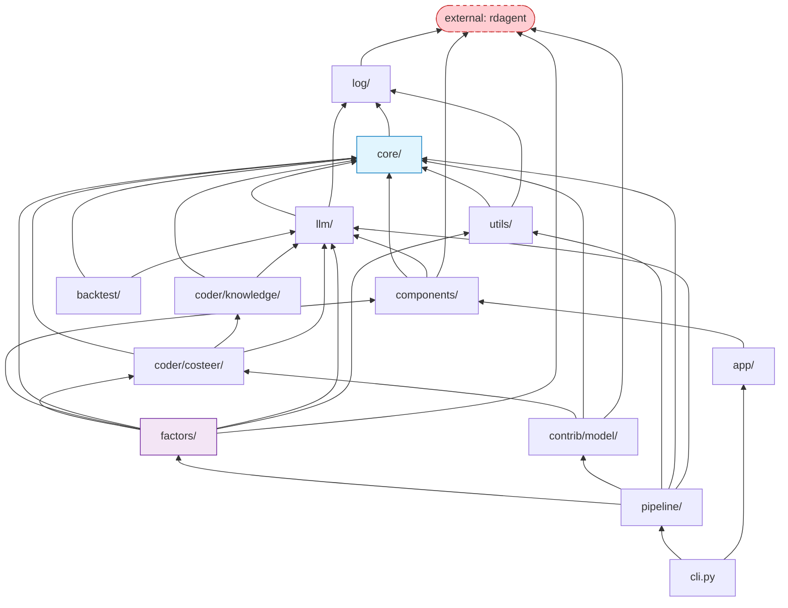

Read bottom-up: arrows point from a module to what it depends on. `core/` is the sink. The dashed red node is the **external** `rdagent` package — an unvendored dependency that several modules still reach into.

---

### Dependency graph — in depth

The internal graph is a strict DAG that sinks into [`core/`](quantaalpha/core/experiment.py): read every arrow as "depends on," and no path cycles back up. `core/` imports only `log/`; `llm/` and `utils/` sit just above it; `coder/costeer/` builds on `coder/knowledge/` + `core/` + `llm/`; `factors/` pulls in `coder/`, `components/`, `core/`, `llm/`, `utils/`; `pipeline/` sits at the top orchestrating `factors/` + `contrib/` + the infrastructure; and [`cli.py`](quantaalpha/cli.py) is the single apex over `pipeline/` + `app/`. Keeping this shape is what keeps the plugin system ([§6](#6-component-wiring--the-plugin-system)) honest — the moment a `core/` ABC imported a `factors/` implementation, the runtime `import_class` indirection would become a lie and swapping a stage by class-path string would stop working.

The one edge that isn't internal is the dashed red node. The external **`rdagent`** package is reached from at least five places — [`log/__init__.py`](quantaalpha/log/__init__.py) (wraps `rdagent_logger`), [`factors/experiment.py`](quantaalpha/factors/experiment.py) and [`factors/workspace.py`](quantaalpha/factors/workspace.py) (rdagent factor templates), [`contrib/model/experiment.py`](quantaalpha/contrib/model/experiment.py), and [`components/runner/__init__.py`](quantaalpha/components/runner/__init__.py). Because `core/` imports `log/` and `log/` imports `rdagent`, **`rdagent` is effectively a base-layer dependency of the entire package**: break it and nothing imports ([§18](#18-known-issues-and-dead-code) #14). If you ever vendor it in, start with `log/` and `factors/` — those are the load-bearing reach-ins; the `contrib/` and `benchmark/` ones are on colder paths and can follow.

## 14. Standalone Backtest (V2)

There are **two distinct backtest paths** and confusing them costs hours:

| Path | Code | When |
| :--- | :--- | :--- |
| **In-loop backtest** | [`factors/runner.py::QlibFactorRunner`](quantaalpha/factors/runner.py) | Step 4 of every mining loop. Validation set. Quick fitness signal. |
| **Standalone V2** | `quantaalpha/backtest/` | After mining. Full out-of-sample test set. What you report. |

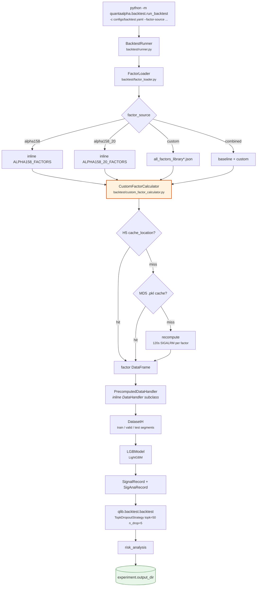

**The three-tier cache in [`custom_factor_calculator.py`](quantaalpha/backtest/custom_factor_calculator.py) is the performance-critical path.** A cold run recomputes every factor with a 120-second per-factor timeout; a warm run reads H5. `FactorLibraryManager.warm_cache_from_json` ([`factors/library.py:236`](quantaalpha/factors/library.py#L236)) can pre-populate tier 2 ahead of time.

> [`backtest/factor_calculator.py`](quantaalpha/backtest/factor_calculator.py) is a **different, unused** module (it has an LLM fallback). [`runner.py`](quantaalpha/backtest/runner.py) uses [`custom_factor_calculator.py`](quantaalpha/backtest/custom_factor_calculator.py). Don't edit the wrong one.

---

### Standalone Backtest — in depth

**[`backtest/runner.py`](quantaalpha/backtest/runner.py) — `BacktestRunner`.** `run()` ([`quantaalpha/backtest/runner.py:54`](quantaalpha/backtest/runner.py#L54)) is the four-stage pipeline: `[1/4] _load_factors` ([`quantaalpha/backtest/runner.py:79`](quantaalpha/backtest/runner.py#L79)) → `[2/4] _compute_custom_factors` ([`quantaalpha/backtest/runner.py:83`](quantaalpha/backtest/runner.py#L83), only for custom/combined) → `[3/4] _create_dataset` ([`quantaalpha/backtest/runner.py:90`](quantaalpha/backtest/runner.py#L90)) → `[4/4] _train_and_backtest` ([`quantaalpha/backtest/runner.py:93`](quantaalpha/backtest/runner.py#L93)). `_train_and_backtest()` ([`quantaalpha/backtest/runner.py:479`](quantaalpha/backtest/runner.py#L479)) runs inside a Qlib `R.start(...)` recorder: (1) `LGBModel(**model_config['params']).fit(dataset)` ([`quantaalpha/backtest/runner.py:499`](quantaalpha/backtest/runner.py#L499)) — `model_config['type']=='lgb'` is required; (2) `model.predict(dataset)` ([`quantaalpha/backtest/runner.py:507`](quantaalpha/backtest/runner.py#L507)); (3) `SignalRecord` + `SigAnaRecord` ([`quantaalpha/backtest/runner.py:511`](quantaalpha/backtest/runner.py#L511)–`517`) under a try/except ([`quantaalpha/backtest/runner.py:515`](quantaalpha/backtest/runner.py#L515)–`537`) that reads `sig_analysis/ic.pkl`/`ric.pkl` and sets `metrics['IC']`/`['ICIR']`/`['Rank IC']`/`['Rank ICIR']` ([`quantaalpha/backtest/runner.py:525`](quantaalpha/backtest/runner.py#L525)–`530`); (4) the portfolio backtest ([`quantaalpha/backtest/runner.py:539`](quantaalpha/backtest/runner.py#L539)–`672`, also try/except) calls `qlib.backtest.backtest(...)` ([`quantaalpha/backtest/runner.py:585`](quantaalpha/backtest/runner.py#L585)) with a `SimulatorExecutor` and a strategy built from `strategy_config` — kwargs explicitly `{signal: pred, topk, n_drop}` ([`quantaalpha/backtest/runner.py:599`](quantaalpha/backtest/runner.py#L599)–`603`) — then computes **net-of-cost** `excess_return_with_cost = portfolio_return - bench_return - cost` ([`quantaalpha/backtest/runner.py:621`](quantaalpha/backtest/runner.py#L621)) and `risk_analysis(...)` ([`quantaalpha/backtest/runner.py:648`](quantaalpha/backtest/runner.py#L648)), extracting `annualized_return` ([`quantaalpha/backtest/runner.py:653`](quantaalpha/backtest/runner.py#L653)), `information_ratio` ([`quantaalpha/backtest/runner.py:654`](quantaalpha/backtest/runner.py#L654)), `max_drawdown` ([`quantaalpha/backtest/runner.py:655`](quantaalpha/backtest/runner.py#L655)) and Calmar. `_create_dataset_with_computed_factors` ([`quantaalpha/backtest/runner.py:204`](quantaalpha/backtest/runner.py#L204)) defines an inline `PrecomputedDataHandler(DataHandler)` ([`quantaalpha/backtest/runner.py:358`](quantaalpha/backtest/runner.py#L358)) and applies per-date cross-sectional rank normalization. Results are written by `_save_results` ([`quantaalpha/backtest/runner.py:693`](quantaalpha/backtest/runner.py#L693)) to `{output_name}_backtest_metrics.json` + `batch_summary.json`.

**[`backtest/factor_loader.py`](quantaalpha/backtest/factor_loader.py) — `FactorLoader`.** [`ALPHA158_20_FACTORS`](quantaalpha/backtest/factor_loader.py#L21) is the 20-factor seed dict (`ROC0/1/5/10/20`, `VRATIO5/10`, `VSTD5_RATIO`, `RANGE`, `VOLATILITY5/10`, `RET_VOL5`, `RSV5/10`, `HIGH_RATIO5`, `LOW_RATIO5`, `SHADOW_RATIO`, `BODY_RATIO`, `MA_RATIO5_10`, `MA_RATIO10_20`); [`ALPHA158_FACTORS`](quantaalpha/backtest/factor_loader.py#L44) is the full ~158 set (note `VWAP0 = "$vwap/$close"` at [`quantaalpha/backtest/factor_loader.py:58`](quantaalpha/backtest/factor_loader.py#L58)). `load_factors` ([`quantaalpha/backtest/factor_loader.py:261`](quantaalpha/backtest/factor_loader.py#L261)) dispatches on `source_type` (`alpha158`/`alpha158_20`/`alpha360`/`custom`/`combined`). For custom factors, [`_parse_factor_json`](quantaalpha/backtest/factor_loader.py#L412) splits each expression via [`_is_qlib_compatible`](quantaalpha/backtest/factor_loader.py#L457) (rejects `ZSCORE`/`RANK`/`DELAY`/`DELTA`/`REGBETA`/`RSI`/`MACD`/`BB_*`/`SMA`/`EMA`/`WMA`/`TS_CORR`/… and ternary `?:`) and [`_convert_to_qlib_expression`](quantaalpha/backtest/factor_loader.py#L481) (`TS_MEAN→Mean`, `TS_STD→Std`, …, and **`$return → ($close/Ref($close,1)-1)`** at [`quantaalpha/backtest/factor_loader.py:490`](quantaalpha/backtest/factor_loader.py#L490)) — Qlib-compatible factors go to Qlib directly, the rest go to the custom calculator.

**[`backtest/custom_factor_calculator.py`](quantaalpha/backtest/custom_factor_calculator.py) — `CustomFactorCalculator`.** The three-tier cache lives in `calculate_factors_batch` ([`quantaalpha/backtest/custom_factor_calculator.py:307`](quantaalpha/backtest/custom_factor_calculator.py#L307)): **tier 1** H5 via `cache_location['result_h5_path']` ([`quantaalpha/backtest/custom_factor_calculator.py:342`](quantaalpha/backtest/custom_factor_calculator.py#L342)), **tier 2** MD5 `.pkl` ([`quantaalpha/backtest/custom_factor_calculator.py:353`](quantaalpha/backtest/custom_factor_calculator.py#L353)), **tier 3** recompute under a 120-second `SIGALRM` ([`quantaalpha/backtest/custom_factor_calculator.py:394`](quantaalpha/backtest/custom_factor_calculator.py#L394)). Computation (`calculate_factor`, [`quantaalpha/backtest/custom_factor_calculator.py:194`](quantaalpha/backtest/custom_factor_calculator.py#L194)) reuses the mining DSL — `parse_symbol`/`parse_expression` from [`factors/coder/expr_parser.py`](quantaalpha/factors/coder/expr_parser.py) and `function_lib` ([`quantaalpha/backtest/custom_factor_calculator.py:204`](quantaalpha/backtest/custom_factor_calculator.py#L204)). The data comes from `get_qlib_stock_data` ([`quantaalpha/backtest/custom_factor_calculator.py:552`](quantaalpha/backtest/custom_factor_calculator.py#L552)), which loads `fields = ['$open','$high','$low','$close','$volume','$vwap']` ([`quantaalpha/backtest/custom_factor_calculator.py:579`](quantaalpha/backtest/custom_factor_calculator.py#L579)) from Qlib — so the standalone path has `$vwap` — and `_prepare_data` ([`quantaalpha/backtest/custom_factor_calculator.py:78`](quantaalpha/backtest/custom_factor_calculator.py#L78)) derives `df['$return']` ([`quantaalpha/backtest/custom_factor_calculator.py:85`](quantaalpha/backtest/custom_factor_calculator.py#L85)), so it supports both `$vwap`- and `$return`-based factors. [`backtest/factor_calculator.py`](quantaalpha/backtest/factor_calculator.py) is the **unused orphan** — `FactorCalculator._generate_factor_code` ([`quantaalpha/backtest/factor_calculator.py:246`](quantaalpha/backtest/factor_calculator.py#L246)) is the LLM-fallback path the runner does *not* use. [`backtest/run_backtest.py`](quantaalpha/backtest/run_backtest.py) is the `python -m quantaalpha.backtest.run_backtest` CLI: `main()` ([`quantaalpha/backtest/run_backtest.py:35`](quantaalpha/backtest/run_backtest.py#L35)) parses `-c/--config`, `-s/--factor-source`, `-j/--factor-json` (repeatable), `--dry-run`, `--skip-uncached`, and requires `--factor-json` for `custom`/`combined`.

## 15. Runtime Artifacts

| Artifact | Default path | Produced by |
| :--- | :--- | :--- |
| Factor library | `data/factorlib/all_factors_library[_suffix].json` | `AlphaAgentLoop.feedback` → `FactorLibraryManager` |
| Session snapshots | `<log_trace_path>/__session__/{loop}/{step}_{name}` | `LoopBase.dump` after every step |
| Workspaces | `$WORKSPACE_PATH` = `$DATA_RESULTS_DIR/workspace_$EXPERIMENT_ID` | `RD_AGENT_SETTINGS.workspace_path` ([`core/conf.py:71-74`](quantaalpha/core/conf.py#L71-L74)) |
| Pickle cache | `$PICKLE_CACHE_FOLDER_PATH_STR` = `$DATA_RESULTS_DIR/pickle_cache_$EXPERIMENT_ID` | [`core/conf.py:81-84`](quantaalpha/core/conf.py#L81-L84), used by `cache_with_pickle` |
| Combined factor panel | `combined_factors_df.parquet` | [`factors/runner.py`](quantaalpha/factors/runner.py) |
| Per-factor values | `<workspace>/result.h5` | `FactorFBWorkspace` subprocess |
| Trajectory pool | `trajectory_pool.json` | `TrajectoryPool` |
| Evolution state | controller state file | `EvolutionController.save_state` |
| Branch logs | `log/branch_{i}` | `execution.branch_log_root` / `branch_log_prefix` |
| Backtest results | `experiment.output_dir` in [`configs/backtest.yaml`](configs/backtest.yaml) | `BacktestRunner` |

Env-var plumbing, end to end:

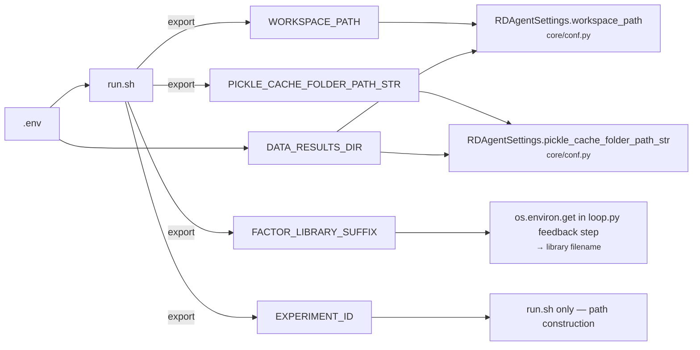

---

### Runtime artifacts — in depth

Everything a run produces is keyed off two ideas: **`EXPERIMENT_ID` isolation** and **snapshot-after-every-step**. `run.sh` derives `WORKSPACE_PATH` and `PICKLE_CACHE_FOLDER_PATH_STR` by suffixing `$DATA_RESULTS_DIR` with the experiment id, and [`RDAgentSettings`](quantaalpha/core/conf.py#L55) reads them back as `workspace_path` ([`core/conf.py:71`](quantaalpha/core/conf.py#L71)) and `pickle_cache_folder_path_str` ([`core/conf.py:81`](quantaalpha/core/conf.py#L81)). Two concurrent experiments therefore never collide — unless you deliberately set `EXPERIMENT_ID=shared`, which points them at the same directories.

There are **two distinct caches**, answering different questions. The **pickle cache** (`$PICKLE_CACHE_FOLDER_PATH_STR`) is the [`@cache_with_pickle`](quantaalpha/core/utils.py#L156) memo for expensive step outputs — `FactorFBWorkspace.execute` and `QlibFactorRunner.develop` hash their task info and skip recomputation on a hit (FileLock-gated when `use_file_lock`, which evolution mode turns off to avoid branch deadlocks). The **factor result cache** is the per-factor `result.h5` inside each workspace, plus the MD5 `.pkl` mirror that [`FactorLibraryManager._sync_h5_to_md5_cache`](quantaalpha/factors/library.py#L152) writes so the standalone backtester ([§14](#14-standalone-backtest-v2)) can look values up by content hash instead of by workspace path.

The **factor library JSON** (`data/factorlib/all_factors_library[_suffix].json`) is the durable output — component D of the paper. The `feedback` step appends to it after every loop via [`add_factors_from_experiment`](quantaalpha/factors/library.py#L56), recording for each factor its expression, generated code, `cache_location`, and a metadata block (experiment / round / evolution-phase / trajectory ids, parent trajectories, hypothesis, planning direction, backtest results, feedback). That metadata is what lets you reconstruct *which* evolutionary step produced a given factor. The **session snapshots** under `__session__/{loop}/{step}_{name}` are the other durable artifact — one pickle per completed step ([§7](#7-the-loop-engine--loopmeta--loopbase)), which is simultaneously the resume point and, in practice, the best forensic record when a run dies mid-loop.

## 16. Configuration Reference

Three configuration systems coexist. They are largely **disjoint** — each feeds a different consumer rather than cleanly layering over one another, so "which file wins" depends on *which value* you mean (see the in-depth).

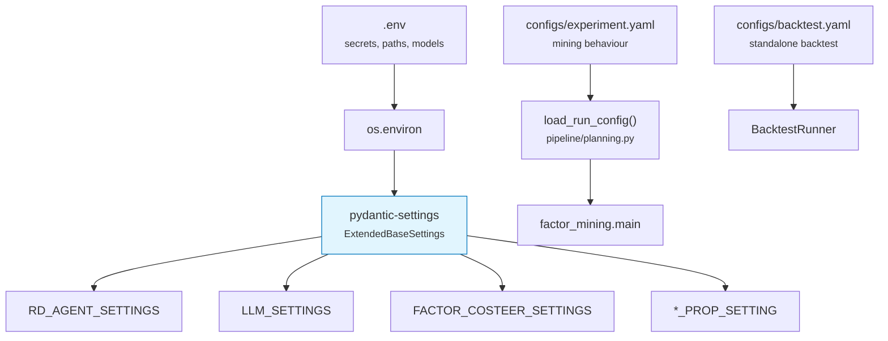

### [`configs/experiment.yaml`](configs/experiment.yaml)

| Section | Keys |
| :--- | :--- |
| `planning` | `enabled`, `num_directions` (2), `max_attempts` (5), `use_llm`, `allow_fallback`, `prompt_file` |
| `execution` | `max_loops` (2), `steps_per_loop` (5, fixed), `step_n`, `use_local` (true), `parallel_execution`, `branch_log_root`, `branch_log_prefix` |
| `evolution` | `enabled`, `mutation_enabled`, `crossover_enabled`, `max_rounds` (3), `crossover_size` (2), `crossover_n` (2), `parallel_enabled`, `prefer_diverse_crossover`, `parent_selection_strategy` (`best`), `top_percent_threshold` (0.3), `fresh_start`, `cleanup_on_finish` |
| `quality_gate` | `consistency_enabled` (**false**) is the **only live knob** — it decides whether the optional `FactorQualityGate` is ever built. `complexity_enabled`/`redundancy_enabled` are read but only feed a log line ([`loop.py:98`](quantaalpha/pipeline/loop.py#L98)); when the gate *is* built both are hardcoded on ([`proposal.py:360-361`](quantaalpha/factors/proposal.py#L360-L361)). `consistency_strict_mode`/`max_correction_attempts` (3) are never threaded — the checker keeps its constructor defaults. See [§10](#10-the-quality-gate), [§18](#18-known-issues-and-dead-code) #17 |
| `factor` | `factors_per_hypothesis` (1), `complexity.*`, `duplication.*` — ⚠️ **none of these are read by the mining gate**; only `duplication.threshold` has an env-var equivalent that reaches it ([§10](#10-the-quality-gate), [§18](#18-known-issues-and-dead-code) #15–16) |
| `backtest` | `use_docker` (false), `timeout` (800), `qlib.config_name` ([`conf_baseline.yaml`](quantaalpha/factors/factor_template/conf_baseline.yaml)) — ⚠️ inert here; the in-loop backtest is driven by [`conf_baseline.yaml`](quantaalpha/factors/factor_template/conf_baseline.yaml) directly |
| `llm` | `factor_mining_timeout`, `max_retries`, `retry_delay`, `json_mode_strict` — ⚠️ inert here; the real values live in `LLM_SETTINGS` (env / [`llm/config.py`](quantaalpha/llm/config.py)) |
| `logging` | `level`, `save_snapshots`, `save_trajectory_pool` — ⚠️ inert here; logging is the rdagent logger |

`step_n` has the highest priority and overrides `max_loops × steps_per_loop`. **Only four sections of this file are actually read** by [`factor_mining.main`](quantaalpha/pipeline/factor_mining.py#L549-L553): `planning`, `execution`, `evolution`, `quality_gate`. The rest (`factor`, `backtest`, `llm`, `logging`) are documented above for completeness but are not consumed by the mining entrypoint — see the in-depth below.

### [`configs/backtest.yaml`](configs/backtest.yaml)

| Section | Notable values |
| :--- | :--- |
| `random_seed` | 42 |
| `factor_source` | `alpha158` \| `alpha158_20` \| `alpha360` \| `custom` \| `combined` |
| `data` | `provider_uri: ~/.qlib/qlib_data/cn_data`, `region: cn`, `market: csi300`, 2016-01-01 → 2025-12-26 |
| `dataset` | label `Ref($close,-2)/Ref($close,-1)-1`; learn/infer processors; train 2016–2020, valid 2021, test 2022–2025 |
| `model` | LightGBM — `learning_rate` 0.05, `max_depth` 8, `num_leaves` 210, `num_boost_round` 500, `early_stopping_round` 50 |
| `backtest` | `TopkDropoutStrategy(topk=50, n_drop=5)`, account 1e8, benchmark `SH000300`, open_cost 0.0005, close_cost 0.0015 |

### Resource cost

| Configuration | Tokens | Wall clock |
| :--- | :--- | :--- |
| 2 directions × 3 rounds × 3 factors | ~100K | 30–60 min |
| 3 × 5 × 5 | ~500K | 2–4 h |
| 5 × 10 × 5 | ~2M | 8–16 h |

---

### Configuration — in depth

The three systems don't form one precedence ladder; they're **two parallel pipelines plus a standalone file**, and knowing which is which saves you from editing a key that nothing reads.

**Layer A — pydantic-settings (env / `.env`).** Every `*_SETTINGS`/`*_SETTING` object is a subclass of [`ExtendedBaseSettings`](quantaalpha/core/conf.py#L41). Its [`settings_customise_sources`](quantaalpha/core/conf.py#L46-L52) collapses Pydantic's usual source chain down to a **single** `ExtendedEnvSettingsSource`, so these objects read *only* from the process environment (into which `.env` is loaded) — never from init args or secret files. Each class carries an `env_prefix`: [`FactorCoSTEERSettings`](quantaalpha/factors/coder/config.py#L7-L8) uses `FACTOR_CoSTEER_`, so `FACTOR_CoSTEER_DUPLICATION_THRESHOLD` sets its [`duplication_threshold`](quantaalpha/factors/coder/config.py#L33). A field with no env override falls back to the class default. These objects are read at import time all over the code (`RD_AGENT_SETTINGS.workspace_path`, `LLM_SETTINGS.factor_mining_timeout`, `FACTOR_COSTEER_SETTINGS.factor_zoo_path`), which is why an env change takes effect *everywhere at once* but a change to the analogous YAML key does nothing.

**Layer B — `experiment.yaml` (loop shape).** [`load_run_config`](quantaalpha/pipeline/planning.py#L109-L116) is a plain `yaml.safe_load` into a dict — no schema, no validation, no merge with Layer A. [`factor_mining.main`](quantaalpha/pipeline/factor_mining.py#L549-L553) then pulls out exactly **four** sub-dicts — `planning`, `execution`, `evolution`, `quality_gate` — and threads them as constructor kwargs into `AlphaAgentLoop` / `run_evolution_loop`. The remaining sections (`factor`, `backtest`, `llm`, `logging`) are never fetched, so their keys are decorative: the real backtest config is [`conf_baseline.yaml`](quantaalpha/factors/factor_template/conf_baseline.yaml), the real LLM timeout is `LLM_SETTINGS` (Layer A), and logging is the rdagent logger. Even inside the four live sections not every key is honored — see the `quality_gate` caveats above and dead-code [§18](#18-known-issues-and-dead-code) #15–17.

**Layer C — `backtest.yaml` (standalone only).** This file is consumed by `BacktestRunner` on the standalone `quantaalpha backtest` path ([§14](#14-standalone-backtest-v2)); the in-loop backtest step ignores it entirely. Two backtest paths, two configs — a recurring trap ([§17](#17-how-to-extend) Traps #6).

**Where the layers touch.** Almost nowhere, and that's the honest version of the "precedence" story. The one genuine overlap is `use_local`: [`factor_mining.main`](quantaalpha/pipeline/factor_mining.py#L568-L572) reads the `USE_LOCAL` env var first, then **overrides it** with `execution.use_local` from YAML if that key is present — so for this single value **YAML wins over env**, the opposite of what a naive "env beats YAML" rule would predict. Everywhere else the two layers govern different values and never contend. Practical rule of thumb: **secrets, paths, models, and gate thresholds → env/`.env`; loop shape (directions, loops, evolution rounds, the consistency switch) → `experiment.yaml`; the standalone backtest → `backtest.yaml`.**

## 17. How to Extend

| I want to… | Touch these |
| :--- | :--- |
| **Swap a pipeline stage** | One string in [`pipeline/settings.py`](quantaalpha/pipeline/settings.py), or the matching `QLIB_FACTOR_*` env var. Implement the `core/` ABC. |
| **Change how hypotheses are generated** | [`factors/proposal.py::AlphaAgentHypothesisGen`](quantaalpha/factors/proposal.py) + [`factors/prompts/prompts.yaml`](quantaalpha/factors/prompts/prompts.yaml) |
| **Add a DSL operator** | [`factors/coder/expr_parser.py`](quantaalpha/factors/coder/expr_parser.py) (grammar) **+** [`factors/coder/function_lib.py`](quantaalpha/factors/coder/function_lib.py) (impl) **+** [`factors/coder/factor_ast.py`](quantaalpha/factors/coder/factor_ast.py) (so the gate sees it) |
| **Change the generated `factor.py`** | [`factors/coder/template.jinjia2`](quantaalpha/factors/coder/template.jinjia2) |
| **Add/modify a quality check** | [`factors/regulator/consistency_checker.py`](quantaalpha/factors/regulator/consistency_checker.py); thresholds in [`configs/experiment.yaml`](configs/experiment.yaml) under `factor.complexity` |
| **Change the fitness metric** | [`pipeline/evolution/trajectory.py::StrategyTrajectory.get_primary_metric`](quantaalpha/pipeline/evolution/trajectory.py) and `is_successful` |
| **Add an evolution operator** | New module in `pipeline/evolution/`, wire into `EvolutionController` phase machine. Follow the *prompt-suffix* convention. |
| **Change backtest model/strategy** | [`configs/backtest.yaml`](configs/backtest.yaml) for the standalone path; [`factors/factor_template/conf_baseline.yaml`](quantaalpha/factors/factor_template/conf_baseline.yaml) for the in-loop path |
| **Add a factor evaluator** | [`factors/coder/eva_utils.py`](quantaalpha/factors/coder/eva_utils.py), register in [`factors/coder/evaluators.py`](quantaalpha/factors/coder/evaluators.py) |
| **Add a CLI command** | [`quantaalpha/cli.py`](quantaalpha/cli.py) — add to the `fire.Fire` dict |
| **Add a pipeline step** | Add a **public** method to `AlphaAgentLoop` (auto-discovered). Keep helpers `_`-prefixed. |
| **Change the LLM provider** | [`.env`](.env) (`OPENAI_BASE_URL`, `CHAT_MODEL`) or [`llm/config.py`](quantaalpha/llm/config.py) |

### Traps

1. **Public methods on loop classes become pipeline steps.** Prefix helpers with `_`.
2. **Loop state must be picklable** — a snapshot is written after every step.
3. **Two parsers, one syntax.** Adding an operator to only one of them fails silently in the other's domain.
4. **`chat_model_map` reads `inspect.stack()[4]`.** Wrapping or re-nesting `APIBackend` calls changes which model gets selected.
5. **Config disagreement.** [`configs/experiment.yaml`](configs/experiment.yaml) and the pydantic settings are *disjoint* layers ([§16](#16-configuration-reference)), not one overriding the other — and only four of its sections are even read. [`docs/experiment_hyperparameters.md`](docs/experiment_hyperparameters.md) is stale and matches neither.
6. **Two backtest paths.** In-loop ([`factors/runner.py`](quantaalpha/factors/runner.py)) vs standalone (`backtest/`). They use different configs and different factor calculators.

---

### How to Extend — in depth

Two structural seams make QuantaAlpha reconfigurable, and knowing them turns most of the table above into one-line changes.

**The settings-string seam (swap a stage).** [`BasePropSetting`](quantaalpha/pipeline/settings.py#L15-L25) declares each pipeline role — `scen`, `hypothesis_gen`, `hypothesis2experiment`, `coder`, `runner`, `summarizer` — as a plain **import-path string**, not a class. [`AlphaAgentFactorBasePropSetting`](quantaalpha/pipeline/settings.py#L48-L57) fills those strings with concrete paths (e.g. `hypothesis_gen = "quantaalpha.factors.proposal.AlphaAgentHypothesisGen"`) under `env_prefix="QLIB_FACTOR_"`. When the loop is built, [`import_class`](quantaalpha/core/utils.py#L75-L88) does a `rsplit(".",1)` → `import_module` → `getattr` to resolve each string to a class and instantiate it ([`loop.py:102-125`](quantaalpha/pipeline/loop.py#L102-L125)). That indirection is why "swap a stage" is genuinely one change: edit the default in [`settings.py`](quantaalpha/pipeline/settings.py), or set the matching `QLIB_FACTOR_*` env var — no loop code moves. The only contract is that your replacement subclasses the same `core/` ABC (`HypothesisGen`, `Hypothesis2Experiment`, `Developer`, `HypothesisExperiment2Feedback`), because the loop calls it through that interface. This is the Strategy pattern threaded through pydantic-settings.

**The public-method seam (add a step).** The other seam is `LoopMeta` ([§7](#7-the-loop-engine--loopmeta--loopbase)): every *public* method of the loop class is auto-registered as a step, in definition order. Adding a step is therefore just adding a public method — but the inverse is the sharpest footgun in the codebase, because a helper you forget to `_`-prefix silently becomes a pipeline step and runs once per loop. Anything you attach to `self` must also stay picklable, since a snapshot is written after every step.

**The two-parser seam (add an operator).** A DSL operator lives in two places that never check each other: [`expr_parser.py`](quantaalpha/factors/coder/expr_parser.py) compiles it for *execution* and [`factor_ast.py`](quantaalpha/factors/coder/factor_ast.py) parses it for the *gate's* complexity/redundancy metrics ([§10](#10-the-quality-gate)). Add it to only one and the other fails silently in its own domain — the factor either runs but is mis-scored by the gate, or passes the gate but won't execute. Add the implementation to [`function_lib.py`](quantaalpha/factors/coder/function_lib.py) as well, or the compiled call resolves to nothing.

## 18. Known Issues and Dead Code

Catalogued while mapping the tree. Useful to know before you spend an afternoon debugging something that was never wired up.

| # | Location | Issue |
| :--- | :--- | :--- |
| 1 | [`pipeline/factor_from_report.py:9`](quantaalpha/pipeline/factor_from_report.py#L9) | Imports `quantaalpha.app.qlib_rd_loop.factor`, which does not exist in this tree (`app/` contains only `benchmark/` and `utils/`). The module cannot import. Also not registered in [`cli.py`](quantaalpha/cli.py). Leftover from the pre-rename AlphaAgent layout. |
| 2 | [`utils/env.py`](quantaalpha/utils/env.py) | `QlibDockerConf.dockerfile_folder_path` → `quantaalpha/scenarios/qlib/docker`, which doesn't exist; the real Dockerfile is [`quantaalpha/docker/Dockerfile`](quantaalpha/docker/Dockerfile). The build branch is guarded by `.exists()`, so it silently no-ops and falls through to an image pull. |
| 3 | [`components/benchmark/conf.py:24`](quantaalpha/components/benchmark/conf.py#L24) | `bench_method_cls` defaults to `"rdagent.components.coder.factor_coder.FactorCoSTEER"` — an **upstream** path. Override with `BENCHMARK_BENCH_METHOD_CLS`. Also uses pydantic-v1-style `class Config` rather than `model_config`. |
| 4 | [`app/benchmark/model/eval.py`](quantaalpha/app/benchmark/model/eval.py) | References `components/coder/model_coder/benchmark`, absent from this tree. |
| 5 | [`utils/loader/experiment_loader.py`](quantaalpha/utils/loader/experiment_loader.py) | `ModelExperimentLoader(Loader[FactorExperiment])` — copy-paste bug, wrong type parameter. |
| 6 | [`backtest/factor_calculator.py`](quantaalpha/backtest/factor_calculator.py) | Orphan. Exported by [`backtest/__init__.py`](quantaalpha/backtest/__init__.py) but unused; [`runner.py`](quantaalpha/backtest/runner.py) uses [`custom_factor_calculator.py`](quantaalpha/backtest/custom_factor_calculator.py). |
| 7 | `utils/agent/{ret.py,tpl.py,tpl.yaml}` | Scaffolding with no consumers outside itself. |
| 8 | [`factors/feedback.py`](quantaalpha/factors/feedback.py) | `QlibModelHypothesisExperiment2Feedback` references `feedback_prompts["model_feedback_generation"]`, not loaded in that file. |
| 9 | [`factors/coder/expr_parser.py::parse_expression`](quantaalpha/factors/coder/expr_parser.py) | Prints the preprocessed expression to stdout — leftover debug artifact, noisy in logs. |
| 10 | [`factors/coder/test.py`](quantaalpha/factors/coder/test.py) | References `template_debug.jinjia2`, which doesn't exist alongside it. |
| 11 | [`factors/prompts/experiment.yaml`](quantaalpha/factors/prompts/experiment.yaml) | Likely a stale local copy; [`experiment.py`](quantaalpha/factors/experiment.py) pulls those prompts from rdagent templates instead. |
| 12 | [`coder/costeer/knowledge_management.py`](quantaalpha/coder/costeer/knowledge_management.py) | `CoSTEERKnowledgeBaseV1` / `CoSTEERRAGStrategyV1` are deprecated and raise `NotImplementedError`. Use V2. |
| 13 | [`docs/experiment_hyperparameters.md`](docs/experiment_hyperparameters.md) | Stale throughout — documents `运行实验.sh`, `alphaagent/app/qlib_rd_loop/run_config.yaml`, and `alphaagent/scenarios/...` paths that no longer exist, plus defaults that disagree with [`configs/experiment.yaml`](configs/experiment.yaml). |
| 14 | package-wide | Hard runtime dependency on the external **`rdagent`** package ([`log/__init__.py`](quantaalpha/log/__init__.py), [`factors/experiment.py`](quantaalpha/factors/experiment.py), [`factors/workspace.py`](quantaalpha/factors/workspace.py), [`contrib/model/experiment.py`](quantaalpha/contrib/model/experiment.py), [`components/runner/__init__.py`](quantaalpha/components/runner/__init__.py)). Since `core/` imports `log/`, losing `rdagent` breaks essentially the whole package. |
| 15 | [`configs/experiment.yaml:124`](configs/experiment.yaml#L124) | **`factor.factors_per_hypothesis` is not consumed by the mining code.** No `.py` under `quantaalpha/` reads it. The factor count per hypothesis is fixed at **2–3 by the prompt** ([`prompts.yaml:338-339`](quantaalpha/factors/prompts/prompts.yaml)); `AlphaAgentHypothesis2FactorExpression` simply iterates whatever the LLM returns ([`proposal.py:451`](quantaalpha/factors/proposal.py#L451)). |
| 16 | [`factors/proposal.py:343-346`](quantaalpha/factors/proposal.py#L343-L346) | **The gate's SL / base-feature thresholds are not wired to config.** `FactorRegulator` is constructed with only `factor_zoo_path` + `duplication_threshold`, so `symbol_length_threshold` (300) and `base_features_threshold` (6) stay at their hardcoded `__init__` defaults ([`factor_regulator.py:20-21`](quantaalpha/factors/regulator/factor_regulator.py#L20-L21)). `FACTOR_CoSTEER_SYMBOL_LENGTH_THRESHOLD` and the `factor.complexity` YAML change neither — see [§10](#10-the-quality-gate). |
| 17 | [`configs/experiment.yaml:102-116`](configs/experiment.yaml#L102-L116) | **Four of the five `quality_gate` keys do nothing.** Only `consistency_enabled` is threaded ([`loop.py:95`](quantaalpha/pipeline/loop.py#L95) → factor constructor). `complexity_enabled`/`redundancy_enabled` are read but only used in a log line ([`loop.py:96-100`](quantaalpha/pipeline/loop.py#L96-L100)); the gate hardcodes both on ([`proposal.py:360-361`](quantaalpha/factors/proposal.py#L360-L361)). `consistency_strict_mode`/`max_correction_attempts` are never passed to `FactorConsistencyChecker`, which is built with `enabled=` only ([`consistency_checker.py:377`](quantaalpha/factors/regulator/consistency_checker.py#L377)) and keeps its defaults (`strict_mode=False`, `max_correction_attempts=3`). |

> Items 1, 2, 4, and 13 all trace to the same incomplete rename from `alphaagent`/`rdagent` to `quantaalpha`. Items 15–17 are config keys that look live but are never read — don't tune them expecting an effect. If you're cleaning up, do each group together.

---

## 19. Glossary

| Term | Meaning |
| :--- | :--- |
| **Alpha factor** | A formula over market data whose cross-sectional ranking predicts future returns |
| **RankIC** | Spearman correlation between factor rank and forward-return rank. The primary fitness metric. |
| **IC** | Pearson version of the above |
| **ICIR / IR** | Information ratio — mean IC divided by its standard deviation |
| **Trajectory** | One complete mining run: hypothesis → factors → backtest → feedback. The unit of evolution. |
| **CoSTEER** | The self-evolving code-generation subsystem — generate → query knowledge → evolve → evaluate |
| **Factor zoo** | Reference set of known factors (e.g. Alpha101) used for redundancy checking |
| **Quality gate** | Consistency + complexity + redundancy checks run before backtest |
| **Scenario** | A [`core/scenario.py`](quantaalpha/core/scenario.py) object bundling background, data description, and output spec for the LLM |
| **Trace** | Append-only history of `(hypothesis, experiment, feedback)` triples fed back into the proposer |
| **Workspace** | A directory holding one generated `factor.py` plus its `result.h5` output |
| **Qlib** | Microsoft's quantitative investment platform — provides data, model training, and backtest |

---

## 20. Reproducing the Paper Results

The paper ([arXiv:2602.07085](https://arxiv.org/abs/2602.07085)) reports, for the best configuration (**QuantaAlpha + GPT-5.2**) on CSI 300 over the 2022–2025 out-of-sample test period:

| Metric | Value |
| :--- | :--- |
| IC | **0.0472** |
| Rank IC | **0.0459** |
| Annualized return (ARR) | **4.68%** |
| Information ratio (IR) | **0.6453** |
| Max drawdown (MDD) | **11.80%** |

Reproducing these numbers is a **two-stage pipeline**: (A) mine a factor library with the LLM at paper scale, then (B) standalone-backtest that library. **No pre-mined factor library ships in the repo** (`data/factorlib/` is empty) — you must run the mining loop yourself. Because the LLM is nondeterministic, you reproduce the *setup* and should expect statistically-similar, not bit-identical, numbers.

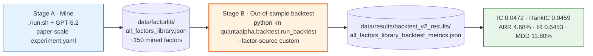

### 20.1 Stage A — full setup to mine the same as the paper

The paper's main experiment: **GPT-5.2**, **CSI 300**, **10 parallel directions**, **5 evolution rounds**, **3 factors per hypothesis**, complexity caps **250 / 6 / 0.5**, producing **~150 validated factors**. The [`configs/experiment.yaml`](configs/experiment.yaml) that ships in the repo is a *smoke-test* config (2 directions / 3 rounds / 1 factor per hypothesis) — do **not** run it for reproduction. Complete from-scratch sequence:

**Step 1 — Clone & install**

```bash
git clone https://github.com/QuantaAlpha/QuantaAlpha.git
cd QuantaAlpha
conda create -n quantaalpha python=3.10 -y
conda activate quantaalpha
SETUPTOOLS_SCM_PRETEND_VERSION=0.1.0 pip install -e .
pip install -r requirements.txt
```

**Step 2 — Download & place data** (HuggingFace dataset [`QuantaAlpha/qlib_csi300`](https://huggingface.co/datasets/QuantaAlpha/qlib_csi300))

```bash
pip install huggingface_hub
huggingface-cli download QuantaAlpha/qlib_csi300 --repo-type dataset --local-dir ./hf_data

# Qlib market data (needed to init Qlib + for the backtest stage)
unzip hf_data/cn_data.zip -d ./data/qlib

# Pre-computed price/volume panels (needed for factor mining)
mkdir -p git_ignore_folder/factor_implementation_source_data
mkdir -p git_ignore_folder/factor_implementation_source_data_debug
cp hf_data/daily_pv.h5        git_ignore_folder/factor_implementation_source_data/daily_pv.h5
cp hf_data/daily_pv_debug.h5  git_ignore_folder/factor_implementation_source_data_debug/daily_pv.h5
```

> The debug file **must be renamed to `daily_pv.h5`** in the debug folder. Both folder paths come from `FactorCoSTEERSettings` ([`quantaalpha/factors/coder/config.py`](quantaalpha/factors/coder/config.py)) and are overridable via `FACTOR_CoSTEER_DATA_FOLDER` / `FACTOR_CoSTEER_DATA_FOLDER_DEBUG`.

**Step 3 — Configure [`.env`](.env)**

```bash
cp configs/.env.example .env
```

Edit [`.env`](.env) to set paths, the paper's headline model, and the symbol-length cap:

```bash
# paths
QLIB_DATA_DIR=./data/qlib/cn_data
QLIB_PROVIDER_URI=./data/qlib/cn_data
DATA_RESULTS_DIR=./data/results
CONDA_ENV_NAME=quantaalpha

# LLM — paper headline model is GPT-5.2 (OpenRouter id: openai/gpt-5.2)
OPENAI_API_KEY=sk-...
OPENAI_BASE_URL=https://your-provider/v1     # must actually serve gpt-5.2
CHAT_MODEL=gpt-5.2
REASONING_MODEL=gpt-5.2

# paper complexity cap intent: symbol length ≤ 250 (see caveat below)
FACTOR_CoSTEER_SYMBOL_LENGTH_THRESHOLD=250

USE_LOCAL=True
```

> ⚠️ **This env var does not lower the gate's SL cap.** The hard accept/reject gate uses `FactorRegulator`'s **hardcoded 300** (§10); `FACTOR_CoSTEER_SYMBOL_LENGTH_THRESHOLD` only tightens the *feedback* warnings ([`feedback.py:240`](quantaalpha/factors/feedback.py#L240)). To actually enforce the paper's SL ≤ 250 at the gate, edit `symbol_length_threshold` at [`factor_regulator.py:21`](quantaalpha/factors/regulator/factor_regulator.py#L21) (or thread the setting through [`proposal.py:343`](quantaalpha/factors/proposal.py#L343)). In practice the LLM prompt already steers factors well under 300 characters, so this rarely bites — but don't expect the env var to change the boundary.

> **Model.** The headline is **GPT-5.2**; the paper's ablations use Qwen3-235B, DeepSeek-V3.2, Gemini-3-pro, Claude-4.5-sonnet, with **DeepSeek-V3.2** as the default backbone for non-main experiments. Set it via `CHAT_MODEL` / `REASONING_MODEL` (bound in [`quantaalpha/llm/config.py:31-32`](quantaalpha/llm/config.py#L31-L32)). The `MODEL_PRESET` table in [`docs/experiment_hyperparameters.md`](docs/experiment_hyperparameters.md) §1.1 is **not implemented** — there is no `MODEL_PRESET` handling in the code. If you don't have GPT-5.2 access, mining with DeepSeek-V3.2 reproduces the *methodology* but yields a different factor library, so you won't match the headline numbers exactly.

#### Running against Ollama (or any OpenAI-compatible local endpoint)

If you're using a local Ollama server instead of a hosted GPT-5.2 endpoint (e.g. `ollama run minimax-m2.7:cloud` at `127.0.0.1:11434`), replace the LLM + embedding lines in [`.env`](.env) with:

```bash
# Ollama OpenAI-compatible endpoint — the /v1 suffix is mandatory
OPENAI_API_KEY=ollama
OPENAI_BASE_URL=http://127.0.0.1:11434/v1
CHAT_MODEL=minimax-m2.7:cloud      # exact name `ollama run` accepts
REASONING_MODEL=minimax-m2.7:cloud

# Embedding — REQUIRED for the default QlibFactorParser path (see point 3 below)
EMBEDDING_API_KEY=ollama
EMBEDDING_BASE_URL=http://127.0.0.1:11434/v1
EMBEDDING_MODEL=nomic-embed-text   # `ollama pull nomic-embed-text` first

CHAT_TEMPERATURE=0.7
CHAT_MAX_TOKENS=4000
# CHAT_STREAM=false   # uncomment if you hit streaming errors
```

Four things verified in the code that bite Ollama users:

1. **`/v1` is mandatory** on `OPENAI_BASE_URL` and `EMBEDDING_BASE_URL`. The `openai` SDK ([`quantaalpha/llm/client.py:490-491`](quantaalpha/llm/client.py#L490-L491)) posts to `{base_url}/chat/completions`; without `/v1` you get 404. `OPENAI_API_KEY` can be any non-empty placeholder for local Ollama (it's only consumed as `api_key` for the SDK client).
2. **Set both `CHAT_MODEL` and `REASONING_MODEL` to the same model.** `REASONING_MODEL` drives the hypothesis / construct / feedback / planning calls — the default `reasoning_flag=True` path, which **forces `json_mode=None`** so no `response_format` is sent on those ([`client.py:804-806`](quantaalpha/llm/client.py#L804-L806)). `CHAT_MODEL` drives the factor evaluators (`reasoning_flag=False`). An empty `chat_model_map` (the default `"{}"`) makes every non-reasoning call fall back to `chat_model`, so both vars are exercised.
3. **An embedding model is required even for the default `QlibFactorParser` coder.** All three coders subclass `CoSTEER` and carry the embedding-backed knowledge base ([`coder/costeer/__init__.py:52-61`](quantaalpha/coder/costeer/__init__.py#L52-L61)). Once a factor succeeds, `CoSTEERRAGStrategyV2.query` calls `calculate_embedding_distance_between_str_list` ([`knowledge_management.py:530`](quantaalpha/coder/costeer/knowledge_management.py#L530)) which is **not** guarded — it crashes with an embedding API error if no embedding model is configured. (The graph's per-node embeds at [`graph.py:140/155`](quantaalpha/coder/knowledge/graph.py#L140) are gracefully skipped on failure, but the query-time similarity embed is not.) So `ollama pull nomic-embed-text` and set the three `EMBEDDING_*` vars.
4. **`response_format={"type":"json_object"}` IS sent on the final-decision factor evaluator** ([`eva_utils.py:565`](quantaalpha/factors/coder/eva_utils.py#L565), `reasoning_flag=False, json_mode=True`, using `CHAT_MODEL`). The response is `json.loads`-parsed with up to **`max_attempts=3` retries on `JSONDecodeError`** — each retry re-rolls with a fresh `APIBackend(use_chat_cache=False)` and `seed=attempts`, and only raises `ValueError("Failed to decode JSON response from API.")` after the budget is exhausted ([`eva_utils.py:576-583`](quantaalpha/factors/coder/eva_utils.py#L576-L583)). Ollama's OpenAI endpoint supports `response_format`, and the client brace-extracts `{...}` from prose first ([`client.py:897-901`](quantaalpha/llm/client.py#L897-L901)), so a strong model like minimax-m2 is fine — but if you see `Failed to decode JSON response from API` in the log, that call is the cause.

> Reproducing the paper's *numbers* with a non-GPT-5.2 model is not expected — the headline is specific to GPT-5.2. But the full mining + backtest pipeline will run end-to-end against Ollama with the config above.

**Step 4 — Set the paper-scale mining config.** Create a paper-scale copy of [`configs/experiment.yaml`](configs/experiment.yaml). `crossover_size=2` and `parent_selection_strategy=best` already match, so only the five scalars below need overriding:

| Knob | Repo default | Paper-scale value | Source |
| :--- | :--- | :--- | :--- |
| `planning.num_directions` | 2 | **10** | paper §4.2.1 |
| `evolution.max_rounds` | 3 | **5** | paper (main = 5 iterations) |
| `factor.factors_per_hypothesis` | 1 | **3** *(not consumed — see note)* | paper |
| `execution.max_loops` | 2 | **(no-op in evolution mode)** | each trajectory runs **one** 5-step loop ([`factor_mining.py:437,477`](quantaalpha/pipeline/factor_mining.py#L437)); `max_loops` only multiplies with `evolution.enabled: false` ([`factor_mining.py:564-566`](quantaalpha/pipeline/factor_mining.py#L564-L566)) |
| `evolution.crossover_n` | 2 | **10** | project balanced-mode guide; paper doesn't name it |
| Complexity caps (SL / ER / free-args) | YAML 200/5 (**never read**) | **300 / 6 / 0.5 hardcoded** | the gate uses `FactorRegulator`'s hardcoded 300/6 (§10), *not* the paper's 250; to force 250 edit [`factor_regulator.py:21`](quantaalpha/factors/regulator/factor_regulator.py#L21) |

```bash
python - <<'PY'
from pathlib import Path
src, dst = Path("configs/experiment.yaml"), Path("configs/experiment_paper.yaml")
s = src.read_text()
for old, new in {
    "num_directions: 2":        "num_directions: 10",
    "max_rounds: 3":            "max_rounds: 5",
    "crossover_n: 2":           "crossover_n: 10",
    "factors_per_hypothesis: 1":"factors_per_hypothesis: 3",
}.items():
    assert old in s, f"expected '{old}' in {src}"
    s = s.replace(old, new, 1)
dst.write_text(s)
print(f"wrote {dst}")
PY
```

> The paper only explicitly specifies `num_directions=10`, `max_rounds=5`, `factors_per_hypothesis=3`, and the complexity caps; `crossover_n=10` comes from the project's "balanced mode" guide ([`docs/experiment_guide.md`](docs/experiment_guide.md) §6.1/§8.1: "10 directions, 5 evolution rounds, 2–3 factors each"), which matches the paper wherever they overlap. **`max_loops` is a no-op in evolution mode** — [`factor_mining.py:437,477`](quantaalpha/pipeline/factor_mining.py#L437) passes `step_n=steps_per_loop` (=5), so every trajectory runs a single 5-step loop regardless of `max_loops`; it only matters if you set `evolution.enabled: false` ([`factor_mining.py:564-566`](quantaalpha/pipeline/factor_mining.py#L564-L566)). The `factor.complexity` / `factor.duplication` blocks in [`configs/experiment.yaml`](configs/experiment.yaml) are **never read by the mining gate** (see [§10](#10-the-quality-gate)); the gate's SL/ER caps are hardcoded 300/6 in [`factor_regulator.py:20-21`](quantaalpha/factors/regulator/factor_regulator.py#L20-L21). **`factors_per_hypothesis` is likewise not consumed by the mining code** ([§18](#18-known-issues-and-dead-code) #15) — the number of factors per hypothesis is fixed at **2–3 by the prompt** ([`prompts.yaml:338`](quantaalpha/factors/prompts/prompts.yaml)), not by the YAML. Setting it to 3 in the paper config documents intent, but editing the prompt is what actually changes the count.

**Step 5 — Run the mining**

```bash
# paper-scale mine → data/factorlib/all_factors_library.json
CONFIG_PATH=configs/experiment_paper.yaml ./run.sh "price-volume factor mining"

# optional: tag the output library with a suffix → all_factors_library_exp_pv.json
CONFIG_PATH=configs/experiment_paper.yaml ./run.sh "price-volume factor mining" "exp_pv"
```

> **Which direction string?** The paper does **not** publish the exact initial direction verbatim. It only says the planning phase expands the seed into **10 diversified directions** — varying signal source (price vs. volume), time scale (short- vs. long-term), and mechanism (momentum vs. mean-reversion) — over the six basic features **open / high / low / close / volume / vwap**. `"price-volume factor mining"` is the repo's canonical example ([`run.sh:10`](run.sh#L10), [`launcher.py:6`](launcher.py#L6)) and matches that six-feature setup, so it is the right direction to use for reproduction. The exact initial string is **not load-bearing** — it only seeds the planning LLM; what matters is the feature set and the 10 diversified sub-directions planning derives from it. If you pass no direction, planning falls back to `"market microstructure"` ([`pipeline/planning.py:52`](quantaalpha/pipeline/planning.py#L52)).

> ⚠️ **The "vwap" above is the paper's feature set, not the code's.** The mining code's sixth feature is `$return`, not `$vwap` — [`generate.py`](quantaalpha/factors/data_template/generate.py) computes `$return`, the prompts advertise `$return`, and the HF `daily_pv.h5` ships with `$factor` (stale). So `"price-volume factor mining"` seeds directions over the *code's* features (OHLCV + `$return`), not the paper's (OHLCV + `$vwap`). See [§20.5](#205-reproducibility-caveats--discrepancies) #8.

[`run.sh`](run.sh) activates conda, sources [`.env`](.env), validates Qlib data, symlinks `~/.qlib/qlib_data/cn_data`, isolates `WORKSPACE_PATH` / `PICKLE_CACHE_FOLDER_PATH_STR` per `EXPERIMENT_ID`, then runs [`quantaalpha mine --direction "..." --config_path configs/experiment_paper.yaml`](configs/experiment_paper.yaml). The 5-step loop (propose → construct → calculate → backtest → feedback) runs **once per trajectory** across 5 evolution rounds (original → mutation → crossover → mutation → crossover): 10 trajectories in the original round, then ~10 per round after, **~50 trajectories total** (each trajectory = one 5-step loop, since `max_loops` is ignored in evolution mode).

> **Cost & time.** Evolution mode runs **one 5-step loop per trajectory** (`max_loops` is ignored). A paper-scale run is **~50 trajectories**: 10 (original) + 10 (mutation) + 10 (crossover) + 10 (mutation) + 10 (crossover), each producing the **2–3 factors the prompt requests** ([`prompts.yaml:338`](quantaalpha/factors/prompts/prompts.yaml)) → ~150 raw proposals (matching the paper's ~150; note the count is prompt-driven, not `factors_per_hypothesis`). At ~5–6 min/LLM-step × 5 steps ≈ 30 min/trajectory, that's **~24–30 h sequential (~1 day)** — more if the in-loop LightGBM backtest steps are slow. It runs **sequentially** by default; set `evolution.parallel_enabled: true` in [`configs/experiment_paper.yaml`](configs/experiment_paper.yaml) to run all tasks within a phase concurrently (needs Ollama to handle parallel requests — `OLLAMA_NUM_PARALLEL` for local, or your cloud model's rate limit) — evolution mode already sets `RD_AGENT_SETTINGS.use_file_lock = False` to avoid deadlocks (see [§8](#8-the-evolution-system)).

**Step 6 — Output & next step.** The mined library is written to `data/factorlib/all_factors_library[_suffix].json` (see [§15](#15-runtime-artifacts)) — ~150 validated factors. Proceed to **§20.2** below to backtest it out-of-sample.

### 20.2 Stage B — the out-of-sample backtest

```bash
python -m quantaalpha.backtest.run_backtest \
  -c configs/backtest.yaml \
  --factor-source custom \
  --factor-json data/factorlib/all_factors_library.json
```

> ⚠️ **Do not confuse this with `quantaalpha backtest`.** The `quantaalpha backtest` CLI command ([`pipeline/factor_backtest.py`](quantaalpha/pipeline/factor_backtest.py)) runs `BacktestLoop` — a *loop-based* backtest that consumes a factor CSV via `FACTOR_BACK_TEST_PROP_SETTING`. The paper's out-of-sample numbers come from `python -m quantaalpha.backtest.run_backtest` → `BacktestRunner` ([`backtest/runner.py`](quantaalpha/backtest/runner.py)). These are two different code paths; only the latter reproduces the paper.

**Does the out-of-sample backtest include LightGBM training? Yes.** `BacktestRunner.run()` ([`backtest/runner.py:54-100`](quantaalpha/backtest/runner.py#L54-L100)) runs the full pipeline, and `_train_and_backtest()` ([`backtest/runner.py:479-674`](quantaalpha/backtest/runner.py#L479-L674)) does:

1. `LGBModel(**model_config['params']).fit(dataset)` — **train LightGBM** ([`runner.py:499-504`](quantaalpha/backtest/runner.py#L499-L504));
2. `model.predict(dataset)` — predictions across the whole panel ([`runner.py:507`](quantaalpha/backtest/runner.py#L507));
3. `SignalRecord` + `SigAnaRecord` — IC / Rank IC ([`runner.py:511-533`](quantaalpha/backtest/runner.py#L511-L533));
4. `qlib.backtest.backtest(...)` — **TopkDropoutStrategy** portfolio backtest ([`runner.py:585-613`](quantaalpha/backtest/runner.py#L585-L613));
5. `risk_analysis(excess_return_with_cost)` — ARR / IR / MDD / Calmar on the **excess-return** series ([`runner.py:648-668`](quantaalpha/backtest/runner.py#L648-L668)).

The dataset segments ([`configs/backtest.yaml:82-85`](configs/backtest.yaml#L82-L85)) are exactly the paper's splits (Table 3):

| Segment | Dates |
| :--- | :--- |
| train | 2016-01-01 → 2020-12-31 |
| valid | 2021-01-01 → 2021-12-31 (early stopping) |
| test | 2022-01-01 → 2025-12-26 |

The label is `Ref($close,-2)/Ref($close,-1)-1` (next-day return, T+2/T+1) at [`backtest.yaml:55`](configs/backtest.yaml#L55). **One model is trained on train+valid and then used to predict the entire 2022–2025 test period — there is no walk-forward retraining.** This is the standard Qlib workflow; if you want rolling retraining you must add it yourself.

Each paper metric is emitted at a specific point in that pipeline:

| Paper metric | Emitted at | Key code |
| :--- | :--- | :--- |
| IC, ICIR | `SigAnaRecord` → `sig_analysis/ic.pkl` | [`runner.py:524-526`](quantaalpha/backtest/runner.py#L524-L526) |
| Rank IC, Rank ICIR | `SigAnaRecord` → `sig_analysis/ric.pkl` | [`runner.py:528-530`](quantaalpha/backtest/runner.py#L528-L530) |
| ARR (annualized_return) | `risk_analysis(excess_return_with_cost)` | [`runner.py:648-658`](quantaalpha/backtest/runner.py#L648-L658) |
| IR (information_ratio) | `risk_analysis(...)` | [`runner.py:659-660`](quantaalpha/backtest/runner.py#L659-L660) |
| MDD (max_drawdown) | `risk_analysis(...)` | [`runner.py:661-662`](quantaalpha/backtest/runner.py#L661-L662) |

Results are written to `experiment.output_dir` (`data/results/backtest_v2_results/`) as `{output_name}_backtest_metrics.json` and appended to `batch_summary.json` ([`runner.py:693-757`](quantaalpha/backtest/runner.py#L693-L757)).

### 20.3 The Alpha158(20) seed

Alpha158(20) is **not** Qlib's stock Alpha158 (158 factors). It is this repo's own curated **20-factor subset**, defined inline as `FactorLoader.ALPHA158_20_FACTORS` at [`quantaalpha/backtest/factor_loader.py:21-42`](quantaalpha/backtest/factor_loader.py#L21-L42):

```
ROC0, ROC1, ROC5, ROC10, ROC20, VRATIO5, VRATIO10, VSTD5_RATIO, RANGE,
VOLATILITY5, VOLATILITY10, RET_VOL5, RSV5, RSV10, HIGH_RATIO5, LOW_RATIO5,
SHADOW_RATIO, BODY_RATIO, MA_RATIO5_10, MA_RATIO10_20
```

There is **no seed file to download** — the seed *is* that dict. Three ways it is used:

| Mode | `--factor-source` | What runs | Config |
| :--- | :--- | :--- | :--- |
| Baseline | `alpha158_20` | Backtest the 20 seed factors alone | default ([`backtest.yaml:25`](configs/backtest.yaml#L25)) |
| Seed + mined | `combined` | The 20 seed factors **plus** your mined factors | [`backtest.yaml:36`](configs/backtest.yaml#L36) (`official_source: alpha158_20`, `include_custom: true`) |
| Mined only | `custom` | Only your `all_factors_library.json` factors | `--factor-source custom --factor-json ...` |

```bash
# dump the 20 seed factors without running a backtest
python -m quantaalpha.backtest.run_backtest -c configs/backtest.yaml \
  --factor-source alpha158_20 --dry-run -v

# backtest the Alpha158(20) baseline
python -m quantaalpha.backtest.run_backtest -c configs/backtest.yaml \
  --factor-source alpha158_20

# seed + mined (combined)
python -m quantaalpha.backtest.run_backtest -c configs/backtest.yaml \
  --factor-source combined --factor-json data/factorlib/all_factors_library.json
```

Per the paper, Alpha158(20) is the **diversified-initialization seed** for the planning directions (grouped by low correlation to broaden initial coverage). In this code snapshot that role is realized through the LLM planning prompt + scenario context ([`quantaalpha/factors/prompts/experiment.yaml`](quantaalpha/factors/prompts/experiment.yaml) references Alpha158), **not** through a separate seed file injected into planning — `generate_parallel_directions` ([`pipeline/planning.py`](quantaalpha/pipeline/planning.py)) builds directions from your text input via the LLM.

> **For headline reproduction, use `--factor-source custom`** (the ~150 mined factors only). The paper's reported numbers use the mined factor pool alone; `alpha158_20` and `combined` are the baseline and the seed-augmented ablation, not the headline configuration.

### 20.4 The trading strategy

**Included and already wired** — you do not need to set it up. [`configs/backtest.yaml:114-121`](configs/backtest.yaml#L114-L121) declares the strategy, and `BacktestRunner._train_and_backtest` executes it via `qlib.backtest.backtest` at [`runner.py:585-613`](quantaalpha/backtest/runner.py#L585-L613):

```yaml
backtest:
  strategy:
    class: "TopkDropoutStrategy"
    module_path: "qlib.contrib.strategy"
    kwargs:
      signal: "<PRED>"      # injected by the runner — do not set this
      topk: 50
      n_drop: 5
  backtest:
    start_time: "2022-01-01"
    end_time:   "2025-12-26"
    account:    100000000
    benchmark:  "SH000300"
    exchange_kwargs:
      limit_threshold: 0.095
      deal_price:  "open"
      open_cost:   0.0005
      close_cost:  0.0015
      min_cost:    5
```

This matches the paper's Table 8 exactly (topk 50, n_drop 5, buy 0.05%, sell 0.15%, deal at open, limit 9.5%, benchmark SH000300). To change it:

- **Swap the strategy class** — edit [`configs/backtest.yaml`](configs/backtest.yaml) `backtest.strategy.class` / `module_path` / `kwargs` (point at another `qlib.contrib.strategy.*` class or a custom one). Then also edit [`runner.py:598-603`](quantaalpha/backtest/runner.py#L598-L603): the runner builds the strategy kwargs **explicitly** as `{signal, topk, n_drop}`, so a strategy with a different kwarg signature needs that block updated too.
- **Change costs / dates / account / benchmark** — edit `backtest.backtest` in [`configs/backtest.yaml:123-133`](configs/backtest.yaml#L123-L133); the runner reads it verbatim ([`runner.py:605-612`](quantaalpha/backtest/runner.py#L605-L612)).

### 20.5 Reproducibility caveats & discrepancies

| # | Issue | Impact on reproduction |
| :--- | :--- | :--- |
| 1 | **No pre-mined library ships.** `data/factorlib/` is empty in the repo. | You must run Stage A; you cannot skip to Stage B. |
| 2 | **LLM nondeterminism.** Mining temperature 0.7 ([`.env.example`](configs/.env.example)); no central RNG seed. | Expect statistically-similar numbers, not bit-identical. Run 2–3 seeds and report the spread. |
| 3 | **[`configs/backtest.yaml:11 random_seed: 42`](configs/backtest.yaml#L11) is dead** — not consumed anywhere in `quantaalpha/backtest/`. | Setting it does nothing. There is no central seed chokepoint; add one in [`cli.py:app()`](quantaalpha/cli.py) if you need it (set `PYTHONHASHSEED` in [`run.sh`](run.sh) pre-interpreter). |
| 4 | **LightGBM `learning_rate` mismatch.** Standalone [`configs/backtest.yaml`](configs/backtest.yaml) uses `0.1` ([`backtest.yaml:95`](configs/backtest.yaml#L95)); the in-loop [`factors/factor_template/conf_baseline.yaml`](quantaalpha/factors/factor_template/conf_baseline.yaml) and [`docs/experiment_hyperparameters.md`](docs/experiment_hyperparameters.md) use `0.05`. The paper does not specify. | The standalone backtest reads [`configs/backtest.yaml`](configs/backtest.yaml) (0.1). If you believe the paper used 0.05, set `learning_rate: 0.05` there and rerun. |
| 5 | **`MODEL_PRESET` not implemented.** [`docs/experiment_hyperparameters.md`](docs/experiment_hyperparameters.md) §1.1 lists presets; no code reads `MODEL_PRESET`. | Set `CHAT_MODEL` / `REASONING_MODEL` directly in [`.env`](.env). |
| 6 | **[`configs/experiment.yaml`](configs/experiment.yaml) `factor.complexity` / `factor.duplication` blocks are never read by the mining gate**, and only the *duplication* cap is env-configurable. The gate's SL (300) and base-features (6) caps are **hardcoded** in `FactorRegulator` ([`factor_regulator.py:20-21`](quantaalpha/factors/regulator/factor_regulator.py#L20-L21)) because [`proposal.py:343-346`](quantaalpha/factors/proposal.py#L343-L346) passes only `duplication_threshold` in; `FACTOR_CoSTEER_SYMBOL_LENGTH_THRESHOLD` feeds only the feedback warnings, not accept/reject. | To change the SL/base caps you must edit [`factor_regulator.py:21`](quantaalpha/factors/regulator/factor_regulator.py#L21) (or thread the setting through [`proposal.py:343`](quantaalpha/factors/proposal.py#L343)). Only `FACTOR_CoSTEER_DUPLICATION_THRESHOLD` reaches the gate. See [§10](#10-the-quality-gate). |
| 7 | **[`docs/experiment_hyperparameters.md`](docs/experiment_hyperparameters.md) is stale.** It references `alphaagent/...` paths that no longer exist and lists `max_rounds: 11` (paper main experiment uses 5). | Use [`configs/experiment.yaml`](configs/experiment.yaml) for live mining values; treat the doc as paper-scale reference, not the running defaults. |
| 8 | **Mining's sixth feature is `$return`, not the paper's `$vwap`.** [`generate.py:9,19`](quantaalpha/factors/data_template/generate.py#L9) pulls only OHLCV and computes `$return=close.pct_change()`; [`factors/prompts/prompts.yaml`](quantaalpha/factors/prompts/prompts.yaml) advertises `$return` (lines 348, 349, 352, 426, 470-471, 477); the HF `daily_pv.h5` ships with `$factor` (stale — neither `$vwap` nor `$return`, so `$return` factors `SyntaxError` until you add the column). The backtest loads `$vwap` from Qlib *and* derives `$return` ([`backtest/custom_factor_calculator.py:579,85-86`](quantaalpha/backtest/custom_factor_calculator.py#L579)), so it handles both. | The mined factor pool is built over `$return`, so it is **not** the paper's `$vwap`-based pool — headline numbers aren't directly comparable. The pipeline still runs end-to-end on `$return` once `daily_pv.h5` has the `$return` column. For paper-faithful mining: regenerate `daily_pv.h5` from Qlib with `$vwap` (Qlib `cn_data` has `vwap.day.bin` per instrument), add `"$vwap"` to [`generate.py:9,19`](quantaalpha/factors/data_template/generate.py#L9) `fields`, and switch the prompts' `$return` → `$vwap`. |

### 20.6 Verification checklist

After Stage B, open `data/results/backtest_v2_results/all_factors_library_backtest_metrics.json` and compare the `metrics` block:

| Paper metric | JSON key | Target (GPT-5.2, CSI 300, 2022–2025) |
| :--- | :--- | :--- |
| IC | `metrics.IC` | 0.0472 |
| Rank IC | `metrics.Rank IC` | 0.0459 |
| ARR | `metrics.annualized_return` | 0.0468 (4.68%) |
| IR | `metrics.information_ratio` | 0.6453 |
| MDD | `metrics.max_drawdown` | -0.1180 (11.80%) |

If any `metrics.*` key is missing, the failure is upstream: a missing key means that stage of `_train_and_backtest` threw and was caught by a `try/except` (see [`runner.py:514-537`](quantaalpha/backtest/runner.py#L514-L537) and [`runner.py:539-672`](quantaalpha/backtest/runner.py#L539-L672)) — check the run log for the printed traceback before trusting a partial result.

## 21. Citation

If you use QuantaAlpha in your research, please cite the paper:

```bibtex
@misc{QuantaAlpha2026,
  author        = {Jun Han and Shuo Zhang and Wei Li and Yifan Dong and Tu Hu and Yumo Zhu and
                   Xiaomin Yu and Xin Guo and Zhaowei Liu and Kunyi Wang and Jingping Liu and
                   Tianyi Jiang and Ruichuan An and Sen Hu and Zhi Yang and Ronghao Che and Huacan Wang},
  title         = {QuantaAlpha: An Evolutionary Framework for LLM-Driven Alpha Mining},
  year          = {2026},
  eprint        = {2602.07085},
  archivePrefix = {arXiv},
  primaryClass  = {q-fin.ST},
  doi           = {10.48550/arXiv.2602.07085}
}
```

- **Paper:** [arXiv:2602.07085](https://arxiv.org/abs/2602.07085) — Han et al., 6 Feb 2026 (v1); last revised 18 May 2026 (v3).
- **Headline result:** CSI 300, 2022–2025 out-of-sample, GPT-5.2 — IC 0.0472 / RankIC 0.0459 / ARR 4.68% / IR 0.6453 / MDD 11.80%. See [§20](#20-reproducing-the-paper-results) for the reproduction recipe.

---

*Map of the `quantaalpha/` backend. If you change the wiring in [`pipeline/settings.py`](quantaalpha/pipeline/settings.py), the loop steps in [`pipeline/loop.py`](quantaalpha/pipeline/loop.py), or the DSL in `factors/coder/`, update the corresponding section here.*
